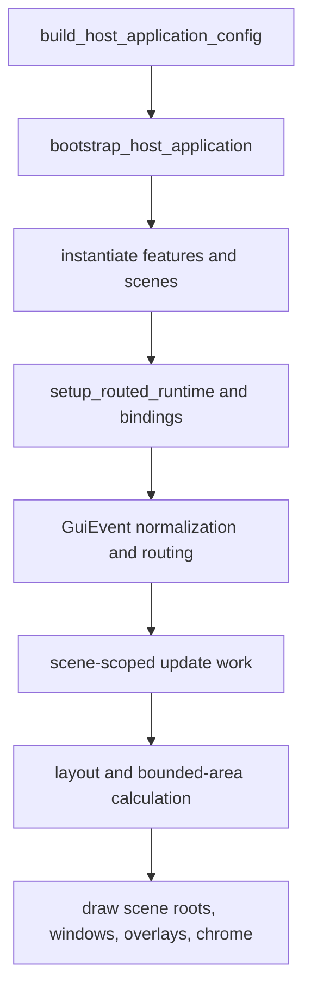
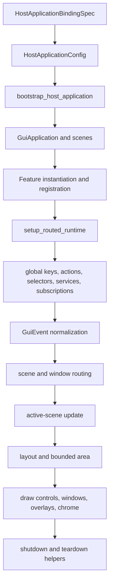
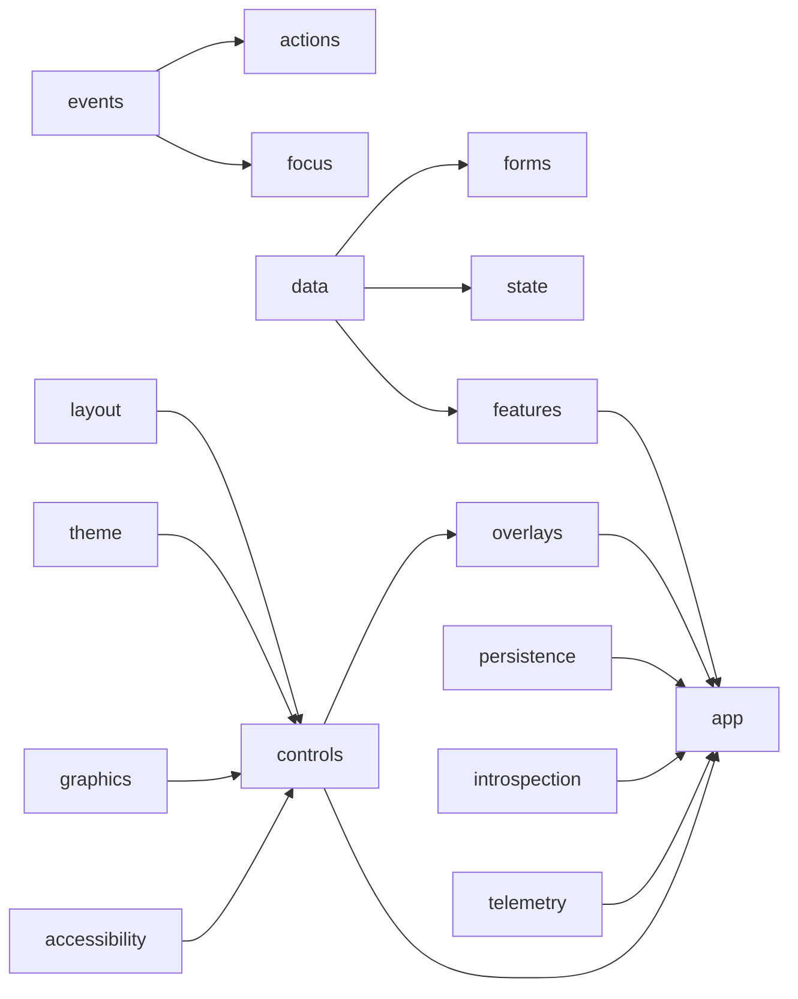

# gui_do Manual

## Title and Purpose
[Back to Table of Contents](#table-of-contents)

This manual documents the current `gui_do` repository as it exists today: the exported root-package API in `gui_do.__all__`, the runtime and public-surface contracts under `docs/`, the behavior asserted by `tests/`, and the real usage patterns in `demo_features/`. It is written for three audiences at once:

- application authors choosing the supported public API surface;
- maintainers extending `gui_do` without breaking runtime contracts;
- reviewers validating that a feature, scene, or subsystem still conforms to the data-driven runtime model.

The library is opinionated in two important ways. First, it prefers declarative runtime assembly over ad hoc widget construction: `bootstrap_host_application()`, `HostApplicationBindingSpec`, `FeatureSpec`, `RuntimeSceneSpec`, and the routed-runtime helpers are the recommended path for new applications. Second, it treats ownership, teardown, and deterministic routing as first-class concerns. Many APIs make more sense when read as lifecycle tools rather than as isolated utility functions.

The manual therefore does not only list APIs. Each chapter explains what the subsystem solves, where it sits in the runtime lifecycle, which public types matter first, when to choose one pattern over another, what typically goes wrong, and which tests or docs prove the described behavior.

## Table of Contents
[Back to Table of Contents](#table-of-contents)

- [Title and Purpose](#title-and-purpose)
- [Table of Contents](#table-of-contents)
- [How to Use This Manual](#how-to-use-this-manual)
- [Feature Organization Conventions](#feature-organization-conventions)
- [Conceptual Foundations](#conceptual-foundations)
- [Quickstart Path](#quickstart-path)
- [Architecture and Runtime Model](#architecture-and-runtime-model)
- [Core Workflow: Build, Bind, Route, Update, Draw](#core-workflow-build-bind-route-update-draw)
- [Main Systems Reference](#main-systems-reference)
- [Application Bootstrap and Host Configuration](#application-bootstrap-and-host-configuration)
- [Feature Lifecycle and Feature Types](#feature-lifecycle-and-feature-types)
- [Events, Actions, Input Mapping, and Routing](#events-actions-input-mapping-and-routing)
- [State and Observables](#state-and-observables)
- [Controls and Control Composition](#controls-and-control-composition)
- [Layout Systems](#layout-systems)
- [Focus and Accessibility](#focus-and-accessibility)
- [Overlays, Dialogs, Notifications, and Command Surfaces](#overlays-dialogs-notifications-and-command-surfaces)
- [Scene, Window, and Task-Panel Presentation Models](#scene-window-and-task-panel-presentation-models)
- [Scheduling, Timing, Animation, and Transitions](#scheduling-timing-animation-and-transitions)
- [Persistence and Workspace/Session State](#persistence-and-workspacesession-state)
- [Theme, Styling, and Visual Systems](#theme-styling-and-visual-systems)
- [Text, Input, Forms, and Validation Systems](#text-input-forms-and-validation-systems)
- [Data and Dataflow Helpers](#data-and-dataflow-helpers)
- [Graphics and Audio Integration Points](#graphics-and-audio-integration-points)
- [Telemetry, Introspection, and Operational Hooks](#telemetry-introspection-and-operational-hooks)
- [Integration Patterns and Composition Recipes](#integration-patterns-and-composition-recipes)
- [End-to-End Reference Application](#end-to-end-reference-application)
- [Testing, Diagnostics, and Reliability](#testing-diagnostics-and-reliability)
- [Performance and Scaling Guidance](#performance-and-scaling-guidance)
- [Migration, Versioning, and Deprecation Notes](#migration-versioning-and-deprecation-notes)
- [FAQ and Troubleshooting](#faq-and-troubleshooting)
- [Appendix](#appendix)
- [Appendix A: Glossary](#appendix-a-glossary)
- [Appendix B: Lifecycle and Event Routing Sequence](#appendix-b-lifecycle-and-event-routing-sequence)
- [Appendix C: System Dependency Map](#appendix-c-system-dependency-map)
- [Appendix D: API Quick Index by Topic](#appendix-d-api-quick-index-by-topic)
- [Appendix D.1: Tier-to-System Reference Matrix](#appendix-d1-tier-to-system-reference-matrix)
- [Appendix D.2: Public API Selection Heuristics](#appendix-d2-public-api-selection-heuristics)
- [Appendix E: Architecture Templates](#appendix-e-architecture-templates)
- [Appendix F: Specifications and Option Reference](#appendix-f-specifications-and-option-reference)

## How to Use This Manual
[Back to Table of Contents](#table-of-contents)

Read the manual through three lenses.

Theory lens: start with Conceptual Foundations, Architecture and Runtime Model, and Appendix B. These chapters explain the data-driven runtime, ownership rules, routed composition, and why the public API is tiered.

Practice lens: start with Quickstart Path, Core Workflow, Application Bootstrap and Host Configuration, Scene, Window, and Task-Panel Presentation Models, and End-to-End Reference Application. These chapters show how real scenes are assembled and why the demo application is organized the way it is.

Contract lens: start with Architecture and Runtime Model, Testing, Diagnostics, and Reliability, Appendix D, and Appendix F. These chapters line up code with the public-surface and runtime-operating contracts under `docs/public_api_spec.md`, `docs/runtime_operating_contracts.md`, `docs/architecture.md`, and the contract tests under `tests/`.

The manual uses two evidence labels throughout.

- `Evidence: direct` means the example or claim is adapted from a real implementation, demo, test, or contract document in the repository.
- `Evidence: inferred` means the shape is derived from the current public API and nearby verified patterns, but the exact composition is not copied from one source file.

When you need to decide between two APIs, prefer the higher-level tier unless you are extending the framework itself. The root export layout in `gui_do/__init__.py` is the stability signal: the lower the tier number, the more strongly the library nudges normal application code toward it.

## Feature Organization Conventions
[Back to Table of Contents](#table-of-contents)

The `demo_features/` package is the repository's reference for application-scale organization. `docs/demo_feature_layout.md` defines the default structure and the actual demo follows it closely:

- each feature or scene lives in its own package directory;
- every feature package exposes a clean `__init__.py` boundary;
- each package contains at least one `*_feature.py` module and one `*_specs.py` module;
- companion logic features live in `*_logic_feature.py` when present;
- `demo_features/demo_config.py` remains the explicit bootstrap entry rather than using filesystem scanning.

This matters because the data-driven runtime expects composition to be explicit. Scene bundles, feature bundles, task-panel configuration, palette entries, and scene transitions are all declared in bootstrap-facing config rather than discovered implicitly.

Minimal layout pattern:

```python
from gui_do import bootstrap_host_application
from demo_features.demo_config import DEMO_BOOTSTRAP_CONFIG


class GuiDoDemo:
    def __init__(self) -> None:
        bootstrap_host_application(self, DEMO_BOOTSTRAP_CONFIG)
```

Expected behavior: the host object receives an `app` and the full configured runtime during construction, and `run_entrypoint()` later drives the event/update/draw loop.

Caution: keep bootstrap-facing concerns in `demo_config.py` or an equivalent host config module. Do not spread scene registration and runtime wiring across arbitrary feature modules; that weakens traceability and makes contract tests less meaningful.

Evidence: direct, adapted from `gui_do_demo.py` and `demo_features/demo_config.py`.

## Conceptual Foundations
[Back to Table of Contents](#table-of-contents)

`gui_do` is a data-driven GUI runtime. The core question is not “which widget should I instantiate first?” but “what runtime model am I declaring, and who owns each effect, subscription, and teardown boundary?”

The foundational ideas are:

- declarative runtime description via `HostApplicationBindingSpec`, `FeatureSpec`, `RuntimeSceneSpec`, `WindowSpec`, `ActionSpec`, and the routed-runtime spec family;
- observable state and reactive derivation via `ObservableValue`, `PresentationModel`, `ComputedValue`, collection observables, selectors, and effect specs;
- feature-scoped ownership via `FeatureRuntimeScope`, feature lifecycle abstractions, service bindings, event subscriptions, and store subscriptions;
- scene-scoped routing for input, windows, overlays, menus, command palette behavior, focus, and bounded-area layout;
- deterministic teardown and replacement semantics for asynchronous or cancelable work.

The problem this solves is lifecycle drift. In a GUI codebase, subscriptions, timers, task queues, and ad hoc callbacks are easy to create and hard to clean up. `gui_do` addresses that by making runtime scope an explicit concept. If a feature declares an event subscription, a service binding, a store selector, or a routed operation spec, that declaration is expected to be bound and unbound together with the owning feature or scene. That is why the prompt's required topical coverage stresses automatic subscription ownership and runtime-scope teardown discipline.

Conceptually, the runtime is layered like this:

1. The host bootstrap creates a `GuiApplication` and scene/runtime bundles.
2. Features are instantiated, registered, and optionally paired with windows, overlays, or task-panel items.
3. Routed runtime helpers bind actions, palette keys, global pointer actions, event subscriptions, service graph entries, and selectors.
4. The active scene alone performs scene-scoped update work, preserving isolation and predictable cost.
5. Draw passes consume scene presentation state, control trees, layout state, theme assets, and graphics helpers.

The higher-level runtime faculties exported from Tier 1 are specialized tools that formalize advanced orchestration instead of leaving it implicit. Examples include `WorkflowCoordinator`, `RuntimePolicyEngine`, `EffectLifetimeOrchestrator`, `EventPipelineRuntime`, `DurableOperationQueueRuntime`, `ProjectionRuntime`, `RecomputeOrchestrator`, `FeatureHealthRuntime`, `RuntimeReplayHarness`, `FeatureHotSwapManager`, `WorkloadBudgetBrokerRuntime`, `CheckpointRecoveryRuntime`, `SagaCompensationRuntime`, `ReactiveDependencyGraphRuntime`, and `ContractMigrationRuntime`. These are not the first APIs most applications need, but their presence in the public API is a signal that the runtime model extends beyond basic widget and scene management.

Practical mental model:

- Use spec families when you are describing what the runtime should assemble.
- Use feature classes when you need logic, state ownership, or lifecycle hooks.
- Use application/runtime helpers when you are extending how the declarative runtime is wired.
- Use low-level infrastructure such as `UiEngine` only when maintaining the framework itself.

Inferred example of lifecycle-safe composition:

```python
from gui_do import (
    EventSubscriptionSpec,
    FeatureSpec,
    ObservableEffectSpec,
    ServiceBindingSpec,
    ServiceConsumerSpec,
    StoreSelectorSpec,
)


feature_spec = FeatureSpec(
    feature_id="editor_logic",
    event_subscriptions=(
        EventSubscriptionSpec(
            attr_name="saved_subscription",
            topic="document.saved",
            handler=lambda payload: None,
        ),
    ),
    service_bindings=(
        ServiceBindingSpec(
            attr_name="document_store_service",
            key="document_store",
            factory=lambda host, feature: object(),
            owned=True,
        ),
    ),
    service_consumers=(
        ServiceConsumerSpec(attr_name="document_store", key="document_store"),
    ),
    store_selectors=(
        StoreSelectorSpec(
            selector=lambda state: state.get("active_document"),
            handler=lambda value: None,
            depends_on=("active_document",),
        ),
    ),
    observable_effects=(
        ObservableEffectSpec(attr_name="refresh_effect", observable_attr_name="is_dirty", handler=lambda value: None),
    ),
)
```

Expected behavior: the declared event subscription, service publication, service resolution, store selector, and observable effect all belong to the same runtime slice and should be bound and torn down together.

Caution: do not treat runtime specs as a bag of unrelated conveniences. The benefit comes from using them as ownership declarations. If you mix declarative bindings with unmanaged side effects created elsewhere, you reintroduce the lifecycle leak the model is trying to prevent.

Evidence: inferred from `gui_do/features/data_driven_runtime.py`, `gui_do/features/runtime_facilities.py`, `gui_do/features/feature_lifecycle.py`, and the exported spec families.

## Quickstart Path
[Back to Table of Contents](#table-of-contents)

The shortest reliable path to a first success is:

1. define a `HostApplicationBindingSpec` and build it through `build_host_application_config()`;
2. declare at least one scene bundle and one feature bundle;
3. bootstrap through `bootstrap_host_application()`;
4. add a `SceneCommandPaletteSpec`, task panel, or scene menu strip only when the scene actually needs chrome;
5. run the app and validate scene switching, focus, and layout before adding richer subsystems.

Direct quickstart example:

```python
from gui_do import (
    HostApplicationBindingSpec,
    SceneBundleBindingSpec,
    build_host_application_config,
    bootstrap_host_application,
)


config = build_host_application_config(
    HostApplicationBindingSpec(
        display_size=(1280, 720),
        window_title="My gui_do App",
        initial_scene_name="main",
        scene_bundle_entries=(
            SceneBundleBindingSpec(scene_name="main", pretty_name="Main"),
        ),
    )
)


class AppHost:
    def __init__(self) -> None:
        bootstrap_host_application(self, config)
```

Expected behavior: this creates a host object with a configured `GuiApplication`, initialized scenes, and the runtime services required by the declared bindings.

Common failure modes:

- forgetting to declare a scene but setting it as `initial_scene_name`;
- declaring palette, task-panel, or menu-strip behavior without scene-scoped specs, then expecting the facility to appear automatically;
- using relative asset paths without understanding they resolve from the process working directory;
- calling `tile_windows()` while automatic layout is disabled and not passing `force=True` for a one-shot relayout;
- expecting a window to appear in the task panel, command palette, or menu strip after opting it out with `window_management_opt_in=False`.

Verification guidance: the demo bootstrap in `demo_features/demo_config.py` is the reference baseline, and the public/runtime contract tests under `tests/test_public_api_exports.py`, `tests/test_public_api_docs_contracts.py`, and `tests/test_runtime_operating_contracts.py` define the minimum release gate.

## Architecture and Runtime Model
[Back to Table of Contents](#table-of-contents)

`docs/architecture.md` defines the broad tiering of the codebase, while `gui_do/__init__.py` defines the supported consumer-facing export tiers. The two views are complementary:

- the architecture document explains subsystem layering inside the repository;
- the root package exports explain how consumers are expected to approach the library.

The public runtime model is centered on these guarantees from `docs/runtime_operating_contracts.md`:

- canonical event normalization to `GuiEvent` before app-level dispatch;
- scene-isolated update execution for scene-contained systems;
- deterministic candidate ordering for focus and key dispatch;
- bounded scheduler dispatch budgets;
- optional scene facilities for menu strip, task panel, and command palette;
- unified window visibility synchronization when multiple optional facilities coexist;
- `GuiApplication.bounded_area_rect()` as the truth source for top/bottom scene chrome exclusion.

Boundary model:

- `gui_do` is the library surface and stable import root.
- `demo_features` is an application that proves how to use the library.
- `docs/` defines contracts, specs, and layout/architecture decisions.
- `tests/` enforce behavior, public-surface parity, and cross-system guarantees.

File path resolution is one of the practical runtime contracts that often gets missed. Multiple subsystems resolve relative paths from the process working directory when the path is not absolute. That includes graphics asset registry paths, image control paths, cursor image paths, and some font-role file paths. Treat relative paths as application-root-sensitive, not module-location-sensitive.

Direct example of CWD-relative asset semantics:

```python
from gui_do import AssetRegistry, GuiApplication


registry = AssetRegistry()
image = registry.image("demo_features/data/images/backdrop.jpg")

# In GuiApplication cursor registration, relative paths are also resolved
# from Path.cwd() when not already absolute.
```

Expected behavior: `AssetRegistry` and cursor/image-loading paths use the current working directory as the base when the path is not absolute.

Caution: running the same app from a different working directory can break relative assets even when the code import paths are unchanged.

Evidence: direct, from `gui_do/graphics/asset_registry.py`, `gui_do/app/gui_application.py`, `gui_do/controls/display/image_control.py`, and `gui_do/theme/font_role_registry.py`.

## Core Workflow: Build, Bind, Route, Update, Draw
[Back to Table of Contents](#table-of-contents)

The core runtime loop is easiest to reason about as a fixed orchestration pipeline.

Build: construct host configuration, scenes, features, scene roots, windows, palette bindings, chrome specs, and optional services.

Bind runtime: instantiate features, register them with `FeatureManager`, create scene/window presentation state, bind actions and key handlers, publish services, subscribe to stores and event buses, and connect overlays and command surfaces.

Route: normalize incoming input to `GuiEvent`, route it through global keys, scene/window scopes, focus-aware handlers, and command surfaces.

Update: advance active-scene schedulers, transitions, animations, validation pipelines, and any scene-contained feature logic.

Draw: render scene roots, windows, overlays, task panel, menu strip, and any additional graphics layers using the current theme and bounded-area constraints.

Mermaid sequence view:



Advanced helper families exist because the bind and route phases are not trivial. `setup_routed_runtime()`, `shutdown_routed_runtime()`, `bind_feature_event_subscription()`, `setup_scene_command_palette_bindings()`, `register_action_hotkeys()`, `register_global_pointer_actions()`, `bind_task_panel_focus_toggle()`, and the presenter/tab helpers all operate on the boundary between declarative specs and live runtime objects.

Decision guidance:

- If a concern can be expressed as a spec plus a standard helper, prefer that over custom host boot code.
- If you need one-off behavior with strict ownership, keep it feature-scoped and bind it during runtime setup rather than in arbitrary control constructors.
- If you are maintaining framework internals, use the advanced helper families, but document the ownership path in tests.

## Main Systems Reference
[Back to Table of Contents](#table-of-contents)

### Application Bootstrap and Host Configuration
[Back to Table of Contents](#table-of-contents)

This subsystem turns declarative application intent into a running host. The primary public surface is `HostApplicationConfig`, `HostApplicationBindingSpec`, `SceneBundleBindingSpec`, `FeatureWindowBundleBindingSpec`, `ActionBindingSpec`, `PaletteBindingSpec`, `TelemetryConfig`, `bootstrap_host_application()`, and `build_host_application_config()`.

Why it exists: application authors need one place to declare display size, scene registration, features, runtime scene specs, action catalog, palette behavior, font roles, cursor assets, telemetry, and scene transitions. The bootstrap layer exists to keep that assembly centralized and testable.

Typical flow:

1. Build `HostApplicationBindingSpec`.
2. Convert it to `HostApplicationConfig` through `build_host_application_config()`.
3. Pass the config to `bootstrap_host_application()`.
4. Let the bootstrap create `GuiApplication`, scenes, features, bindings, and optional facilities.

Direct example adapted from the demo:

```python
from gui_do import (
    ActionBindingSpec,
    FeatureWindowBundleBindingSpec,
    HostApplicationBindingSpec,
    PaletteBindingSpec,
    SceneBundleBindingSpec,
    SceneTransitionStyle,
    build_host_application_config,
)


config = build_host_application_config(
    HostApplicationBindingSpec(
        display_size=(1920, 1080),
        window_title="gui_do demo",
        initial_scene_name="main",
        scene_bundle_entries=(
            SceneBundleBindingSpec(
                scene_name="main",
                pretty_name="Desktop Demo",
                transition_style=SceneTransitionStyle.SLIDE_RIGHT,
            ),
        ),
        feature_window_bundle_entries=(
            FeatureWindowBundleBindingSpec(
                "_systems_feature",
                object,
                "systems",
                task_panel_label="Systems",
                task_panel_slot_index=1,
            ),
        ),
        action_entries=(
            ActionBindingSpec(kind="exit", action_id="exit", label="Exit"),
        ),
        palette_spec=PaletteBindingSpec(
            enable_builtin_entries=True,
            include_scene_entries=True,
            include_window_entries=True,
        ),
    )
)
```

Expected behavior: scene bundles provide scene metadata and transition policy; feature-window bundles declare feature-backed windows; action bindings feed action and command-surface registration; palette bindings configure builtin and custom command entries.

Caution: `HostApplicationBindingSpec` is the highest-level composition surface. Do not bypass it for normal apps unless you have a concrete extension reason, because the surrounding helpers assume the host config is the canonical source of runtime truth.

Evidence: direct, adapted from `demo_features/demo_config.py`.

### Feature Lifecycle and Feature Types
[Back to Table of Contents](#table-of-contents)

`Feature`, `DirectFeature`, `LogicFeature`, `RoutedFeature`, `FeatureMessage`, `FeatureManager`, `ScenePresentationModel`, `SceneSetupSpec`, and the advanced runtime helpers together define the lifecycle model.

Mental model:

- `DirectFeature` owns direct draw/update behavior.
- `LogicFeature` encapsulates domain logic that may not own presentation directly.
- `RoutedFeature` participates in routed-runtime composition and scene/action wiring.
- `FeatureManager` owns registration and lookup.
- `FeatureRuntimeScope` and related helpers define runtime-scoped ownership and teardown boundaries.

The feature system solves two problems: avoiding a single monolithic app object, and giving each slice of functionality a predictable home for subscriptions, actions, runtime resources, and scene/window relationships.

Advanced path: use `RoutedRuntimeSpec`, `RoutedFeatureLifecycleSpec`, `FeatureWindowBundleBindingSpec`, `configure_routed_feature_runtime()`, `bind_routed_feature_lifecycle()`, and `shutdown_routed_feature_lifecycle()` when feature creation, route wiring, and teardown must stay aligned.

Decision guidance:

- Choose `DirectFeature` when the feature is primarily a visual or simulation surface.
- Choose `LogicFeature` when the feature owns state transitions, computation, or event handling without being the primary presenter.
- Choose `RoutedFeature` when the feature needs scene-scoped actions, palette integration, task-panel integration, or routed runtime helpers.

Common mistakes:

- binding long-lived subscriptions in ad hoc constructors instead of feature setup;
- publishing services outside the feature runtime scope;
- confusing presentational windows with logic ownership and causing teardown asymmetry.

Verification touchpoints: `tests/test_demo_feature_abstractions.py`, `tests/test_feature_lifecycle_classes.py`, `demo_features/life/`, `demo_features/mandelbrot/`, and `demo_features/main/` cover the main patterns.

### Events, Actions, Input Mapping, and Routing
[Back to Table of Contents](#table-of-contents)

The event stack is built around `GuiEvent`, `EventType`, `EventPhase`, `EventManager`, `EventBus`, `ActionManager`, `ActionRegistry`, `InputMap`, key-chord helpers, and focus-aware dispatch. The core contract is that input is normalized to `GuiEvent` before application-level routing.

Problem framing: raw platform events are noisy and sequencing-sensitive. The event stack gives the runtime a canonical object model, stable dispatch order, middleware, and a clean split between commands, direct handlers, and focus-scoped behavior.

Command palette two-bind model: `SceneCommandPaletteSpec` deliberately models two independent binds.

- `toggle`: open or close the palette itself.
- `action`: while the palette is open, trigger an entry-specific action under the pointer, commonly a window visibility toggle, without closing the palette.

Direct example from the main scene specs:

```python
import pygame

from gui_do import PaletteInputBindSpec, SceneCommandPaletteSpec


palette_spec = SceneCommandPaletteSpec(
    scene_name="main",
    toggle=PaletteInputBindSpec(
        action_name="command_palette_toggle",
        key=pygame.K_F5,
    ),
    action=PaletteInputBindSpec(
        action_name="command_palette_action",
        pointer_button=2,
    ),
)
```

Expected behavior: `setup_scene_command_palette_bindings()` binds the toggle and action separately. The toggle bind is registered as a global key through `ActionManager.bind_global_key()` so it is reachable before focus dispatch, active-window handlers, and screen-event handlers.

Caution: if you collapse these binds into one mental model, you will misread palette behavior. The palette toggle key and the palette action trigger solve different routing problems.

Evidence: direct, adapted from `demo_features/main/main_specs.py`, `gui_do/features/data_driven_runtime.py`, `gui_do/actions/action_manager.py`, and `tests/test_command_palette_grouped_entries.py`.

Advanced routing guidance:

- use `ActionMiddleware` for cross-cutting command concerns such as logging, gating, or metrics;
- use `InputMap` when you need explicit key-to-action translation;
- use `ActionRegistry` for named action catalogs and command surfaces;
- use `EventBus` for feature-to-feature message broadcasting rather than fragile direct callbacks.

### State and Observables
[Back to Table of Contents](#table-of-contents)

State in `gui_do` is intentionally layered. The lightweight layer is `ObservableValue`, `ComputedValue`, `PresentationModel`, observable collections, bindings, and `CollectionView`. The more structured layer is `AppStateStore`, `StateSelector`, `StateTransaction`, command history, routing, and state machines.

Why this split exists: not all state should be stored in one global structure. Local presentation values, field-level validation messages, and control state belong close to the owning feature or control. Cross-feature application state, transactional mutations, and selector-driven derivations belong in `AppStateStore` or equivalent structured state abstractions.

Direct example from `tests/test_app_state_store.py`:

```python
from gui_do import AppStateStore, StateTransaction


store = AppStateStore({"a": 0, "b": 0})
selector = store.select(lambda state: state.get("a", 0) + state.get("b", 0))

with StateTransaction(store):
    store.dispatch({"a": 1})
    store.dispatch({"b": 2})

assert selector.value == 3
```

Expected behavior: the transaction batches mutations, subscribers are notified after commit, and selectors re-evaluate against the committed snapshot.

Caution: use `StateTransaction` only when several updates must be observed atomically. For simple single-key changes, direct `dispatch()` is clearer.

Decision guidance:

- `ObservableValue` for local state owned by one feature or control.
- `CollectionView` and observable collections for filtered, sorted, derived list state.
- `AppStateStore` for cross-feature state, transactional updates, and selector subscriptions.
- `CommandHistory` and `UndoContextManager` when state changes need reversible semantics.

Verification touchpoints: `tests/test_app_state_store.py`, `tests/test_collection_view.py`, `tests/test_command_history.py`, `tests/test_command_history_and_object_pool.py`, and `demo_features/systems/systems_state_helpers.py`.

### Controls and Control Composition
[Back to Table of Contents](#table-of-contents)

The control surface is intentionally broad: Tier 12 covers core controls such as `PanelControl`, `LabelControl`, `ButtonControl`, `ToggleControl`, `SliderControl`, `ScrollbarControl`, `CanvasControl`, `FrameControl`, `ImageControl`, `ButtonGroupControl`, `TabControl`, and `DockWorkspacePanel`; Tier 13 adds richer controls such as `TextInputControl`, `TextAreaControl`, `DropdownControl`, `ListViewControl`, `DataGridControl`, `TreeControl`, `SplitterControl`, `ScrollViewControl`, `WindowControl`, `TaskPanelControl`, `MenuStripControl`, `ToolbarControl`, `StatusBarControl`, `ChipInputControl`, and more.

The recommended composition path is still feature-first rather than control-first. Controls are building blocks; features and scene/window specs determine where they live, how they are wired, and how focus, routing, and teardown work.

Minimal inferred composition:

```python
from pygame import Rect

from gui_do import ButtonControl, LabelControl, PanelControl


panel = PanelControl(control_id="editor_panel", rect=Rect(0, 0, 320, 200))
label = LabelControl(control_id="title", rect=Rect(12, 12, 220, 24), text="Editor")
button = ButtonControl(control_id="save", rect=Rect(12, 48, 100, 28), text="Save", on_click=lambda: None)

panel.add_child(label)
panel.add_child(button)
```

Expected behavior: the panel owns its child control tree, which can then be placed into a scene root or window presenter.

Caution: when a control participates in scene-level bounded layout, window raising/lowering, or task-panel/menu-strip chrome, prefer the higher-level helpers and presenters rather than manually placing everything into a generic panel.

Evidence: inferred from exported controls and helper patterns in `gui_do/features/data_driven_runtime.py` and the showcase demo packages.

### Layout Systems
[Back to Table of Contents](#table-of-contents)

Layout is a family of related tools rather than one engine. The public surface includes `ConstraintLayout`, `FlexLayout`, `GridLayout`, `FlowLayout`, `DockWorkspace`, `Viewport`, `LayoutPass`, `LayoutAnimator`, and the newer `AdaptivePolicy`, `ConstraintSet`, `LayoutConstraint`, and `resolve_adaptive_policy()` APIs for adaptive constraint layout v2.

Problem framing: static pixel placement is insufficient for real scenes with chrome, scene roots, window presenters, docking, scroll regions, and bounded areas that change under auto-hide task panels or scene menu strips. The library therefore exposes both general-purpose layout primitives and window-specific layout behavior.

Automatic window layout contract:

- `set_window_layout_enabled()`, `is_window_layout_enabled()`, and `toggle_window_layout_enabled()` are the primary API names.
- `set_window_tiling_enabled()`, `is_window_tiling_enabled()`, and `toggle_window_tiling_enabled()` remain compatibility aliases.
- layout enablement is scene-scoped;
- when layout handling is disabled, automatic relayout and automatic window interference stop;
- when enabled, `raise_window()` and `lower_window()` route through the layout handler and relayout all windows via the forced path;
- a one-shot manual relayout still works through `tile_windows(..., force=True)` even when automatic layout is disabled.

Direct example of the one-shot path and alias-friendly mental model:

```python
app.toggle_window_layout_enabled(scene_name="main")

# Force a one-time relayout even if automatic layout is currently off.
app.tile_windows(as_visibility_event=True, force=True)
```

Expected behavior: toggling layout changes scene-level automatic behavior; the explicit force path still runs the handler once.

Caution: `tile_windows()` without `force=True` is a no-op when automatic layout is disabled.

Evidence: direct, from `gui_do/app/gui_application.py`, `gui_do/layout/window_layout_handler.py`, `demo_features/main/main_feature.py`, and `tests/test_gui_application_wheel_pointer_sync.py`.

Adaptive constraint layout v2 guidance: choose it when priorities, viewport-adaptive constraints, and policy resolution matter more than simple linear or grid placement. Use flex or grid for straightforward content arrangement; use adaptive constraints for responsive panels whose size/placement policy changes with available space.

Virtualization note: `MeasureMode`, `MeasurePolicy`, `VirtualizedWindow`, `RecyclePool`, and `VirtualizationCore` belong conceptually to layout as much as to controls. They exist to keep large data presentations bounded in cost.

### Focus and Accessibility
[Back to Table of Contents](#table-of-contents)

Focus and accessibility are separate subsystems that intentionally intersect. `FocusManager`, `FocusScope`, `FocusScopeManager`, `WindowFocusManager`, and `FocusRing` manage keyboard focus and scope ordering. `AccessibilityRole`, `LivePoliteness`, `AccessibilityNode`, `AccessibilityTree`, `AccessibilityAnnouncement`, and `AccessibilityBus` provide semantic structure and live-region announcements.

Why both matter together: keyboard navigation without accessibility metadata is incomplete, and an accessibility tree that does not reflect actual focus or window state produces misleading assistive output.

Accessibility bus pattern: use it when important runtime events need to become announcements or role-state updates rather than only visual changes.

Direct-style example based on current public types:

```python
from gui_do import AccessibilityBus, AccessibilityNode, AccessibilityRole, AccessibilityTree


root = AccessibilityNode(node_id="root", role=AccessibilityRole.WINDOW, label="Main Window")
button = AccessibilityNode(node_id="save", role=AccessibilityRole.BUTTON, label="Save")
root.children = [button]

tree = AccessibilityTree(root=root)
bus = AccessibilityBus()
bus.announce("Saved", politeness="polite")
```

Expected behavior: the semantic tree models the UI structure while the bus carries live announcements.

Caution: keep accessibility ids and labels stable enough that dynamic scene/window composition does not produce noisy or contradictory assistive state.

Evidence: direct on types and announcements from `gui_do/accessibility/accessibility_tree.py`; example assembly inferred because the repository's main direct validation is structural tests in `tests/test_accessibility_tree.py`.

### Overlays, Dialogs, Notifications, and Command Surfaces
[Back to Table of Contents](#table-of-contents)

This chapter covers transient and command-oriented UI: `OverlayManager`, `DialogManager`, `ToastManager`, `ContextMenuManager`, `CommandPaletteManager`, `TooltipManager`, `MenuBarManager`, `FileDialogManager`, `NotificationCenter`, `ShortcutHelpOverlay`, `ClipboardManager`, `TransferManager`, `DragDropManager`, and popup placement helpers.

Mental model: these APIs do not replace scenes and windows; they sit on top of them. Their main jobs are transient interaction, command activation, ephemeral feedback, and bridge behavior between input and presentation.

Unified menu-strip model: `gui_do` documents menu strip behavior as one model rather than separate unrelated scene and window stories. There may be a scene-level menu strip and a window-level menu strip, but both share the same conceptual role: top-docked command chrome within their scope.

Command palette details beyond the two binds:

- builtin entry groups may include scenes and windows;
- custom entries are provided through `PaletteBindingSpec.custom_entries_provider`;
- `group_order` controls how builtin and custom groups are interleaved;
- when `connect_window_presentation=True`, builtin window entries follow task-panel slot ordering instead of control id ordering.

Direct example from demo bootstrap and tests:

```python
from gui_do import PaletteBindingSpec


palette = PaletteBindingSpec(
    enable_builtin_entries=True,
    include_scene_entries=True,
    include_window_entries=True,
    group_order=("windows", "scenes", "custom"),
    connect_window_presentation=True,
)
```

Expected behavior: the palette includes builtin scene/window entries and can merge them with custom entries in a deterministic order.

Caution: palette entry grouping and window ordering are easy places to create subtle UX drift. If task-panel ordering matters, keep `connect_window_presentation=True` and validate the order with tests.

Evidence: direct, from `demo_features/demo_config.py` and `tests/test_command_palette_grouped_entries.py`.

### Scene, Window, and Task-Panel Presentation Models
[Back to Table of Contents](#table-of-contents)

This is the most important chapter for scene chrome and bounded window behavior. The key public APIs are `GuiApplication`, `WindowControl`, `TaskPanelControl`, `WindowPresenter`, `SceneCommandPaletteSpec`, `SceneTaskPanelSpec`, `TaskPanelSlotLayoutSpec`, `TaskPanelWindowToggleGroupSpec`, `TaskPanelWindowTogglePlacement`, `MenuStripControl`, `SceneMenuOptions`, `WindowMenuOptions`, `FeatureWindowBundleBindingSpec`, `WindowToggleBindingSpec`, `make_window_toggle_spec()`, `set_window_visible_state()`, `toggle_window_visibility()`, and the advanced runtime helpers that materialize these declarations.

Unified window visibility model:

- task panel window toggle group;
- scene menu strip Windows menu;
- command palette window entries.

When these facilities are present together for a scene, they are expected to represent the same managed window set. `window_management_opt_in=False` opt-outs remove a window from all three management surfaces together. This is a deliberate consistency guarantee, not an incidental side effect.

Per-scene optional facilities:

- task panel is only created when declared;
- menu strip is only created when declared;
- command palette is only created when declared;
- `GuiApplication.bounded_area_rect(scene_name=None)` subtracts scene menu strip height at the top and task-panel reserved height at the bottom when those facilities exist.

Direct task-panel placement example from the main demo:

```python
from gui_do import TaskPanelWindowToggleGroupSpec


window_toggle_group = TaskPanelWindowToggleGroupSpec(
    flow_start_slot=2,
    panel_rect_overrides={
        "systems": (284, 10, 124, 30),
        "life": (418, 10, 124, 30),
        "mandel": (552, 10, 124, 30),
    },
)
```

Expected behavior: placement is explicit-first. Any managed window with a `panel_rect_overrides` entry gets that exact panel-relative rectangle. Remaining windows flow from `flow_start_slot`, and `flow_slot_assignments` can pin specific windows to specific slots before fallback flow applies.

Caution: the returned `TaskPanelWindowTogglePlacement.panel_rect` values are panel-relative rects that ignore task-panel auto-hide offsets. Use them for stable identity/geometry reporting inside the panel, not for absolute screen positioning.

Evidence: direct, from `demo_features/main/main_specs.py`, `gui_do/features/data_driven_runtime.py`, and `tests/test_demo_feature_abstractions.py`.

Direct geometry reporting example from tests:

```python
result = add_scene_task_panel_items(
    host,
    task_panel,
    layout,
    window_toggle_group_spec=TaskPanelWindowToggleGroupSpec(
        panel_rect_overrides={
            "first": (20, 8, 100, 24),
            "second": (138, 8, 110, 24),
        },
        flow_start_slot=1,
    ),
    window_presentation=presentation,
)

assert tuple(result.window_toggle_placements[0].panel_rect) == (20, 8, 100, 24)
```

Expected behavior: `SceneTaskPanelItemsResult.window_toggle_placements` reports one deterministic `(window_key, control_id, panel_rect)` record per generated toggle.

Caution: treat this as reporting metadata, not as a replacement for control ownership. The controls still belong to the task panel and its runtime.

Evidence: direct, from `tests/test_demo_feature_abstractions.py`.

Automatic layout and z-order interactions:

- `raise_window(window, scene_name=...)` relayouts through the handler when layout is enabled;
- `lower_window(window, scene_name=...)` does the same for demotion;
- `tile_windows(..., force=True)` is the explicit F3-style one-time relayout path;
- when layout is disabled, direct parent raise/lower behavior applies and automatic interference stops.

This operating contract is important because window z-order and layout are intentionally unified when automatic layout is active. You are not merely changing stacking order; you are potentially asking the handler to recompute the scene's window arrangement.

Verification touchpoints: `docs/public_api_spec.md`, `docs/runtime_operating_contracts.md`, `tests/test_scene_chrome_contracts.py`, `tests/test_window_visibility_transition_and_window_list_routing.py`, `tests/test_gui_application_wheel_pointer_sync.py`, and the `demo_features/main/` scene specs and feature methods.

### Scheduling, Timing, Animation, and Transitions
[Back to Table of Contents](#table-of-contents)

The scheduling family includes `TaskScheduler`, `Timers`, `TweenManager`, `AnimationSequence`, `TransitionManager`, `SceneTimeline`, `Debouncer`, `Throttler`, `CooperativeScheduler`, `AnimationStateMachine`, `InteractionStateMachine`, and `DataflowPipeline` with `CancellationToken`, `PipelineStage`, and `PipelineHandle`.

Why this subsystem is broad: GUI work includes both frame-oriented animation and non-visual asynchronous processing. The library exposes both so that UI transitions, debounced validation, workflow execution, and stale-work cancellation can share predictable semantics.

Direct example from `tests/test_dataflow_pipeline.py`:

```python
from gui_do import CancellationToken, DataflowPipeline, PipelineStage


pipeline = DataflowPipeline(
    [
        PipelineStage("add1", lambda value, token: value + 1),
        PipelineStage("add2", lambda value, token: value + 2),
    ]
)

handle = pipeline.run(0)
assert handle.result == 3
```

Expected behavior: each stage receives the current value and cancellation token; the resulting `PipelineHandle` exposes completion, cancellation, and result/error state.

Caution: cancellation is part of the pipeline contract, not an afterthought. Stale-generation behavior should be designed into multi-stage pipelines instead of bolted on with ad hoc flags.

Evidence: direct, from `tests/test_dataflow_pipeline.py`.

Advanced path: use `AsyncFormValidator` for debounced cross-field validation, `CooperativeScheduler` for frame-friendly coroutine progression, `InteractionStateMachine` for guarded input-phase coordination, and `AnimationStateMachine` when visual state transitions need explicit phase modeling.

### Persistence and Workspace/Session State
[Back to Table of Contents](#table-of-contents)

Persistence in `gui_do` spans `WorkspacePersistenceManager`, `SettingsRegistry`, `SceneSnapshot`, `NodeSnapshot`, `SchemaVersion`, `VersionedSnapshot`, `MigrationRegistry`, `SnapshotMigrator`, `MigrationStep`, `MigrationError`, `make_snapshot()`, and `read_version()`.

Problem framing: GUI applications need to preserve more than one thing. There is application settings state, scene/window presentation state, and potentially versioned durable state that must survive format changes.

Operational model:

- `WorkspacePersistenceManager` owns save/load of workspace state;
- `DEFAULT_WORKSPACE_STATE_PATH` defaults to `Path.home() / ".gui_do" / "workspace_state.json"`;
- restore reports include switched scene, restored feature states, scene nodes, applied settings, skipped settings, and missing settings blocks;
- snapshot migration APIs exist so serialized state can evolve safely.

Decision guidance:

- use settings registry for durable key-value preferences;
- use workspace persistence for application restore semantics;
- use versioned snapshots and migration registry when persisted schema shape can change across versions.

Evidence note: the workspace restore report semantics are direct from `docs/runtime_operating_contracts.md` and `gui_do/persistence/workspace_persistence.py`; migration APIs are directly exported from `gui_do/persistence/snapshot_migration.py`, while richer multi-step examples are inferred from the current public surface.

### Theme, Styling, and Visual Systems
[Back to Table of Contents](#table-of-contents)

Theme and styling are carried by `ThemeManager`, `ColorTheme`, `DesignTokens`, `FontManager`, `FontRoleRegistry`, `ScopedTheme`, `ScopedThemeManager`, and `ThemeInvalidationBus`.

Why the subsystem exists: drawing and control composition should not hardcode colors, fonts, spacing semantics, or cache invalidation policy. Theme changes are expected to invalidate visual caches rather than leave stale visuals live until some unrelated redraw path happens.

Theme invalidation contract: switching themes should automatically flush relevant visual caches through the invalidation bus so that visuals are recomputed with the new tokens.

Direct-style example:

```python
from gui_do import ColorTheme, ThemeManager, ThemeInvalidationBus


theme_manager = ThemeManager(ColorTheme())
invalidation_bus = ThemeInvalidationBus()

# Theme change should invalidate dependent visual caches.
theme_manager.set_theme(ColorTheme())
```

Expected behavior: theme change propagates through the manager and invalidation paths so cached visuals are not silently reused under the wrong theme.

Caution: if you introduce custom draw caches outside the framework's theme/invalidation path, you must either subscribe to theme invalidation or guarantee explicit rebuilds yourself.

Evidence: direct on exported types and invalidation contract from `gui_do/theme/theme_manager.py` and `gui_do/theme/theme_invalidation_bus.py`; example composition inferred from the current public surface.

### Text, Input, Forms, and Validation Systems
[Back to Table of Contents](#table-of-contents)

This chapter combines text/localization and forms because the repository treats input, formatting, validation, and schema-driven form behavior as connected concerns.

Primary text and localization APIs:

- `TextFormatter`, `NumericFormatter`, `PatternFormatter`, `FixedPatternFormatter`;
- `TextFlow`, `TextSpan` for layout and wrapping;
- `TextSearcher`, `TextMatch` for search;
- `StringTable`, `LocaleRegistry` for localization.

Primary forms and validation APIs:

- `FormModel`, `FormField`, `ValidationRule`, `FieldError`, `FormSchema`, `SchemaField`;
- `AsyncFieldValidator`, `AsyncFormValidator`;
- `FieldSchema`, `FieldGraphSchema`, `ValidationPolicy`, `SchemaFormRuntime`;
- `DocumentModel`, `WizardFlow`, and validators from `gui_do.data.validator`.

Direct async validation example adapted from tests:

```python
from gui_do.data.presentation_model import ObservableValue
from gui_do.forms.async_form_validator import AsyncFieldValidator, AsyncFormValidator


class Field:
    def __init__(self, initial_value=""):
        self.value = ObservableValue(initial_value)
        self.name = "username"


field = Field("initial")
validator = AsyncFieldValidator(
    field=field,
    local_rules=[lambda value: None if value else "Required"],
    async_check=lambda value: None if value != "taken" else "Already taken",
    debounce_ms=50,
)
form = AsyncFormValidator([validator])
```

Expected behavior: local validation runs immediately on value change; async validation is debounced; stale async results are discarded when a newer generation supersedes them.

Caution: call update progression on validators or the owning runtime path that advances them. Debounce timers and async result collection depend on runtime update progression.

Evidence: direct, adapted from `tests/test_async_form_validator.py`.

Decision guidance:

- use `TextFormatter` families when the primary need is editing/formatting discipline;
- use validator families when the primary need is validity semantics;
- use `SchemaFormRuntime` when field visibility, dependency graphs, and policy-based validation must be declared rather than hand-wired.

### Data and Dataflow Helpers
[Back to Table of Contents](#table-of-contents)

The advanced data family covers `VirtualItemSource`, `FixedItemSource`, `SortFilterProxySource`, `AsyncDataProvider`, `LoadState`, `ObjectPool`, `DataCache`, `ListDiffCalculator`, `ListDiff`, and the diff record types. Together these APIs solve the scaling problems that appear once observable lists are no longer tiny.

Typical usage patterns:

- `CollectionView` for filtering and sorting a live collection;
- `SortFilterProxySource` when you want a proxy layer over another source;
- `VirtualItemSource` and virtualization core for large item counts;
- `AsyncDataProvider` for staged or remote loading;
- `DataCache` for reuse and hit-rate-aware retrieval;
- `ObjectPool` for hot-path allocation control;
- `ListDiffCalculator` when changes need to be expressed as inserts/removes/moves rather than complete replacement.

Inferred example of source composition:

```python
from gui_do import FixedItemSource, SortFilterProxySource


source = FixedItemSource([{"name": "B"}, {"name": "A"}])
proxy = SortFilterProxySource(source, key=lambda item: item["name"])
```

Expected behavior: the proxy projects a sorted view of the upstream source without changing the underlying storage model.

Caution: when the displayed item count is large, combine source-level projection with virtualization rather than relying on naive full materialization and repaint.

Evidence: inferred from exported APIs and patterns in `demo_features/systems/systems_data_helpers.py`; direct tests cover `CollectionView` rather than every advanced source type.

### Graphics and Audio Integration Points
[Back to Table of Contents](#table-of-contents)

Graphics APIs include `DrawContext`, `DrawPhase`, `AssetRegistry`, `DebugOverlay`, `DirtyRegionTracker`, `SurfaceCompositor`, `Layer`, `ShapeRenderer`, `SurfaceEffects`, `VectorPath`, `SpriteSheet`, `FrameAnimation`, `ParticleSystem`, `Emitter`, `ParticleLayer`, `TileSet`, `TileMap`, `RenderTarget`, `LiveRenderTarget`, `OffscreenRenderTarget`, `create_render_target()`, `create_surface()`, `Node2D`, `SceneGraph2D`, and `Camera2D`. Audio APIs include `SoundCue`, `SoundBankRegistry`, and `SoundEventBus`.

These are integration points rather than the only rendering path. Most applications will still spend most of their time in scene/window/control composition. Reach for the graphics layer when you need custom draw phases, offscreen composition, particle or tile-map rendering, scene graph structure, or explicit render-target workflows.

Inferred example of asset-and-audio integration:

```python
from gui_do import AssetRegistry, SoundBankRegistry, SoundCue, SoundEventBus


assets = AssetRegistry()
sounds = SoundBankRegistry()
bus = SoundEventBus()

click = SoundCue(name="click", path="demo_features/data/audio/click.wav")
sounds.register(click)
bus.emit("ui.click", cue_name="click")
```

Expected behavior: the sound bank maps cue metadata while the event bus provides decoupled playback signaling.

Caution: audio APIs are public but specialized. Normal application code should use them through higher-level interaction flows rather than turning every control callback into an inline audio backend call.

Evidence: direct on current exported types from `gui_do/audio/sound_event_bus.py`; usage composition inferred because the repository exposes the APIs more strongly than it demonstrates them in tests.

### Telemetry, Introspection, and Operational Hooks
[Back to Table of Contents](#table-of-contents)

This chapter groups observability and debug-oriented APIs: `TelemetryCollector`, `TelemetrySample`, `configure_telemetry()`, telemetry analyzers, `SceneSpatialIndex`, `ui_property`, `PropertyDescriptor`, `PropertyRegistry`, `property_registry`, `PropertyInspectorModel`, `InspectedProperty`, and the public-but-not-primary `UiEngine` export.

Problem framing: large GUI systems become hard to reason about when runtime state cannot be inspected and hot-path cost cannot be measured. The telemetry and introspection families exist to keep operational visibility first-class.

Direct-style example of property metadata:

```python
from gui_do import PropertyInspectorModel, ui_property


class ViewModel:
    @ui_property("Zoom")
    def zoom(self):
        return 1.0


inspector = PropertyInspectorModel()
```

Expected behavior: decorated properties can be discovered and surfaced through the property-inspection workflow.

Caution: `UiEngine` is exported but belongs in the infrastructure/internal caution bucket. It is not the recommended entry point for normal application code; use `bootstrap_host_application()` and `GuiApplication` instead.

Evidence: direct on exported introspection types from `gui_do/introspection/property_registry.py` and related modules; example assembly inferred from the inspection workflow surface.

## Integration Patterns and Composition Recipes
[Back to Table of Contents](#table-of-contents)

Recipe 1: routed scene chrome.

- declare `SceneTaskPanelSpec`, `TaskPanelSlotLayoutSpec`, `TaskPanelWindowToggleGroupSpec`, and `SceneCommandPaletteSpec` together for one scene;
- enable `PaletteBindingSpec.connect_window_presentation=True` so command palette window ordering matches task-panel ordering;
- use `window_management_opt_in=False` only for windows that should disappear from all three management surfaces.

Recipe 2: transactional state plus async validation.

- use `AppStateStore` for cross-feature persisted form state;
- use `AsyncFieldValidator` for debounced local/remote checks;
- subscribe through selectors or store subscription specs so feature ownership stays explicit.

Recipe 3: presenter tabs over feature-backed windows.

- use `TabBuilderSpec`, `create_tab_control_from_specs()`, `compute_tabbed_window_layout()`, and `setup_feature_presenter_tabs()` when multiple feature surfaces belong in one presenter shell;
- keep tab update routing in `ActiveTabUpdateRouter` or equivalent routed helpers rather than hardcoding tab-change side effects in individual controls.

Recipe 4: service graph plus event bus.

- publish reusable typed services through `ServiceBindingSpec` or `ServiceScope`;
- consume them through `ServiceConsumerSpec` or typed `ServiceKey` lookup;
- use `EventBus` or `FeatureOperationBus` for cross-slice signaling where direct service ownership would be the wrong abstraction.

Recipe 5: large list/data UI.

- source data through `AsyncDataProvider` or `VirtualItemSource`;
- project it through collection/view or sort-filter proxies;
- render it through virtualized controls and recycle pools;
- use `ListDiffCalculator` for precise change application instead of full rebuilds when possible.

## End-to-End Reference Application
[Back to Table of Contents](#table-of-contents)

The repository's end-to-end reference application is the demo launched by `gui_do_demo.py` and configured in `demo_features/demo_config.py`.

What it proves:

- bootstrap through `build_host_application_config()` and `bootstrap_host_application()`;
- multi-scene setup with transitions;
- scene task panel, scene menu strip, command palette, and unified window visibility;
- feature-window bundle composition for Systems, Life, and Mandelbrot windows;
- showcase scene for control inventory and layout patterns;
- systems scene for advanced subsystem demos;
- scene-scoped keyboard shortcuts including F1, F2, F3, F5, and F9 behavior in the main scene.

Validation checklist for the reference app:

1. Launch the demo and confirm the main scene appears.
2. Press `F5` and confirm the command palette opens regardless of focus.
3. Use the palette, task panel, and menu strip to show and hide managed windows and verify they stay synchronized.
4. Press `F2` to toggle automatic window layout.
5. Press `F3` to force a one-time relayout.
6. Press `F1` to raise or lower task-panel focus.
7. Switch scenes and confirm transitions, scene-specific facilities, and bounded-area behavior remain stable.
8. Open systems demos that exercise state, validation, scheduling, and graphics subsystems.

The main demo scene is the best operational reference for scene/window/task-panel behavior. The systems scene is the best reference for advanced subsystem APIs. The showcase scene is the best control composition catalog.

## Testing, Diagnostics, and Reliability
[Back to Table of Contents](#table-of-contents)

`gui_do` leans heavily on contract tests. The most important categories are:

- public API and docs parity: `tests/test_public_api_exports.py`, `tests/test_public_api_docs_contracts.py`;
- runtime operating contracts: `tests/test_runtime_operating_contracts.py`;
- architecture and boundary contracts: `tests/test_boundary_contracts.py`, `tests/test_architecture_boundary_docs_contracts.py`, `tests/test_library_demo_separation_contracts.py`;
- scene chrome and window behavior: `tests/test_scene_chrome_contracts.py`, `tests/test_window_visibility_transition_and_window_list_routing.py`, `tests/test_demo_feature_abstractions.py`, `tests/test_command_palette_grouped_entries.py`;
- subsystem tests for state, validation, layout, collections, accessibility, dataflow, and more.

Maintainer checklist when changing public behavior:

1. Update the implementation and keep the root export surface intentional.
2. Update or add focused tests for the changed behavior.
3. Update contract docs under `docs/` when the change alters runtime guarantees or public-surface expectations.
4. Re-check any scene chrome interactions if the change touches windows, palette behavior, layout, focus, or visibility.
5. Re-check lifecycle ownership when adding new subscriptions, services, or background work.

Diagnostics guidance:

- use telemetry collectors and analyzers for performance hotspots;
- use property inspection and scene spatial index for runtime inspection workflows;
- use event recorder/playback when input reproduction matters;
- prefer deterministic tests around scene-scoped behavior rather than global integration smoke tests only.

## Performance and Scaling Guidance
[Back to Table of Contents](#table-of-contents)

The runtime operating contracts already embed several performance choices, including scene-isolated update execution and scheduler budget clamping. Beyond that, the practical scaling guidance is:

- keep work scene-scoped whenever possible;
- use `reactive_batch()` to collapse noisy observable updates;
- use selectors so derived subscribers only re-run when their projection changes;
- choose virtualized data presentation for large collections;
- prefer `ObjectPool`, `DataCache`, and list diffs on hot paths;
- use `DirtyRegionTracker`, `SurfaceCompositor`, and render targets when custom rendering cost grows;
- use `CooperativeScheduler`, debouncers, throttlers, and dataflow cancellation to avoid stale or repeated work;
- keep theme invalidation explicit so visual caches are rebuilt only when necessary.

Decision guidance:

- small app with a few windows: ordinary control composition and observables are usually enough;
- many windows or dynamically shown/hidden windows: enable automatic layout and validate bounded-area interactions;
- large list/tree/grid data: combine proxy sources, virtualization, and diffing;
- remote or expensive validation/data transforms: use async validators or dataflow pipelines with cancellation semantics.

## Migration, Versioning, and Deprecation Notes
[Back to Table of Contents](#table-of-contents)

Version identity comes from `gui_do.__version__`. Public API stability is signaled by root exports and the public API spec rather than by deep import paths.

Migration guidance:

- keep consumers on root-package named imports;
- prefer primary API names over compatibility aliases;
- when adding persisted state, attach schema versions and migration steps early rather than later;
- when introducing specialized public helpers, document whether they are normal application entry points or advanced-runtime extension hooks.

Specific current guidance:

- use `set_window_layout_enabled()`, `is_window_layout_enabled()`, and `toggle_window_layout_enabled()` as the preferred names;
- keep the `*_window_tiling_enabled()` aliases only for compatibility and existing code readability;
- treat `UiEngine` and similar low-level infrastructure as public-but-not-primary.

Deprecation rule of thumb: if a symbol remains publicly exported but is no longer preferred for normal application code, keep it documented with a usage-boundary note instead of silently hiding it.

## FAQ and Troubleshooting
[Back to Table of Contents](#table-of-contents)

Why does the command palette not open from deep focus inside a control?

Because it should. The intended path is a global key binding registered through `ActionManager.bind_global_key()` from `SceneCommandPaletteSpec`. If it does not open, verify the scene's routed runtime bindings were actually set up.

Why does `tile_windows()` do nothing?

Because automatic layout may be disabled for the scene. Use `is_window_layout_enabled()` to confirm, or call `tile_windows(..., force=True)` for an explicit one-shot relayout.

Why does a window appear in one command surface but not another?

It should not, assuming you are using the built-in unified window visibility model. Check `window_management_opt_in`, custom filtering, and whether all facilities are connected to shared window presentation.

Why are my relative asset paths failing only in some launch modes?

Because several path-accepting APIs resolve relative paths from the process working directory, not from the module file.

Why does async validation show an old error after the field changed?

It should not if the validator is being updated correctly. Confirm the validator's update path is advancing and that you are not bypassing the generation-based stale-result protection.

Why are theme changes not affecting my custom cached visuals?

Because your custom cache may not be hooked into theme invalidation. Subscribe to the theme invalidation mechanism or rebuild on theme changes explicitly.

## Appendix
[Back to Table of Contents](#table-of-contents)

### Appendix A: Glossary
[Back to Table of Contents](#table-of-contents)

Feature: a lifecycle-owned runtime slice that encapsulates logic, presentation, or both.

Routed runtime: the composition layer that binds scene-scoped actions, palette behavior, task-panel helpers, subscriptions, and other declarative specs to live runtime objects.

Window presentation: the shared model that lets task panel, menu strip, and command palette agree on managed windows.

Bounded area: the scene rect after subtracting top and bottom scene chrome such as menu strip and task panel reserved height.

Scene chrome: scene-level UI furniture such as task panel, menu strip, and related bounded-area participants.

Direct example: an example adapted from a verified source file in the repository.

Inferred example: an example synthesized from the current public API and nearby verified patterns when no single direct usage exists.

### Appendix B: Lifecycle and Event Routing Sequence
[Back to Table of Contents](#table-of-contents)



Operational note: the active scene is the runtime focus for scene-scoped work. Optional facilities participate only when declared. Teardown is expected to mirror setup: what the routed runtime binds, it should also be able to unbind.

### Appendix C: System Dependency Map
[Back to Table of Contents](#table-of-contents)



Interpretation: `app` and `features` are the top-level orchestration layers. `controls`, `overlays`, `layout`, `data`, and `events` are the core building systems underneath them. Specialized subsystems such as persistence, accessibility, telemetry, audio, text, and introspection plug into that runtime rather than replace it.

### Appendix D: API Quick Index by Topic
[Back to Table of Contents](#table-of-contents)

This appendix is driven by the current `gui_do.__all__` surface and groups symbols by tier/system so every exported family is indexed somewhere in the manual.

Tier 1: Primary entry points and data-driven APIs

`Feature`, `DirectFeature`, `LogicFeature`, `RoutedFeature`, `FeatureMessage`, `FeatureManager`, `ScenePresentationModel`, `SceneSetupSpec`, `setup_standard_font_roles`, `FeatureSpec`, `WindowSpec`, `WindowEffectsSpec`, `RuntimeSceneSpec`, `ActionSpec`, `StaticAccessibilitySpec`, `CursorSpec`, `SceneRootSpec`, `AnchoredWindowSpec`, `LogicBindingSpec`, `TaskPanelButtonSpec`, `TaskPanelWindowToggleGroupSpec`, `TaskPanelWindowTogglePlacement`, `PaletteInputBindSpec`, `SceneCommandPaletteSpec`, `ActionHotkeySpec`, `ControlKeyBindingSpec`, `SceneTaskPanelSpec`, `TaskPanelSlotLayoutSpec`, `TaskPanelSceneNavButtonSpec`, `EventSubscriptionSpec`, `ServiceBindingSpec`, `ServiceConsumerSpec`, `StoreSubscriptionSpec`, `StoreSelectorSpec`, `ObservableEffectSpec`, `SignalEffectSpec`, `FailurePolicySpec`, `FeatureOperationSpec`, `ShortcutOverlaySpec`, `TaskPanelFocusToggleSpec`, `GlobalPointerActionSpec`, `FeatureDependencySpec`, `ExecutionContextSpec`, `WorkloadBudgetClassSpec`, `WorkloadBudgetSpec`, `CheckpointDomainSpec`, `CheckpointSpec`, `SagaStepSpec`, `SagaSpec`, `ReactiveSourceSpec`, `ReactiveNodeSpec`, `ReactiveGraphSpec`, `MigrationStepSpec`, `MigrationTargetSpec`, `ContractMigrationSpec`, `RuntimePolicySpec`, `EffectBindingSpec`, `EventPipelineStageSpec`, `EventPipelineSpec`, `DurableOperationBindingSpec`, `DurableOperationQueueSpec`, `DurableQueueRecord`, `CapabilityProviderSpec`, `CapabilityRequirementSpec`, `ProjectionNodeSpec`, `ProjectionSpec`, `PolicyDecision`, `WorkflowStepSpec`, `WorkflowSpec`, `RecomputeNodeSpec`, `QoSPolicySpec`, `HealthProbeSpec`, `ReplaySpec`, `ReplacePolicySpec`, `WorkflowCoordinator`, `RuntimePolicyEngine`, `EffectLifetimeOrchestrator`, `EventPipelineRuntime`, `DurableOperationQueueRuntime`, `CapabilityContractRuntime`, `ProjectionRuntime`, `RecomputeOrchestrator`, `QoSPolicyRuntime`, `FeatureHealthRuntime`, `RuntimeReplayHarness`, `FeatureHotSwapManager`, `ExecutionContextRuntime`, `WorkloadBudgetBrokerRuntime`, `CheckpointRecoveryRuntime`, `SagaCompensationRuntime`, `ReactiveDependencyGraphRuntime`, `ContractMigrationRuntime`, `RoutedRuntimeSpec`, `RoutedFeatureLifecycleSpec`, `FeatureWindowBundleBindingSpec`, `WindowToggleBindingSpec`, `SceneSetupBindingSpec`, `RuntimeSceneBindingSpec`, `SceneRootBindingSpec`, `CursorBindingSpec`, `FontRoleBindingSpec`, `ActionBindingSpec`, `PaletteBindingSpec`, `SceneBundleBindingSpec`, `HostApplicationBindingSpec`, `TabbedPresenterSpec`, `AccessibilitySequenceSpec`, `TabBuilderSpec`, `NotificationSpec`, `HostApplicationConfig`, `TelemetryConfig`, `bootstrap_host_application`, `build_notification_center`, `make_window_toggle_spec`, `make_scene_nav_action`, `make_exit_action`, `make_palette_toggle_action`, `make_static_accessibility_spec`, `build_feature_specs`, `build_feature_window_bundle_specs`, `build_window_toggle_specs`, `build_scene_setup_specs`, `build_runtime_scene_specs`, `build_scene_root_specs`, `build_cursor_specs`, `build_font_role_specs`, `build_scene_nav_actions`, `build_action_specs`, `build_scene_bundle_specs`, `build_static_accessibility_specs`, `build_host_application_config`

Tier 2: Core application

`GuiApplication`, `create_display`, `SceneTransitionManager`, `SceneTransitionStyle`, `apply_scene_setup_specs`

Tier 3: Data and state foundations

`ObservableValue`, `PresentationModel`, `ComputedValue`, `InvalidationTracker`, `ChangeKind`, `CollectionChange`, `ObservableList`, `ObservableDict`, `CollectionViewQuery`, `CollectionView`, `Binding`, `BindingGroup`, `ObservableStream`, `SelectionModel`, `SelectionMode`

Tier 4: Events, actions, focus, and input

`EventPhase`, `EventType`, `GuiEvent`, `ValueChangeCallback`, `ValueChangeReason`, `EventManager`, `EventBus`, `GestureRecognizer`, `EventRecorder`, `EventPlayback`, `RecordedEvent`, `InputSnapshot`, `Signal`, `SignalConnection`, `ActionManager`, `ActionContext`, `ActionMiddleware`, `ActionDescriptor`, `ActionRegistry`, `InputMap`, `InputBinding`, `KeyChordManager`, `KeyChord`, `ChordStep`, `FocusManager`, `FocusScope`, `FocusScopeManager`, `WindowFocusManager`, `FocusRing`

Tier 5: Scheduling and animation

`TaskEvent`, `TaskScheduler`, `Timers`, `TweenManager`, `TweenHandle`, `Easing`, `AnimationSequence`, `AnimationHandle`, `TransitionManager`, `TransitionSpec`, `TransitionEvent`, `AnimationStateMachine`, `AnimationTransitionMode`, `SceneTimeline`, `Debouncer`, `Throttler`, `CooperativeScheduler`, `CoroutineHandle`, `Pause`, `Sleep`, `WaitForEvent`, `WaitForSignal`, `WaitUntil`, `WaitForAll`

Tier 6: Theme and fonts

`FontManager`, `FontRoleRegistry`, `ColorTheme`, `ThemeManager`, `DesignTokens`, `ScopedTheme`, `ScopedThemeManager`

Tier 7: Telemetry

`TelemetryCollector`, `TelemetrySample`, `configure_telemetry`, `telemetry_collector`, `analyze_telemetry_log_file`, `analyze_telemetry_records`, `load_telemetry_log_file`, `render_telemetry_report`

Tier 8: Layout

`LayoutAxis`, `ConstraintLayout`, `AnchorConstraint`, `DockPane`, `DockTabs`, `DockSplit`, `DockWorkspace`, `FlexLayout`, `FlexItem`, `FlexDirection`, `FlexAlign`, `FlexJustify`, `GridLayout`, `GridTrack`, `GridPlacement`, `LayoutAnimator`, `LayoutPass`, `MeasureContext`, `ArrangeContext`, `LayoutRoot`, `FlowLayout`, `FlowItem`, `Viewport`

Tier 9: Overlays and windows

`OverlayManager`, `OverlayHandle`, `Alignment`, `PlacementResult`, `PopupPlacement`, `Side`, `compute_popup_rect`, `DialogManager`, `DialogHandle`, `ToastManager`, `ToastHandle`, `ToastSeverity`, `ContextMenuManager`, `ContextMenuItem`, `ContextMenuHandle`, `CommandPaletteManager`, `CommandEntry`, `CommandPaletteHandle`, `TooltipManager`, `TooltipHandle`, `MenuBarManager`, `FileDialogManager`, `FileDialogOptions`, `FileDialogHandle`, `NotificationCenter`, `NotificationRecord`, `ResizeManager`, `CursorManager`, `CursorHandle`, `CursorShape`, `DragDropManager`, `DragPayload`, `ClipboardManager`, `TransferData`, `TransferManager`, `ShortcutHelpOverlay`, `ShortcutSection`, `ShortcutEntry`

Tier 10: Forms and validation

`FormModel`, `FormField`, `ValidationRule`, `FieldError`, `FormSchema`, `SchemaField`, `DocumentModel`, `WizardFlow`, `WizardStep`, `WizardHandle`, `ValidationResult`, `Validator`, `RequiredValidator`, `RangeValidator`, `LengthValidator`, `PatternValidator`, `CustomValidator`, `DependentValidator`, `ValidationPipeline`

Tier 11: State and persistence

`CommandHistory`, `Command`, `CommandTransaction`, `StateMachine`, `HierarchicalStateMachine`, `Router`, `RouteEntry`, `SettingsRegistry`, `SettingDescriptor`, `WorkspaceState`, `WorkspacePersistenceManager`, `DEFAULT_WORKSPACE_STATE_PATH`, `SceneSnapshot`, `NodeSnapshot`

Tier 12: Primary controls

`PanelControl`, `LabelControl`, `ButtonControl`, `ToggleControl`, `SliderControl`, `ScrollbarControl`, `CanvasControl`, `CanvasEventPacket`, `CanvasViewport`, `FrameControl`, `ImageControl`, `ArrowBoxControl`, `ButtonGroupControl`, `TabControl`, `TabItem`, `DockWorkspacePanel`

Tier 13: Extended controls and chrome

`TextInputControl`, `TextAreaControl`, `RichLabelControl`, `DropdownControl`, `DropdownOption`, `ListViewControl`, `ListItem`, `OverlayPanelControl`, `DataGridControl`, `GridColumn`, `GridRow`, `TreeControl`, `TreeNode`, `SplitterControl`, `SpinnerControl`, `RangeSliderControl`, `ColorPickerControl`, `ScrollViewControl`, `ProgressBarControl`, `AnimatedImageControl`, `ErrorBoundary`, `WindowControl`, `TaskPanelControl`, `WindowPresenter`, `MenuStripControl`, `MenuEntry`, `SceneMenuOptions`, `WindowMenuOptions`, `NotificationPanelControl`, `PropertyInspectorPanel`, `ToolbarControl`, `ToolbarItem`, `StatusBarControl`, `StatusSlot`, `ExpanderControl`, `DatePickerControl`, `TimePickerControl`, `BreadcrumbControl`, `BreadcrumbItem`, `SplitButtonControl`, `SplitButtonOption`, `ChipInputControl`

Tier 14: Text and localization

`TextFormatter`, `NumericFormatter`, `PatternFormatter`, `FixedPatternFormatter`, `TextFlow`, `TextSpan`, `TextSearcher`, `TextMatch`, `StringTable`, `LocaleRegistry`

Tier 15: Data and collections

`VirtualItemSource`, `FixedItemSource`, `SortFilterProxySource`, `AsyncDataProvider`, `LoadState`, `LoadStateKind`, `ObjectPool`, `DataCache`, `CacheStats`, `ListDiffCalculator`, `ListDiff`, `DiffInsert`, `DiffRemove`, `DiffMove`

Tier 16: Graphics and rendering

`BuiltInGraphicsFactory`, `DirtyRegionTracker`, `DrawContext`, `DrawPhase`, `AssetRegistry`, `DebugOverlay`, `SurfaceCompositor`, `Layer`, `ShapeRenderer`, `SurfaceEffects`, `VectorPath`, `SpriteSheet`, `FrameAnimation`, `ParticleSystem`, `Emitter`, `ParticleLayer`, `TileSet`, `TileMap`

Tier 17: Introspection and inspection

`SceneSpatialIndex`, `ui_property`, `PropertyDescriptor`, `PropertyRegistry`, `property_registry`, `PropertyInspectorModel`, `InspectedProperty`

Tier 18: Advanced runtime and bootstrapping

`FrameTimer`, `TabPanelManager`, `WindowRelativeRect`, `resolve_scene_selection_callback`, `minimize_window_menu_entries`, `set_window_visible_state`, `toggle_window_visibility`, `create_anchored_feature_window`, `add_window_menu_strip`, `split_slot_bounds`, `place_control`, `place_control_unlabeled`, `register_placed_control`, `add_group_label`, `PlacedControl`, `make_labeled_slot_height_fn`, `apply_category_visibility`, `ControlRegistry`, `RowCellSpec`, `build_horizontal_row_specs`, `build_multi_column_grid_specs`, `build_tools_menu_entries`, `add_standard_menu_strip`, `add_menu_strip_from_spec`, `apply_accessibility_sequence`, `apply_accessibility_sequence_from_attrs`, `register_companion_logic_features`, `ensure_scene_scheduler`, `sorted_window_bindings`, `collect_window_toggle_controls`, `apply_window_toggle_accessibility`, `add_window_toggle_task_panel_controls`, `add_task_panel_window_toggle_group`, `setup_scene_command_palette_bindings`, `register_window_toggle_tooltips`, `initialize_locale_registry`, `bind_input_map_actions`, `register_descriptors`, `resolve_canvas_local_point`, `apply_runtime_scene_pristine_assets`, `bind_runtime_scene_exit_keys`, `prewarm_runtime_scenes`, `add_task_panel_button`, `add_task_panel_buttons`, `register_tooltip_specs`, `register_action_hotkeys`, `register_global_pointer_actions`, `draw_controls_prewarm`, `bind_palette_window_action_bind`, `ensure_scene_task_panel`, `create_task_panel_slot_layout`, `add_task_panel_scene_nav_button`, `add_scene_task_panel_items`, `centered_overlay_rect`, `create_shortcut_help_overlay`, `bind_feature_event_subscription`, `unbind_feature_event_subscription`, `setup_routed_runtime`, `FeatureOperationBus`, `FeatureOperationContext`, `FeatureOperationHandle`, `FeatureRuntimeScope`, `shutdown_routed_runtime`, `bind_task_panel_focus_toggle`, `add_window_control`, `add_window_label`, `add_window_button`, `add_window_button_row`, `instantiate_features_from_specs`, `register_features_from_specs`, `register_window_presentation_specs`, `register_window_tab_builders`, `build_tab_builder_specs`, `create_tab_control_from_specs`, `compute_tabbed_window_layout`, `setup_feature_presenter_tabs_from_window_content`, `register_window_tab_builder_specs`, `setup_feature_presenter_tabs`, `register_tab_update_handlers`, `create_presented_anchored_window`, `create_presented_window_from_spec`, `create_feature_presented_window`, `configure_routed_feature_runtime`, `register_routed_feature_companions`, `bind_routed_feature_lifecycle`, `shutdown_routed_feature_lifecycle`, `ActiveTabUpdateRouter`, `TabLayoutContext`, `declare_host_actions`, `build_host_main_tab_order`, `apply_host_main_accessibility`

Tier 19: Infrastructure

`UiEngine`

Additional root-visible specialized exports imported at the package root

`WindowLayoutHandler`, `RenderTarget`, `LiveRenderTarget`, `OffscreenRenderTarget`, `create_render_target`, `create_surface`, `SoundCue`, `SoundBankRegistry`, `SoundEventBus`, `AccessibilityRole`, `LivePoliteness`, `AccessibilityNode`, `AccessibilityTree`, `AccessibilityAnnouncement`, `AccessibilityBus`, `ThemeInvalidationBus`, `UndoContextManager`, `AsyncFieldValidator`, `AsyncFormValidator`

Tier 25: Scoped service graph

`ServiceKey`, `ServiceScope`, `ScopeStack`

Tier 26: Cancelable dataflow pipeline

`CancellationToken`, `PipelineStage`, `DataflowPipeline`, `PipelineHandle`

Tier 27: Transactional app state store

`AppStateStore`, `StateSelector`, `StateTransaction`

Tier 28: Adaptive constraint layout v2

`ConstraintAttr`, `LayoutConstraint`, `ConstraintSet`, `AdaptivePolicy`, `resolve_adaptive_policy`

Tier 29: Unified virtualization core

`MeasureMode`, `MeasurePolicy`, `VirtualizedWindow`, `RecyclePool`, `VirtualizationCore`

Tier 30: Interaction state machine framework

`InteractionPhase`, `InteractionContext`, `InteractionTransition`, `InteractionStateMachine`

Tier 31: Schema-driven form runtime

`FieldSchema`, `FieldGraphSchema`, `ValidationPolicy`, `SchemaFormRuntime`

Tier 32: Portable snapshot and migration layer

`SchemaVersion`, `VersionedSnapshot`, `MigrationStep`, `MigrationRegistry`, `SnapshotMigrator`, `MigrationError`, `make_snapshot`, `read_version`

### Appendix D.1: Tier-to-System Reference Matrix
[Back to Table of Contents](#table-of-contents)

| Tier | Primary use | Main chapter |
| --- | --- | --- |
| 1 | Declarative app/runtime composition | Application Bootstrap and Host Configuration; Feature Lifecycle and Feature Types |
| 2 | Host application and scene core | Application Bootstrap and Host Configuration; Scene, Window, and Task-Panel Presentation Models |
| 3 | Reactive local state | State and Observables |
| 4 | Input, actions, focus | Events, Actions, Input Mapping, and Routing; Focus and Accessibility |
| 5 | Scheduling and animation | Scheduling, Timing, Animation, and Transitions |
| 6 | Theming and fonts | Theme, Styling, and Visual Systems |
| 7 | Telemetry | Telemetry, Introspection, and Operational Hooks |
| 8 | General layout | Layout Systems |
| 9 | Overlays and command surfaces | Overlays, Dialogs, Notifications, and Command Surfaces |
| 10 | Forms and validation | Text, Input, Forms, and Validation Systems |
| 11 | Structured state and persistence | State and Observables; Persistence and Workspace/Session State |
| 12-13 | UI controls and chrome | Controls and Control Composition; Scene, Window, and Task-Panel Presentation Models |
| 14 | Text and localization | Text, Input, Forms, and Validation Systems |
| 15 | Advanced data and collections | Data and Dataflow Helpers |
| 16 | Graphics and rendering | Graphics and Audio Integration Points |
| 17 | Introspection | Telemetry, Introspection, and Operational Hooks |
| 18 | Advanced wiring helpers | Core Workflow; Integration Patterns and Composition Recipes |
| 19 | Infrastructure | Telemetry, Introspection, and Operational Hooks |
| Root-visible specialized exports outside current `__all__` | Render targets, audio, accessibility, theme invalidation, undo routing, async validation, window layout handler | Graphics and Audio Integration Points; Focus and Accessibility; Theme, Styling, and Visual Systems; State and Observables; Text, Input, Forms, and Validation Systems; Layout Systems |
| 20-21 | Audio and accessibility | Graphics and Audio Integration Points; Focus and Accessibility |
| 22-32 | Specialized modern subsystems | Theme, State, Scheduling, Layout, Forms, Data, and Persistence chapters as applicable |

### Appendix D.2: Public API Selection Heuristics
[Back to Table of Contents](#table-of-contents)

Choose `bootstrap_host_application()` over direct `GuiApplication` assembly for new applications unless you are extending framework internals.

Choose `SceneCommandPaletteSpec`, `SceneTaskPanelSpec`, and menu-strip specs over ad hoc command-surface creation when the surface is scene chrome.

Choose `AppStateStore` when you need transactions, selectors, or cross-feature state; choose `ObservableValue` for simple local ownership.

Choose `set_window_layout_enabled()` names over the compatibility `*_window_tiling_enabled()` aliases in new code.

Choose virtualization and proxy/data-source APIs when list size or refresh rate can grow; do not wait for performance problems to become visible before introducing them.

Choose `UiEngine` only when working on framework internals.

### Appendix E: Architecture Templates
[Back to Table of Contents](#table-of-contents)

Template 1: minimal single-scene host

```python
from gui_do import HostApplicationBindingSpec, SceneBundleBindingSpec, build_host_application_config, bootstrap_host_application


config = build_host_application_config(
    HostApplicationBindingSpec(
        display_size=(1280, 720),
        window_title="Minimal App",
        initial_scene_name="main",
        scene_bundle_entries=(SceneBundleBindingSpec(scene_name="main", pretty_name="Main"),),
    )
)


class Host:
    def __init__(self) -> None:
        bootstrap_host_application(self, config)
```

Template 2: multi-scene host with scene chrome

```python
from gui_do import (
    HostApplicationBindingSpec,
    PaletteBindingSpec,
    SceneBundleBindingSpec,
    SceneCommandPaletteSpec,
    SceneTaskPanelSpec,
    build_host_application_config,
)


config = build_host_application_config(
    HostApplicationBindingSpec(
        display_size=(1600, 900),
        initial_scene_name="main",
        scene_bundle_entries=(
            SceneBundleBindingSpec(scene_name="main", pretty_name="Main"),
            SceneBundleBindingSpec(scene_name="reports", pretty_name="Reports"),
        ),
        palette_spec=PaletteBindingSpec(enable_builtin_entries=True, include_scene_entries=True),
    )
)
```

Template 3: routed feature-backed window bundle

```python
from gui_do import FeatureWindowBundleBindingSpec


window_bundle = FeatureWindowBundleBindingSpec(
    "_reports_feature",
    object,
    "reports",
    task_panel_label="Reports",
    task_panel_slot_index=3,
)
```

Template 4: schema-driven form subsystem

```python
from gui_do import FieldGraphSchema, FieldSchema, SchemaFormRuntime, ValidationPolicy


schema = FieldGraphSchema(
    fields=(FieldSchema(field_id="name"), FieldSchema(field_id="email")),
    validation_policy=ValidationPolicy(),
)
runtime = SchemaFormRuntime(schema)
```

### Appendix F: Specifications and Option Reference
[Back to Table of Contents](#table-of-contents)

This appendix lists the major discovered spec families and their key fields/options. It is intentionally grouped by family so maintainers can confirm where a behavior belongs before editing implementation or tests.

| Spec name | Field or option | Purpose | Default or notable behavior | Cross-reference chapter | Validation notes |
| --- | --- | --- | --- | --- | --- |
| `HostApplicationBindingSpec` | `display_size`, `window_title`, `initial_scene_name` | Host-level bootstrap declaration | Central input to `build_host_application_config()` | Application Bootstrap and Host Configuration | Direct: `demo_features/demo_config.py` |
| `HostApplicationBindingSpec` | `scene_bundle_entries`, `feature_entries`, `feature_window_bundle_entries` | Scene and feature registration | Explicit, no package scanning | Application Bootstrap and Host Configuration | Direct: `docs/demo_feature_layout.md` and demo config |
| `HostApplicationBindingSpec` | `action_entries`, `palette_spec`, `cursor_entries`, `font_role_entries`, `telemetry` | Bind command surfaces, assets, and diagnostics | Optional families; only applied when declared | Application Bootstrap and Host Configuration | Direct: demo config |
| `SceneBundleBindingSpec` | `scene_name`, `pretty_name`, `transition_style`, `prewarm` | Scene bundle metadata | May emit related nav/root specs in richer setups | Application Bootstrap and Host Configuration | Direct: demo config |
| `FeatureWindowBundleBindingSpec` | feature attr, factory/type, `window_key`, `task_panel_label`, `task_panel_slot_index` | Feature-backed window composition | Bridges feature lifecycle and window presentation | Scene, Window, and Task-Panel Presentation Models | Direct: demo config |
| `FeatureSpec` | feature id, runtime/service/effect families | Declarative feature description | Advanced composition surface | Conceptual Foundations; Feature Lifecycle and Feature Types | Direct on type; examples partly inferred |
| `WindowSpec` | title, sizing, management/visibility fields | Window declaration | Participates in unified window management unless opted out | Scene, Window, and Task-Panel Presentation Models | Direct on public spec surface |
| `AnchoredWindowSpec` | anchor/relative placement fields | Anchored presentation | Specialized window positioning | Scene, Window, and Task-Panel Presentation Models | Direct on type |
| `RuntimeSceneSpec` | scene identity and runtime facilities | Scene-level declarative runtime | Optional facilities remain absent unless declared | Application Bootstrap and Host Configuration | Direct via routed runtime docs and demo |
| `ActionSpec` | action id/label/handler grouping | Declarative action family | Feeds action catalog and command surfaces | Events, Actions, Input Mapping, and Routing | Direct via builders and demo |
| `ActionBindingSpec` | `kind`, `action_id`, `label`, `category` | Host action declaration | Used by bootstrap helpers | Application Bootstrap and Host Configuration | Direct: demo config |
| `PaletteBindingSpec` | builtin-entry flags, `group_order`, `custom_entries_provider`, `connect_window_presentation` | Command palette population policy | Window entries can follow task-panel order | Overlays, Dialogs, Notifications, and Command Surfaces | Direct: demo config and palette tests |
| `PaletteInputBindSpec` | `action_name`, `key`, `pointer_button` | One palette input bind | Used for both toggle and action binds | Events, Actions, Input Mapping, and Routing | Direct: `SceneCommandPaletteSpec` docs and code |
| `SceneCommandPaletteSpec` | `scene_name`, `toggle`, `action` | Per-scene command palette binding model | Two-bind contract by design | Events, Actions, Input Mapping, and Routing | Direct: main specs and palette binding code |
| `SceneTaskPanelSpec` | height, dock/auto-hide fields | Task panel chrome declaration | Optional, bottom-docked, scene-only | Scene, Window, and Task-Panel Presentation Models | Direct: public API spec and main specs |
| `TaskPanelSlotLayoutSpec` | left/top/item width-height/spacing | Slot layout fallback geometry | Used when explicit panel rects are absent | Scene, Window, and Task-Panel Presentation Models | Direct: main specs |
| `TaskPanelButtonSpec` | attr/control id/label/callback/style | Static task-panel button declaration | Added explicitly, no defaults | Scene, Window, and Task-Panel Presentation Models | Direct: main specs and task-panel helpers |
| `TaskPanelSceneNavButtonSpec` | target scene, slot index, accessibility fields | Scene-nav task-panel button | Usually used for scene switching | Scene, Window, and Task-Panel Presentation Models | Direct: main specs |
| `TaskPanelFocusToggleSpec` | action name, key, scene | Keyboard focus transfer for task panel | Main demo uses `F1` | Scene, Window, and Task-Panel Presentation Models | Direct: main specs |
| `TaskPanelWindowToggleGroupSpec` | `flow_start_slot`, `flow_slot_assignments`, `panel_rect_overrides` | Managed-window toggle placement policy | Explicit rects first, slot flow fallback second | Scene, Window, and Task-Panel Presentation Models | Direct: public API spec, tests, main specs |
| `TaskPanelWindowTogglePlacement` | `window_key`, `control_id`, `panel_rect` | Geometry/identity reporting for generated toggles | `panel_rect` is panel-relative, ignores auto-hide offset | Scene, Window, and Task-Panel Presentation Models | Direct: tests |
| `ShortcutOverlaySpec` | toggle action/key/size/manual sections | Shortcut/help overlay declaration | Can prepend manual shortcuts and filter sections | Overlays, Dialogs, Notifications, and Command Surfaces | Direct: main specs |
| `ActionHotkeySpec` | key, action name, scene scope, global flag | Declarative action hotkey binding | May bind globally before focus dispatch | Events, Actions, Input Mapping, and Routing | Direct: main specs and binding code |
| `ControlKeyBindingSpec` | control-specific key mapping | Control-local shortcuts | Specialized | Events, Actions, Input Mapping, and Routing | Direct on exported type |
| `CursorBindingSpec` | cursor id, image path, hotspot | Declarative cursor asset registration | Relative paths resolve from CWD | Architecture and Runtime Model | Direct: demo config and `GuiApplication` |
| `FontRoleBindingSpec` | role name/size/source | Declarative font role binding | File paths may resolve from CWD | Theme, Styling, and Visual Systems | Direct: demo config and font manager |
| `StaticAccessibilitySpec` | id/label/role metadata | Static accessibility registration | Complements live tree workflows | Focus and Accessibility | Direct on exported type |
| `AccessibilitySequenceSpec` | ordered accessibility setup | Higher-level accessibility helper family | Advanced runtime wiring | Focus and Accessibility | Direct on exported type and runtime helpers |
| `EventSubscriptionSpec` | `topic`, `handler`, `scope` | Feature-managed event-bus subscription | Ownership intended to follow feature lifecycle | Conceptual Foundations | Direct on exported type |
| `ServiceBindingSpec` | typed key, factory, ownership | Feature publishes service into runtime scope | `owned=True` signals lifecycle-managed ownership | Conceptual Foundations | Direct on exported type |
| `ServiceConsumerSpec` | typed key, required flag | Feature resolves scoped service | Typed-service graph helper | Conceptual Foundations | Direct on exported type |
| `StoreSubscriptionSpec` | `state_key`, handler, store attr | Key-level store subscription declaration | Can invoke immediately | State and Observables | Direct on exported type |
| `StoreSelectorSpec` | selector, handler, dependencies | Derived-state observation declaration | Supports dependency hints and optional immediate invoke | State and Observables | Direct on exported type |
| `ObservableEffectSpec` | observable attr and handler | Declarative observable side effect | Lifecycle-managed effect binding | Conceptual Foundations | Direct on exported type |
| `SignalEffectSpec` | signal attr and handler | Declarative signal side effect | Same ownership story as observable effects | Conceptual Foundations | Direct on exported type |
| `FeatureOperationSpec` | operation declaration and failure semantics | Routed operation contract | Often paired with failure policies | Conceptual Foundations | Direct on exported type |
| `FailurePolicySpec` | failure handling strategy | Retry/fail/cancel policy declaration | Advanced runtime discipline | Conceptual Foundations | Direct on exported type |
| `RuntimePolicySpec`, `QoSPolicySpec`, `HealthProbeSpec` | policy and health config | Advanced runtime governance | Specialized extension surface | Conceptual Foundations | Direct on exported types |
| `EventPipelineStageSpec`, `EventPipelineSpec` | event pipeline staging | Declarative event-pipeline assembly | Specialized runtime faculty | Conceptual Foundations | Direct on exported types |
| `DurableOperationBindingSpec`, `DurableOperationQueueSpec` | durable queue setup | Retryable/durable operations | Specialized runtime faculty | Conceptual Foundations | Direct on exported types |
| `CapabilityProviderSpec`, `CapabilityRequirementSpec` | capability publishing/requirement | Runtime capability negotiation | Specialized surface | Conceptual Foundations | Direct on exported types |
| `ProjectionNodeSpec`, `ProjectionSpec` | projection graph definition | Derived projection runtime | Specialized surface | Conceptual Foundations | Direct on exported types |
| `WorkflowStepSpec`, `WorkflowSpec` | workflow graph | Multi-step routed orchestration | Specialized surface | Conceptual Foundations | Direct on exported types |
| `ReactiveSourceSpec`, `ReactiveNodeSpec`, `ReactiveGraphSpec` | reactive graph declaration | Higher-level dependency runtime | Specialized surface | Conceptual Foundations | Direct on exported types |
| `MigrationStepSpec`, `MigrationTargetSpec`, `ContractMigrationSpec` | contract migration description | Advanced migration/runtime compatibility | Specialized surface | Migration, Versioning, and Deprecation Notes | Direct on exported types |
| `RoutedRuntimeSpec` | scene-name and routed facilities | Top-level routed runtime declaration | Central to command palette/task panel/action hotkeys | Core Workflow | Direct: main specs |
| `RoutedFeatureLifecycleSpec` | feature lifecycle hooks | Routed feature startup/shutdown model | Advanced feature wiring | Feature Lifecycle and Feature Types | Direct on exported type |
| `SceneSetupBindingSpec`, `RuntimeSceneBindingSpec`, `SceneRootBindingSpec` | scene/runtime/root binding families | Declarative scene assembly pieces | Primarily used by runtime builders | Application Bootstrap and Host Configuration | Direct on exported types |
| `WindowToggleBindingSpec` | window toggle metadata | Shared window-management wiring | Bridges task panel/menu/palette surfaces | Scene, Window, and Task-Panel Presentation Models | Direct on exported type |
| `TabbedPresenterSpec`, `TabBuilderSpec` | tabbed presentation declaration | Presenter/window tab composition | Advanced but user-facing | Integration Patterns and Composition Recipes | Direct on exported types and helpers |
| `NotificationSpec` | notification center entry payload | Declarative notification creation | Used by notification center builder | Overlays, Dialogs, Notifications, and Command Surfaces | Direct on exported type |
| `TelemetryConfig` | telemetry enablement and options | Host-level telemetry policy | Passed through bootstrap config | Testing, Diagnostics, and Reliability | Direct: demo config |
| `FieldSchema`, `FieldGraphSchema`, `ValidationPolicy` | schema-form runtime declaration | Schema-driven forms and validation policy | Chapter-local “spec” family for forms | Text, Input, Forms, and Validation Systems | Direct: exported types and schema tests |

Appendix F usage note: this table is a family guide, not a substitute for implementation reads. When editing a spec family, validate the owning dataclass/module, the runtime builder that consumes it, and at least one test or demo that proves its behavior.
