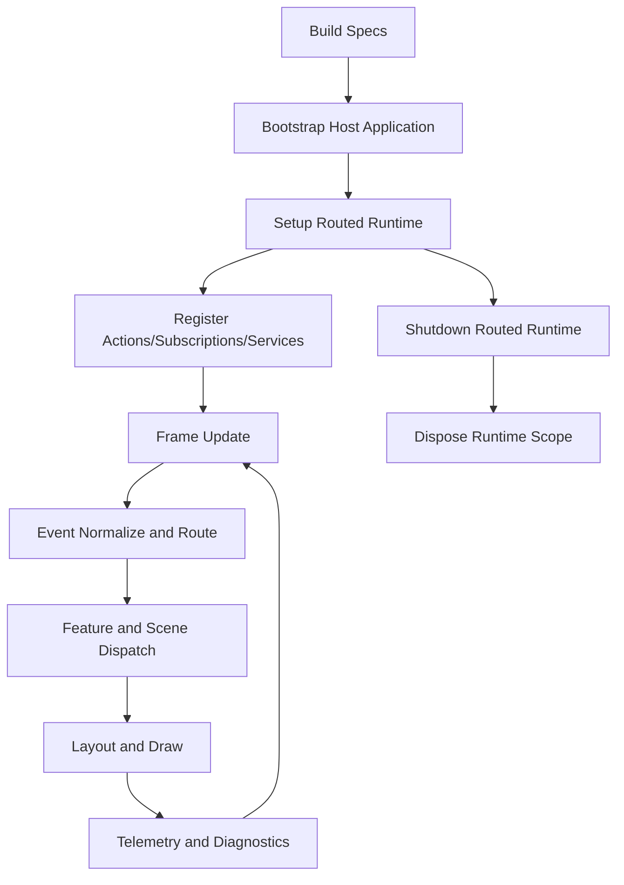

# gui_do Manual

## 1. Title and Purpose
[Back to Table of Contents](#table-of-contents)

This manual is the authoritative operational guide for building applications with `gui_do` using the current repository state.

Audience:
- Application developers integrating `gui_do` as a runtime and UI framework.
- Maintainers evolving feature/runtime APIs without breaking contracts.
- Demo authors using `demo_features` as consumer-side composition.

Intent:
- Explain what each major runtime system solves.
- Show how systems compose at runtime (bootstrap, bind, route, update, draw).
- Provide verified examples tied to code/tests/docs.
- Provide a complete API index derived from `gui_do.__all__` plus explicit notes for root exports intentionally omitted from `__all__`.

Design note:
- This manual follows a tri-lens model: theory, practice, and contract verification.

## 2. Table of Contents
[Back to Table of Contents](#table-of-contents)

- [1. Title and Purpose](#1-title-and-purpose)
- [2. Table of Contents](#2-table-of-contents)
- [3. How to Use This Manual](#3-how-to-use-this-manual)
- [4. Feature Organization Conventions](#4-feature-organization-conventions)
- [5. Conceptual Foundations (Theory)](#5-conceptual-foundations-theory)
- [6. Quickstart Path (Practice)](#6-quickstart-path-practice)
- [7. Architecture and Runtime Model](#7-architecture-and-runtime-model)
- [8. Core Workflow: Build, Bind, Route, Update, Draw](#8-core-workflow-build-bind-route-update-draw)
- [9. Main Systems Reference](#9-main-systems-reference)
  - [9.1 Application Bootstrap and Host Configuration](#91-application-bootstrap-and-host-configuration)
  - [9.2 Feature Lifecycle and Feature Types](#92-feature-lifecycle-and-feature-types)
  - [9.3 Events, Actions, Input Mapping, and Routing](#93-events-actions-input-mapping-and-routing)
  - [9.4 State and Observables](#94-state-and-observables)
  - [9.5 Controls and Control Composition](#95-controls-and-control-composition)
  - [9.6 Layout Systems](#96-layout-systems)
  - [9.7 Focus and Accessibility](#97-focus-and-accessibility)
  - [9.8 Overlays, Dialogs, Notifications, and Command Surfaces](#98-overlays-dialogs-notifications-and-command-surfaces)
  - [9.9 Scene, Window, and Task-Panel Presentation Models](#99-scene-window-and-task-panel-presentation-models)
  - [9.10 Scheduling, Timing, Animation, and Transitions](#910-scheduling-timing-animation-and-transitions)
  - [9.11 Persistence and Workspace/Session State](#911-persistence-and-workspacesession-state)
  - [9.12 Theme, Styling, and Visual Systems](#912-theme-styling-and-visual-systems)
  - [9.13 Text, Input, Forms, and Validation Systems](#913-text-input-forms-and-validation-systems)
  - [9.14 Data and Dataflow Helpers](#914-data-and-dataflow-helpers)
  - [9.15 Graphics and Audio Integration Points](#915-graphics-and-audio-integration-points)
  - [9.16 Telemetry, Introspection, and Operational Hooks](#916-telemetry-introspection-and-operational-hooks)
- [10. Integration Patterns and Composition Recipes](#10-integration-patterns-and-composition-recipes)
- [11. End-to-End Reference Application](#11-end-to-end-reference-application)
- [12. Testing, Diagnostics, and Reliability](#12-testing-diagnostics-and-reliability)
- [13. Performance and Scaling Guidance](#13-performance-and-scaling-guidance)
- [14. Migration, Versioning, and Deprecation Notes](#14-migration-versioning-and-deprecation-notes)
- [15. FAQ and Troubleshooting](#15-faq-and-troubleshooting)
- [16. Appendix](#16-appendix)
  - [Appendix A: Glossary](#appendix-a-glossary)
  - [Appendix B: Lifecycle and Event Routing Sequence](#appendix-b-lifecycle-and-event-routing-sequence)
  - [Appendix C: System Dependency Map](#appendix-c-system-dependency-map)
  - [Appendix D: API Quick Index by Topic](#appendix-d-api-quick-index-by-topic)
  - [Appendix D.1: Tier-to-System Reference Matrix](#appendix-d1-tier-to-system-reference-matrix)
  - [Appendix D.2: Public API Selection Heuristics](#appendix-d2-public-api-selection-heuristics)
  - [Appendix E: Architecture Templates](#appendix-e-architecture-templates)
  - [Appendix F: Specifications and Option Reference](#appendix-f-specifications-and-option-reference)
  - [Required Topical Coverage Matrix (38 Items)](#required-topical-coverage-matrix-38-items)

## 3. How to Use This Manual
[Back to Table of Contents](#table-of-contents)

Recommended reading paths:
- Onboarding path: Sections 3 -> 6 -> 8 -> 9.1 -> 9.2 -> 9.3 -> 9.9.
- Runtime operator path: Sections 7 -> 8 -> 12 -> 13 -> 14.
- Maintainer/contract path: Sections 7 -> 12 -> 16 (B, D, F).

Tri-lens framing:
- Theory: conceptual model and lifecycle ownership.
- Practice: concrete API patterns and examples.
- Contracts: test/doc evidence and failure boundaries.

Contract alignment:
- Public-surface intent: `docs/public_api_spec.md`.
- Runtime behavior contracts: `docs/runtime_operating_contracts.md`.
- Architecture and boundary rules: `docs/architecture.md`, `docs/library_demo_separation_contract.md`.

Example evidence notation used in this manual:
- Direct example: behavior is shown in tests/demo code.
- Inferred example: minimal, valid usage inferred from adjacent verified patterns.

## 4. Feature Organization Conventions
[Back to Table of Contents](#table-of-contents)

`demo_features/` is organized as consumer-side package code, not framework internals.

Conventions from `docs/demo_feature_layout.md`:
- Each feature/scene lives in its own folder package.
- Each folder has `__init__.py` for canonical exports.
- Keep `*_feature.py` and `*_specs.py` per feature package.
- Keep root `demo_features/` focused on `demo_config.py`, shared assets, and feature folders.

Why this matters:
- Keeps framework (`gui_do/`) and demo-consumer code (`demo_features/`) cleanly separated.
- Makes runtime wiring explicit in specs rather than dynamic package scanning.

## 5. Conceptual Foundations (Theory)
[Back to Table of Contents](#table-of-contents)

Problem framing:
- GUI runtimes often fail from unclear ownership, hidden wiring, and non-deterministic update ordering.
- `gui_do` addresses this with declarative specs, feature lifecycle boundaries, and scene-scoped systems.

Conceptual model:
- Data-driven runtime: specs declare behavior; runtime helpers materialize objects/wiring.
- Feature lifecycle: register, bind runtime, update, draw, teardown.
- Ownership discipline: runtime scopes own subscriptions/services and dispose on shutdown.

Operational behavior:
- Routed runtime setup is explicit via `setup_routed_runtime(...)`.
- Teardown is explicit via `shutdown_routed_runtime(...)` and runtime-scope dispose.

Key safety concepts:
- Automatic subscription ownership and cleanup via `FeatureRuntimeScope` cleanup bag.
- Scene-isolated runtime work and optional facilities per scene.
- Deterministic ordering policies for focus/key routing and scheduler budgets.

Direct evidence:
- `gui_do/features/runtime_facilities.py`
- `gui_do/features/data_driven_runtime.py`
- `tests/test_new_factory_utilities.py`

## 6. Quickstart Path (Practice)
[Back to Table of Contents](#table-of-contents)

Milestone path:
1. Define feature/window/action/runtime scene specs.
2. Build `HostApplicationConfig` and call `bootstrap_host_application(...)`.
3. Run with `GuiApplication.run_entrypoint(...)`.
4. Verify scene facilities (menu strip/task panel/palette) and key routing.

Minimal baseline example (inferred from verified runtime patterns):

```python
from gui_do import (
    FeatureSpec,
    RuntimeSceneSpec,
    HostApplicationConfig,
    bootstrap_host_application,
    build_host_application_config,
)

feature_specs = (
    FeatureSpec(name="main", feature_cls=None),
)
runtime_scenes = (
    RuntimeSceneSpec(scene_name="main"),
)

config: HostApplicationConfig = build_host_application_config(
    feature_specs=feature_specs,
    runtime_scene_specs=runtime_scenes,
)
app, host = bootstrap_host_application(config)
app.run_entrypoint(target_fps=120)
```

Expected behavior:
- Host/app are constructed with scene/runtime managers.
- Runtime scene setup is applied in deterministic startup flow.

Caution:
- Always keep scene names consistent across specs and bindings.
- Do not rely on star imports as API contract (`docs/public_api_spec.md`).

## 7. Architecture and Runtime Model
[Back to Table of Contents](#table-of-contents)

Boundary model:
- `gui_do/` is framework runtime.
- `demo_features/` is consumer integration.
- Enforcement by boundary tests (`tests/test_boundary_contracts.py`).

Tier model:
- Runtime exports are organized in `gui_do/__init__.py` with tiered grouping.
- Generation-time public API coverage is based on `__all__` plus root-export caution notes for non-`__all__` families.

Runtime guarantees:
- Canonical event normalization to `GuiEvent`.
- Scene-scoped update execution.
- Deterministic routing and constrained scheduler budgets.

Event pipeline model:
- Input normalization -> action mapping -> feature/system handlers -> scene/window dispatch -> overlays/focus mediation.

Why this model scales:
- Separate concerns by system family.
- Keep runtime ownership explicit.
- Preserve predictable frame-time behavior.

## 8. Core Workflow: Build, Bind, Route, Update, Draw
[Back to Table of Contents](#table-of-contents)

Build:
- Declare specs (`FeatureSpec`, `WindowSpec`, `RuntimeSceneSpec`, `ActionSpec`, etc.).

Bind runtime:
- `setup_routed_runtime(feature, host, runtime_spec)` wires services/effects/operations/subscriptions.

Route:
- `ActionManager`, `InputMap`, `EventBus`, command palette/global keys, and scene scopes coordinate routing.

Update:
- Scheduler/timers/tweens/cooperative jobs run scene-scoped.

Draw:
- Scene render path plus overlays and optional chrome; bounded-area-aware layout.

Teardown:
- `shutdown_routed_runtime(...)` unbinds subscriptions and disposes runtime scope.

Direct evidence:
- `tests/test_new_factory_utilities.py`
- `tests/test_scene_command_palette_bindings.py`

## 9. Main Systems Reference
[Back to Table of Contents](#table-of-contents)

### 9.1 Application Bootstrap and Host Configuration
[Back to Table of Contents](#table-of-contents)

What and why:
- Bootstraps app/host from declarative config with consistent runtime wiring.

Primary APIs:
- `HostApplicationConfig`, `TelemetryConfig`, `bootstrap_host_application`, `build_host_application_config`.

Typical flow:
- Build config -> bootstrap -> optional prewarm -> run.

Advanced path:
- Include routed runtime binding specs and per-scene optional facilities.

Common mistakes:
- Missing scene linkage between runtime scene specs and feature bindings.

Diagnostics:
- Start with `tests/test_new_factory_utilities.py` and `tests/test_public_api_exports.py`.

### 9.2 Feature Lifecycle and Feature Types
[Back to Table of Contents](#table-of-contents)

What and why:
- Feature classes provide runtime ownership boundaries and composable behavior.

Primary APIs:
- `Feature`, `DirectFeature`, `LogicFeature`, `RoutedFeature`, `FeatureManager`, `SceneSetupSpec`.

Minimal example (inferred):

```python
from gui_do import RoutedFeature, RoutedRuntimeSpec, setup_routed_runtime, shutdown_routed_runtime

class MyFeature(RoutedFeature):
    def bind_runtime(self, host):
        spec = RoutedRuntimeSpec(scene_name="main")
        self.scheduler = setup_routed_runtime(self, host, spec)

    def shutdown_runtime(self, host):
        shutdown_routed_runtime(self, host, RoutedRuntimeSpec(scene_name="main"))
```

Advanced pattern:
- Use `FeatureRuntimeScope` to own service graph and cleanup tasks.

Pitfalls:
- Not disposing runtime scope leads to stale subscriptions.

### 9.3 Events, Actions, Input Mapping, and Routing
[Back to Table of Contents](#table-of-contents)

What and why:
- Coordinates normalized events and action dispatch paths.

Primary APIs:
- `GuiEvent`, `EventManager`, `EventBus`, `ActionManager`, `ActionRegistry`, `InputMap`, `KeyChordManager`.

Verified behavior:
- Global palette keys are tested before focus/active-window/screen handlers when configured through routed runtime.

Minimal verified pattern (from tests):

```python
from gui_do import SceneCommandPaletteSpec, PaletteInputBindSpec

spec = SceneCommandPaletteSpec(
    scene_name="main",
    toggle=PaletteInputBindSpec(action_name="command_palette_toggle", key=116),
    action=PaletteInputBindSpec(action_name="command_palette_action", pointer_button=2),
)
```

Pitfalls:
- Event objects may lack pointer position; command-palette action binds should fallback to logical pointer position.

### 9.4 State and Observables
[Back to Table of Contents](#table-of-contents)

What and why:
- Provides reactive state primitives and transactional state store options.

Primary APIs:
- `ObservableValue`, `PresentationModel`, `ComputedValue`, `ObservableList`, `ObservableDict`, `Binding`.
- Advanced store APIs: `AppStateStore`, `StateSelector`, `StateTransaction`.

Verified transactional pattern:

```python
from gui_do import AppStateStore

store = AppStateStore({"status": "idle", "count": 1})
store.dispatch({"status": "running"})
snapshot = store.snapshot()
```

Pitfalls:
- Selector dependencies (`depends_on`) should be declared for efficient recalculation.

### 9.5 Controls and Control Composition
[Back to Table of Contents](#table-of-contents)

What and why:
- Control layer provides reusable primitives and composites for structured UI building.

Primary APIs:
- Core controls (Tier 12): panel/label/button/toggle/slider/canvas/tab.
- Extended controls (Tier 13): text inputs, grids, trees, splitters, window/task panel chrome, toolbar/status, chip input.

Advanced composition helpers:
- `place_control`, `place_control_unlabeled`, `register_placed_control`, `build_multi_column_grid_specs`.

Pitfalls:
- Keep scene chrome controls (menu strip/task panel) in correct scope (scene vs window).

### 9.6 Layout Systems
[Back to Table of Contents](#table-of-contents)

What and why:
- Multiple layout strategies: constraint/flex/grid/flow/dock/viewport plus scene window layout handler.

Primary APIs:
- `ConstraintLayout`, `FlexLayout`, `GridLayout`, `FlowLayout`, `DockWorkspace`, `WindowLayoutHandler`.
- Adaptive v2 APIs: `ConstraintAttr`, `LayoutConstraint`, `ConstraintSet`, `AdaptivePolicy`, `resolve_adaptive_policy`.

Automatic window layout APIs:
- `set_window_layout_enabled(enabled, relayout=True, scene_name=None)`
- `is_window_layout_enabled(scene_name=None)`
- `toggle_window_layout_enabled(relayout=True, scene_name=None)`
- Compatibility aliases: `set_window_tiling_enabled`, `is_window_tiling_enabled`, `toggle_window_tiling_enabled`

Operational contract:
- Disabled layout: automatic relayout and automatic interference stop.
- Enabled layout: raise/lower relayout all windows through handler.
- Explicit one-time relayout: `tile_windows(..., force=True)` runs forced path.

Verified usage (direct pattern):

```python
# F3-style explicit one-time relayout
app.tile_windows(as_visibility_event=True, force=True)
```

Cross-link:
- See [9.9 Scene, Window, and Task-Panel Presentation Models](#99-scene-window-and-task-panel-presentation-models).

### 9.7 Focus and Accessibility
[Back to Table of Contents](#table-of-contents)

What and why:
- Focus systems and accessibility trees ensure keyboard and assistive consistency.

Primary APIs:
- `FocusManager`, `FocusScopeManager`, `WindowFocusManager`, `FocusRing`.
- Accessibility APIs: `AccessibilityTree`, `AccessibilityNode`, `AccessibilityRole`, `AccessibilityBus`, `LivePoliteness`.

Advanced notes:
- Visibility transitions clear focus on entry to avoid stale focus-hint rendering.
- Use `AccessibilityBus` for live announcements with politeness levels.

### 9.8 Overlays, Dialogs, Notifications, and Command Surfaces
[Back to Table of Contents](#table-of-contents)

What and why:
- Handles transient UX surfaces and command interaction layers.

Primary APIs:
- `OverlayManager`, `DialogManager`, `ToastManager`, `TooltipManager`, `ContextMenuManager`, `CommandPaletteManager`, `NotificationCenter`.

Command palette two-bind model:
- `SceneCommandPaletteSpec.toggle` controls open/close bind.
- `SceneCommandPaletteSpec.action` controls action-at-pointer while open.
- Each bind may have key, pointer button, or both.

Behavior details:
- Pointer action uses event position when present; otherwise fallback to `app.logical_pointer_pos`.
- Action activation path should avoid follow-up suppression lockups.

Unified menu-strip model:
- Use one unified menu-strip narrative (`MenuStripControl` + `MenuStripSpec`) rather than split/legacy models.

### 9.9 Scene, Window, and Task-Panel Presentation Models
[Back to Table of Contents](#table-of-contents)

What and why:
- Defines per-scene optional facilities and unified window visibility behavior.

Primary APIs:
- `SceneTaskPanelSpec`, `TaskPanelButtonSpec`, `TaskPanelFocusToggleSpec`.
- `TaskPanelWindowToggleGroupSpec(flow_start_slot, flow_slot_assignments, panel_rect_overrides)`.
- `SceneTaskPanelItemsResult.window_toggle_placements` with `TaskPanelWindowTogglePlacement` records.
- `GuiApplication.bounded_area_rect(scene_name=None)`.

Task-panel window-toggle placement guidance:
- Non-linear placement: use `panel_rect_overrides` for explicit panel-relative rectangles.
- Slot-flow fallback: windows without explicit override use `flow_start_slot` and optional `flow_slot_assignments`.

Verified direct example:

```python
from gui_do import TaskPanelWindowToggleGroupSpec

group = TaskPanelWindowToggleGroupSpec(
    panel_rect_overrides={
        "first": (20, 8, 100, 24),
        "second": (138, 8, 110, 24),
    },
    flow_start_slot=1,
)
```

Identity/geometry reporting guidance:
- `window_toggle_placements` returns panel-relative `Rect` geometry.
- Rect semantics are panel-local; they intentionally ignore task-panel auto-hide movement offsets.

Unified visibility model:
- Task panel, menu strip Windows menu, and command palette window entries should remain synchronized when present.

Raise/lower and relayout interaction:
- `raise_window(...)` and `lower_window(...)` route through layout handler when enabled.
- `tile_windows(..., force=True)` performs explicit forced relayout independent of enabled state.

### 9.10 Scheduling, Timing, Animation, and Transitions
[Back to Table of Contents](#table-of-contents)

Primary APIs:
- `TaskScheduler`, `Timers`, `TweenManager`, `TransitionManager`, `AnimationSequence`, `SceneTimeline`, `CooperativeScheduler`.

Why it exists:
- Centralized frame-safe timing, animation orchestration, and cooperative background work.

Tradeoffs:
- Cooperative systems reduce frame spikes but require disciplined coroutine design.

Pitfalls:
- Long unyielding tasks starve frame loop.

### 9.11 Persistence and Workspace/Session State
[Back to Table of Contents](#table-of-contents)

Primary APIs:
- `WorkspacePersistenceManager`, `WorkspaceState`, `SceneSnapshot`, `NodeSnapshot`, `DEFAULT_WORKSPACE_STATE_PATH`.
- Snapshot/migration APIs: `SchemaVersion`, `VersionedSnapshot`, `MigrationRegistry`, `SnapshotMigrator`.

Path resolution behavior:
- Several file/path APIs resolve relative paths against process current working directory when not absolute (for example asset/image/cursor paths).

Migration pattern (inferred from verified classes):

```python
from gui_do import MigrationRegistry, SnapshotMigrator

registry = MigrationRegistry()
migrator = SnapshotMigrator(registry)
```

### 9.12 Theme, Styling, and Visual Systems
[Back to Table of Contents](#table-of-contents)

Primary APIs:
- `ThemeManager`, `ColorTheme`, `FontManager`, `FontRoleRegistry`, `ScopedThemeManager`, `DesignTokens`.
- Theme invalidation: `ThemeInvalidationBus`.

Theme invalidation contract:
- On theme switch, invalidate visual caches through registered callbacks.

Common mistake:
- Not unsubscribing theme invalidation callbacks when feature/control is disposed.

### 9.13 Text, Input, Forms, and Validation Systems
[Back to Table of Contents](#table-of-contents)

Text/localization APIs:
- `TextFormatter`, `TextFlow`, `TextSearcher`, `StringTable`, `LocaleRegistry`.

Forms/validation APIs:
- `FormModel`, `FormSchema`, validators, `AsyncFieldValidator`, `AsyncFormValidator`.
- Schema runtime: `FieldSchema`, `FieldGraphSchema`, `ValidationPolicy`, `SchemaFormRuntime`.

Async form validation flow:
- Local validation immediate.
- Async checks debounced.
- Update loop flushes async results and drives UI state.

Example (directly aligned with tests):

```python
from gui_do.forms.async_form_validator import AsyncFormValidator

form = AsyncFormValidator(validators)
form.update(0.016)
```

### 9.14 Data and Dataflow Helpers
[Back to Table of Contents](#table-of-contents)

Primary APIs:
- Collection/data helpers: `VirtualItemSource`, `SortFilterProxySource`, `AsyncDataProvider`, `ObjectPool`, `DataCache`, `ListDiffCalculator`.
- Dataflow pipeline: `CancellationToken`, `PipelineStage`, `DataflowPipeline`, `PipelineHandle`.
- Service graph: `ServiceKey`, `ServiceScope`, `ScopeStack`.

Cancelable pipeline behavior:
- Pipelines support cancellation tokens, generation guards, stage composition, and handle-based completion reporting.

Pitfalls:
- Failing to cancel stale handles can surface outdated results.

### 9.15 Graphics and Audio Integration Points
[Back to Table of Contents](#table-of-contents)

Graphics APIs:
- `RenderTarget`, `LiveRenderTarget`, `OffscreenRenderTarget`, `DrawContext`, `DrawPhase`, `SceneGraph2D`, `ParticleSystem`, `TileMap`, `SurfaceCompositor`, `DebugOverlay`, `AssetRegistry`.

Audio APIs:
- `SoundCue`, `SoundBankRegistry`, `SoundEventBus`.

Why this chapter exists:
- Graphics and audio are high-variance integrations; this chapter keeps boundary guidance explicit.

Practical pattern (inferred):

```python
from gui_do import SoundCue, SoundBankRegistry, SoundEventBus

bank = SoundBankRegistry()
# register cues in bank, then emit semantic event names from UI actions
bus = SoundEventBus(bank)
bus.emit("button.click")
```

### 9.16 Telemetry, Introspection, and Operational Hooks
[Back to Table of Contents](#table-of-contents)

Telemetry APIs:
- `TelemetryCollector`, `TelemetrySample`, `configure_telemetry`, `telemetry_collector`, telemetry analyzers.

Introspection/inspection APIs:
- `SceneSpatialIndex`, `PropertyRegistry`, `ui_property`, `PropertyInspectorModel`.

Operational hooks:
- Runtime helper families in Tier 18 (presenter/tab helpers, host-action helpers, setup/shutdown helpers).

Guidance:
- Keep operational hooks additive and deterministic; avoid bypassing lifecycle ownership.

## 10. Integration Patterns and Composition Recipes
[Back to Table of Contents](#table-of-contents)

Recipe A: Routed runtime + state store + command palette
- Use `RoutedRuntimeSpec` to bind store selectors/effects and palette bindings.
- Route global palette toggle key for reliable access.

Recipe B: Scene optional facilities with unified visibility
- Add `SceneTaskPanelSpec` + `MenuStripSpec` + `SceneCommandPaletteSpec`.
- Ensure window entries share one presentation model.

Recipe C: Async forms + schema runtime + undo contexts
- Use `SchemaFormRuntime` for visibility/dependencies.
- Use `AsyncFormValidator` for debounced remote checks.
- Route edits through `UndoContextManager` named stacks.

Recipe D: Virtualized data view + dataflow pipeline
- `VirtualizationCore` manages visible windows/recycling.
- `DataflowPipeline` handles staged loading/transforms with cancellation.

## 11. End-to-End Reference Application
[Back to Table of Contents](#table-of-contents)

Reference path:
- `gui_do_demo.py` with `demo_features/demo_config.py` and feature packages.

Checklist:
1. Scene bootstrap and host config compile.
2. Routed runtime setup/shutdown are symmetric.
3. Optional facilities instantiate only when declared.
4. Window relayout behavior matches enabled/forced contract.
5. Palette two-bind interactions work with pointer fallback.
6. Async validation and state selectors update deterministically.
7. Accessibility tree and announcements produce expected snapshots/events.
8. Theme switch invalidates visual caches.

## 12. Testing, Diagnostics, and Reliability
[Back to Table of Contents](#table-of-contents)

Contract tests to run:
- `tests/test_public_api_exports.py`
- `tests/test_public_api_docs_contracts.py`
- `tests/test_runtime_operating_contracts.py`
- `tests/test_boundary_contracts.py`

High-signal system tests:
- `tests/test_demo_feature_abstractions.py`
- `tests/test_new_factory_utilities.py`
- `tests/test_scene_command_palette_bindings.py`
- `tests/test_scene_chrome_contracts.py`
- `tests/test_window_layout_handler_single_window_animation.py`

Maintainer diff checklist:
1. Did any `gui_do/__init__.py` export move tiers or naming?
2. Are docs and tests updated for runtime contract changes?
3. Are scene-optional facilities still optional with no implicit creation?
4. Does teardown ownership remain complete (subscriptions/disposables/services)?
5. Do relayout semantics still respect disable/enable/force paths?

## 13. Performance and Scaling Guidance
[Back to Table of Contents](#table-of-contents)

Principles:
- Keep per-frame work scene-scoped.
- Use bounded scheduler budgets and prewarm jobs for first-frame smoothness.
- Prefer virtualization/object pooling for large datasets.
- Use dirty-region and explicit invalidation patterns.

Scaling tips:
- Use `VirtualizationCore` for list/tree/grid windows.
- Use `DataCache` and `ObjectPool` to cap allocations.
- Keep operation bus handlers short or deferred.

Anti-patterns:
- Large synchronous handlers in input/action path.
- Recomputing full layout when only targeted force path is needed.

## 14. Migration, Versioning, and Deprecation Notes
[Back to Table of Contents](#table-of-contents)

Versioning model:
- Root `gui_do` import is consumer contract surface.
- Snapshot versioning/migration uses `SchemaVersion` + migration graph.

Deprecation guidance:
- Prefer compatibility aliases only as temporary bridge (`*_window_tiling_enabled` aliases to layout APIs).
- Keep docs and tests synchronized when replacing terminology.

Migration workflow:
1. Register migration steps in `MigrationRegistry`.
2. Validate path with `SnapshotMigrator.can_migrate(...)`.
3. Apply migration and verify with state/schema tests.

## 15. FAQ and Troubleshooting
[Back to Table of Contents](#table-of-contents)

Q: Why do my windows stop auto-reflowing?
- `is_window_layout_enabled(scene_name=...)` may be false.
- Use `toggle_window_layout_enabled(...)` to re-enable.
- For one-off reflow, call `tile_windows(..., force=True)`.

Q: Why does command palette action click miss pointer location?
- Ensure action bind uses logical-pointer fallback when event position is missing.

Q: Why is my task panel toggle geometry off while auto-hide is animating?
- `window_toggle_placements` are panel-relative geometry records and intentionally not offset by auto-hide movement.

Q: Why are accessibility announcements not visible?
- Verify `AccessibilityBus` subscribers and politeness levels.

Q: Why does theme switch leave stale visuals?
- Register relevant controls/features with `ThemeInvalidationBus`.

## 16. Appendix
[Back to Table of Contents](#table-of-contents)

### Appendix A: Glossary
[Back to Table of Contents](#table-of-contents)

- Routed runtime: spec-driven feature wiring phase.
- Runtime scope: ownership scope for services/subscriptions/disposables.
- Optional facility: per-scene feature that only exists when declared.
- Forced relayout: explicit call path bypassing disabled-layout guard.
- Panel-relative geometry: coordinates relative to task-panel control rect.

### Appendix B: Lifecycle and Event Routing Sequence
[Back to Table of Contents](#table-of-contents)



### Appendix C: System Dependency Map
[Back to Table of Contents](#table-of-contents)

- App runtime depends on events/data/scheduling/layout/theme/overlays.
- Feature runtime composes actions/event bus/state/services.
- Scene chrome (menu/task/palette) depends on action routing + window presentation.
- Diagnostics span telemetry + introspection + contract tests.

### Appendix D: API Quick Index by Topic
[Back to Table of Contents](#table-of-contents)

The following index is generated from the current `gui_do.__all__` grouping in `gui_do/__init__.py`.

#### Tier 1: PRIMARY ENTRY POINTS
Feature, DirectFeature, LogicFeature, RoutedFeature, FeatureMessage, FeatureManager, ScenePresentationModel, SceneSetupSpec, setup_standard_font_roles, FeatureSpec, WindowSpec, WindowEffectsSpec, RuntimeSceneSpec, ActionSpec, StaticAccessibilitySpec, CursorSpec, SceneRootSpec, AnchoredWindowSpec, LogicBindingSpec, TaskPanelButtonSpec, TaskPanelWindowToggleGroupSpec, TaskPanelWindowTogglePlacement, PaletteInputBindSpec, SceneCommandPaletteSpec, ActionHotkeySpec, ControlKeyBindingSpec, SceneTaskPanelSpec, TaskPanelSlotLayoutSpec, TaskPanelSceneNavButtonSpec, EventSubscriptionSpec, ServiceBindingSpec, ServiceConsumerSpec, StoreSubscriptionSpec, StoreSelectorSpec, ObservableEffectSpec, SignalEffectSpec, FailurePolicySpec, FeatureOperationSpec, ShortcutOverlaySpec, TaskPanelFocusToggleSpec, GlobalPointerActionSpec, FeatureDependencySpec, ExecutionContextSpec, WorkloadBudgetClassSpec, WorkloadBudgetSpec, CheckpointDomainSpec, CheckpointSpec, SagaStepSpec, SagaSpec, ReactiveSourceSpec, ReactiveNodeSpec, ReactiveGraphSpec, MigrationStepSpec, MigrationTargetSpec, ContractMigrationSpec, RuntimePolicySpec, EffectBindingSpec, EventPipelineStageSpec, EventPipelineSpec, DurableOperationBindingSpec, DurableOperationQueueSpec, DurableQueueRecord, CapabilityProviderSpec, CapabilityRequirementSpec, ProjectionNodeSpec, ProjectionSpec, PolicyDecision, WorkflowStepSpec, WorkflowSpec, RecomputeNodeSpec, QoSPolicySpec, HealthProbeSpec, ReplaySpec, ReplacePolicySpec, WorkflowCoordinator, RuntimePolicyEngine, EffectLifetimeOrchestrator, EventPipelineRuntime, DurableOperationQueueRuntime, CapabilityContractRuntime, ProjectionRuntime, RecomputeOrchestrator, QoSPolicyRuntime, FeatureHealthRuntime, RuntimeReplayHarness, FeatureHotSwapManager, ExecutionContextRuntime, WorkloadBudgetBrokerRuntime, CheckpointRecoveryRuntime, SagaCompensationRuntime, ReactiveDependencyGraphRuntime, ContractMigrationRuntime, RoutedRuntimeSpec, RoutedFeatureLifecycleSpec, FeatureWindowBundleBindingSpec, WindowToggleBindingSpec, SceneSetupBindingSpec, RuntimeSceneBindingSpec, SceneRootBindingSpec, CursorBindingSpec, FontRoleBindingSpec, ActionBindingSpec, PaletteBindingSpec, SceneBundleBindingSpec, HostApplicationBindingSpec, TabbedPresenterSpec, AccessibilitySequenceSpec, TabBuilderSpec, NotificationSpec, HostApplicationConfig, TelemetryConfig, bootstrap_host_application, build_notification_center, make_window_toggle_spec, make_scene_nav_action, make_exit_action, make_palette_toggle_action, make_static_accessibility_spec, build_feature_specs, build_feature_window_bundle_specs, build_window_toggle_specs, build_scene_setup_specs, build_runtime_scene_specs, build_scene_root_specs, build_cursor_specs, build_font_role_specs, build_scene_nav_actions, build_action_specs, build_scene_bundle_specs, build_static_accessibility_specs, build_host_application_config

#### Tier 2: CORE APPLICATION
GuiApplication, create_display, SceneTransitionManager, SceneTransitionStyle, apply_scene_setup_specs

#### Tier 3: DATA & STATE
ObservableValue, PresentationModel, ComputedValue, InvalidationTracker, ChangeKind, CollectionChange, ObservableList, ObservableDict, CollectionViewQuery, CollectionView, Binding, BindingGroup, ObservableStream, SelectionModel, SelectionMode

#### Tier 4: EVENTS & ACTIONS
EventPhase, EventType, GuiEvent, ValueChangeCallback, ValueChangeReason, EventManager, EventBus, GestureRecognizer, EventRecorder, EventPlayback, RecordedEvent, InputSnapshot, Signal, SignalConnection, ActionManager, ActionContext, ActionMiddleware, ActionDescriptor, ActionRegistry, InputMap, InputBinding, KeyChordManager, KeyChord, ChordStep, FocusManager, FocusScope, FocusScopeManager, WindowFocusManager, FocusRing

#### Tier 5: SCHEDULING
TaskEvent, TaskScheduler, Timers, TweenManager, TweenHandle, Easing, AnimationSequence, AnimationHandle, TransitionManager, TransitionSpec, TransitionEvent, AnimationStateMachine, AnimationTransitionMode, SceneTimeline, Debouncer, Throttler, CooperativeScheduler, CoroutineHandle, Pause, Sleep, WaitForEvent, WaitForSignal, WaitUntil, WaitForAll

#### Tier 6: THEME
FontManager, FontRoleRegistry, ColorTheme, ThemeManager, DesignTokens, ScopedTheme, ScopedThemeManager

#### Tier 7: TELEMETRY
TelemetryCollector, TelemetrySample, configure_telemetry, telemetry_collector, analyze_telemetry_log_file, analyze_telemetry_records, load_telemetry_log_file, render_telemetry_report

#### Tier 8: LAYOUT
LayoutAxis, ConstraintLayout, AnchorConstraint, DockPane, DockTabs, DockSplit, DockWorkspace, FlexLayout, FlexItem, FlexDirection, FlexAlign, FlexJustify, GridLayout, GridTrack, GridPlacement, LayoutAnimator, LayoutPass, MeasureContext, ArrangeContext, LayoutRoot, FlowLayout, FlowItem, Viewport

#### Tier 9: OVERLAYS
OverlayManager, OverlayHandle, Alignment, PlacementResult, PopupPlacement, Side, compute_popup_rect, DialogManager, DialogHandle, ToastManager, ToastHandle, ToastSeverity, ContextMenuManager, ContextMenuItem, ContextMenuHandle, CommandPaletteManager, CommandEntry, CommandPaletteHandle, TooltipManager, TooltipHandle, MenuBarManager, FileDialogManager, FileDialogOptions, FileDialogHandle, NotificationCenter, NotificationRecord, ResizeManager, CursorManager, CursorHandle, CursorShape, DragDropManager, DragPayload, ClipboardManager, TransferData, TransferManager, ShortcutHelpOverlay, ShortcutSection, ShortcutEntry

#### Tier 10: FORMS
FormModel, FormField, ValidationRule, FieldError, FormSchema, SchemaField, DocumentModel, WizardFlow, WizardStep, WizardHandle, ValidationResult, Validator, RequiredValidator, RangeValidator, LengthValidator, PatternValidator, CustomValidator, DependentValidator, ValidationPipeline

#### Tier 11: STATE
CommandHistory, Command, CommandTransaction, StateMachine, HierarchicalStateMachine, Router, RouteEntry, SettingsRegistry, SettingDescriptor, WorkspaceState, WorkspacePersistenceManager, DEFAULT_WORKSPACE_STATE_PATH, SceneSnapshot, NodeSnapshot

#### Tier 12: PRIMARY CONTROLS
PanelControl, LabelControl, ButtonControl, ToggleControl, SliderControl, ScrollbarControl, CanvasControl, CanvasEventPacket, CanvasViewport, FrameControl, ImageControl, ArrowBoxControl, ButtonGroupControl, TabControl, TabItem, DockWorkspacePanel

#### Tier 13: EXTENDED CONTROLS
TextInputControl, TextAreaControl, RichLabelControl, DropdownControl, DropdownOption, ListViewControl, ListItem, OverlayPanelControl, DataGridControl, GridColumn, GridRow, TreeControl, TreeNode, SplitterControl, SpinnerControl, RangeSliderControl, ColorPickerControl, ScrollViewControl, ProgressBarControl, AnimatedImageControl, ErrorBoundary, WindowControl, TaskPanelControl, WindowPresenter, MenuStripControl, MenuEntry, SceneMenuOptions, WindowMenuOptions, NotificationPanelControl, PropertyInspectorPanel, ToolbarControl, ToolbarItem, StatusBarControl, StatusSlot, ExpanderControl, DatePickerControl, TimePickerControl, BreadcrumbControl, BreadcrumbItem, SplitButtonControl, SplitButtonOption, ChipInputControl

#### Tier 14: TEXT
TextFormatter, NumericFormatter, PatternFormatter, FixedPatternFormatter, TextFlow, TextSpan, TextSearcher, TextMatch, StringTable, LocaleRegistry

#### Tier 15: DATA
VirtualItemSource, FixedItemSource, SortFilterProxySource, AsyncDataProvider, LoadState, LoadStateKind, ObjectPool, DataCache, CacheStats, ListDiffCalculator, ListDiff, DiffInsert, DiffRemove, DiffMove

#### Tier 16: GRAPHICS
BuiltInGraphicsFactory, DirtyRegionTracker, DrawContext, DrawPhase, AssetRegistry, DebugOverlay, SurfaceCompositor, Layer, ShapeRenderer, SurfaceEffects, VectorPath, SpriteSheet, FrameAnimation, ParticleSystem, Emitter, ParticleLayer, TileSet, TileMap

#### Tier 17: INTROSPECTION
SceneSpatialIndex, ui_property, PropertyDescriptor, PropertyRegistry, property_registry, PropertyInspectorModel, InspectedProperty

#### Tier 18: ADVANCED RUNTIME
FrameTimer, TabPanelManager, WindowRelativeRect, resolve_scene_selection_callback, minimize_window_menu_entries, set_window_visible_state, toggle_window_visibility, create_anchored_feature_window, add_window_menu_strip, split_slot_bounds, place_control, place_control_unlabeled, register_placed_control, add_group_label, PlacedControl, make_labeled_slot_height_fn, apply_category_visibility, ControlRegistry, RowCellSpec, build_horizontal_row_specs, build_multi_column_grid_specs, build_tools_menu_entries, add_standard_menu_strip, add_menu_strip_from_spec, apply_accessibility_sequence, apply_accessibility_sequence_from_attrs, register_companion_logic_features, ensure_scene_scheduler, sorted_window_bindings, collect_window_toggle_controls, apply_window_toggle_accessibility, add_window_toggle_task_panel_controls, add_task_panel_window_toggle_group, setup_scene_command_palette_bindings, register_window_toggle_tooltips, initialize_locale_registry, bind_input_map_actions, register_descriptors, resolve_canvas_local_point, apply_runtime_scene_pristine_assets, bind_runtime_scene_exit_keys, prewarm_runtime_scenes, add_task_panel_button, add_task_panel_buttons, register_tooltip_specs, register_action_hotkeys, register_global_pointer_actions, draw_controls_prewarm, bind_palette_window_action_bind, ensure_scene_task_panel, create_task_panel_slot_layout, add_task_panel_scene_nav_button, add_scene_task_panel_items, centered_overlay_rect, create_shortcut_help_overlay, bind_feature_event_subscription, unbind_feature_event_subscription, setup_routed_runtime, FeatureOperationBus, FeatureOperationContext, FeatureOperationHandle, FeatureRuntimeScope, shutdown_routed_runtime, bind_task_panel_focus_toggle, add_window_control, add_window_label, add_window_button, add_window_button_row, instantiate_features_from_specs, register_features_from_specs, register_window_presentation_specs, register_window_tab_builders, build_tab_builder_specs, create_tab_control_from_specs, compute_tabbed_window_layout, setup_feature_presenter_tabs_from_window_content, register_window_tab_builder_specs, setup_feature_presenter_tabs, register_tab_update_handlers, create_presented_anchored_window, create_presented_window_from_spec, create_feature_presented_window, configure_routed_feature_runtime, register_routed_feature_companions, bind_routed_feature_lifecycle, shutdown_routed_feature_lifecycle, ActiveTabUpdateRouter, TabLayoutContext, declare_host_actions, build_host_main_tab_order, apply_host_main_accessibility

#### Tier 19: INFRASTRUCTURE
UiEngine

#### Tier 25: SCOPED SERVICE GRAPH
ServiceKey, ServiceScope, ScopeStack

#### Tier 26: CANCELABLE DATAFLOW PIPELINE
CancellationToken, PipelineStage, DataflowPipeline, PipelineHandle

#### Tier 27: TRANSACTIONAL APP STATE STORE
AppStateStore, StateSelector, StateTransaction

#### Tier 28: ADAPTIVE CONSTRAINT LAYOUT v2
ConstraintAttr, LayoutConstraint, ConstraintSet, AdaptivePolicy, resolve_adaptive_policy

#### Tier 29: UNIFIED VIRTUALIZATION CORE
MeasureMode, MeasurePolicy, VirtualizedWindow, RecyclePool, VirtualizationCore

#### Tier 30: INTERACTION STATE MACHINE FRAMEWORK
InteractionPhase, InteractionContext, InteractionTransition, InteractionStateMachine

#### Tier 31: SCHEMA-DRIVEN FORM RUNTIME
FieldSchema, FieldGraphSchema, ValidationPolicy, SchemaFormRuntime

#### Tier 32: PORTABLE SNAPSHOT & MIGRATION LAYER
SchemaVersion, VersionedSnapshot, MigrationStep, MigrationRegistry, SnapshotMigrator, MigrationError, make_snapshot, read_version

Additional root-exported families currently imported at package root but intentionally omitted from `__all__`:
- Tier 20 Audio: `SoundCue`, `SoundBankRegistry`, `SoundEventBus`
- Tier 21 Accessibility: `AccessibilityRole`, `LivePoliteness`, `AccessibilityNode`, `AccessibilityTree`, `AccessibilityAnnouncement`, `AccessibilityBus`
- Tier 22 Theme invalidation: `ThemeInvalidationBus`
- Tier 23 Undo context routing: `UndoContextManager`
- Tier 24 Async form validation: `AsyncFieldValidator`, `AsyncFormValidator`

### Appendix D.1: Tier-to-System Reference Matrix
[Back to Table of Contents](#table-of-contents)

- Tier 1: declarative bootstrap and runtime specs.
- Tier 2-11: core app/events/state/scheduling/theme/telemetry/layout/overlays/forms/state-machine/persistence.
- Tier 12-13: primary and extended control families.
- Tier 14-17: text/data/graphics/introspection specialized systems.
- Tier 18: advanced runtime wiring and helper families.
- Tier 19: infrastructure engine hook.
- Tier 20-24: specialized but not `__all__`-listed advanced public families.
- Tier 25-32: advanced typed runtime infrastructure families.

### Appendix D.2: Public API Selection Heuristics
[Back to Table of Contents](#table-of-contents)

- Prefer Tier 1 APIs for new app bootstrap and declarative runtime composition.
- Use Tier 18 helpers only when extending host/runtime behavior beyond defaults.
- Use Tier 20-24 systems when needed, but treat them as specialized subsystems.
- Treat Tier 19 (`UiEngine`) as infrastructure hook, not normal app entrypoint.

### Appendix E: Architecture Templates
[Back to Table of Contents](#table-of-contents)

Template 1: Small app
- One scene, one routed feature, minimal optional facilities.

Template 2: Multi-scene app
- Scene bundle specs + navigation actions + per-scene optional chrome.

Template 3: Data-heavy app
- Virtualization core + dataflow pipeline + app-state store + undo contexts.

Template 4: Ops-focused app
- Telemetry hooks + introspection + contract test gate.

### Appendix F: Specifications and Option Reference
[Back to Table of Contents](#table-of-contents)

This appendix summarizes discovered spec families and key option fields.

| Spec family | Field/option | Purpose | Default/notable behavior | Cross-reference | Validation notes |
| --- | --- | --- | --- | --- | --- |
| `SceneTaskPanelSpec` | `height`, `auto_hide`, `hidden_peek_pixels`, `dock_bottom` | Scene task-panel chrome behavior | Reserved height depends on auto-hide mode | 9.9 | `tests/test_scene_chrome_contracts.py` |
| `TaskPanelSlotLayoutSpec` | `left`, `top_offset`, `item_width`, `item_height`, `spacing`, `horizontal` | Slot layout geometry for panel controls | Horizontal flow by default | 9.9 | `tests/test_demo_feature_abstractions.py` |
| `TaskPanelWindowToggleGroupSpec` | `flow_start_slot`, `flow_slot_assignments`, `panel_rect_overrides` | Window-toggle placement policy | Explicit rect override then slot-flow fallback | 9.9 | `tests/test_demo_feature_abstractions.py` |
| `SceneCommandPaletteSpec` | `scene_name`, `toggle`, `action` | Palette two-bind input model | Independent toggle/action binds | 9.8 | `tests/test_scene_command_palette_bindings.py` |
| `PaletteInputBindSpec` | `action_name`, `key`, `pointer_button` | Configure one palette bind | Key/pointer may be combined | 9.8 | `tests/test_scene_command_palette_bindings.py` |
| `RoutedRuntimeSpec` | service/effect/subscription/operation/palette/overlay fields | Declarative routed wiring | Setup/shutdown helper pair owns lifecycle | 8, 9.2, 9.3 | `tests/test_new_factory_utilities.py` |
| `ServiceBindingSpec` | `attr_name`, `key`, `factory`, `owned` | Publish service into runtime scope | Owned bindings disposed with scope | 9.14 | `tests/test_new_factory_utilities.py` |
| `ServiceConsumerSpec` | `attr_name`, `key`, `required` | Resolve service from scope | Required lookup failure is contract boundary | 9.14 | `tests/test_new_factory_utilities.py` |
| `StoreSubscriptionSpec` | `state_key`, `handler`, `store_attr_name`, `invoke_immediately` | Observe state key updates | Immediate invoke optional | 9.4 | `tests/test_new_factory_utilities.py` |
| `StoreSelectorSpec` | `selector`, `handler`, `depends_on`, `invoke_immediately` | Observe derived state values | Key dependency scoping supported | 9.4 | `tests/test_new_factory_utilities.py` |
| `ObservableEffectSpec` | `handler`, `observable_attr_name`, `invoke_immediately` | Observe observable changes | Immediate invoke optional | 9.4 | `tests/test_new_factory_utilities.py` |
| `SignalEffectSpec` | `handler`, `signal_attr_name`, `once` | Connect signal-like source | One-shot mode supported | 9.3 | implementation + runtime wiring tests |
| `FailurePolicySpec` | `retries`, `retry_delay_seconds`, `timeout_seconds`, publish fields | Operation failure handling | Retry and timeout policies available | 9.2 | `tests/test_new_factory_utilities.py` |
| `FeatureOperationSpec` | `name`, `handler`, `failure_policy` | Register operation-bus handlers | Sync/deferred flow supported | 9.2 | `tests/test_new_factory_utilities.py` |
| `ShortcutOverlaySpec` | action/bind dimensions and toggles | Shortcut overlay wiring | Supports scene/global key paths | 9.8 | `tests/test_new_factory_utilities.py` |
| `TaskPanelFocusToggleSpec` | `action_name`, `scene_name`, `key` | Task-panel focus mode toggle action | Runtime wiring skips when app facilities missing | 9.9 | `tests/test_new_factory_utilities.py` |
| `EventSubscriptionSpec` | `attr_name`, `topic`, `handler`, `scope` | Feature-managed event bus subscriptions | Explicit unbind on shutdown | 9.3 | `tests/test_new_factory_utilities.py` |
| `LayoutConstraint` + `ConstraintSet` + `AdaptivePolicy` | priority and adaptive layout fields | Adaptive constraint layout v2 | policy-resolved per viewport | 9.6 | `tests/test_adaptive_constraint_layout.py` |
| `FieldSchema` + `FieldGraphSchema` + `ValidationPolicy` | schema graph and validation timing | Schema-driven form runtime | ON_CHANGE/ON_BLUR/ON_SUBMIT | 9.13 | `tests/test_schema_form_runtime.py` |
| `SchemaVersion` + `MigrationStep` + `MigrationRegistry` | version and migration graph fields | Portable snapshot migration | BFS migration workflows | 9.11 | `tests/test_snapshot_migration.py` |

### Required Topical Coverage Matrix (38 Items)
[Back to Table of Contents](#table-of-contents)

For each item: Scope/Motivation, Lifecycle placement, API refs, Example, Pitfall, Cross-links, Evidence note.

1. Data-driven runtime/lifecycle model: declarative spec-driven orchestration in bind/shutdown phases; APIs `RoutedRuntimeSpec`, `setup_routed_runtime`, `shutdown_routed_runtime`; example in 8; pitfall missing symmetric teardown; links 9.2/9.3; evidence direct (`tests/test_new_factory_utilities.py`).
2. Automatic subscription ownership/cleanup: runtime scope owns cleanup bag and disposes reverse-order; APIs `FeatureRuntimeScope`; example in 9.2; pitfall leaked subscriptions; links 12; evidence direct (`gui_do/features/runtime_facilities.py`).
3. Runtime-scope teardown discipline: dispose runtime scope on shutdown; APIs `shutdown_routed_runtime`; pitfall orphaned handlers; links 8/12; evidence direct tests.
4. Declarative service/effect/operation specs and failure policy: service, selector, observable, operation declarations with retry/timeout; APIs `ServiceBindingSpec`, `StoreSelectorSpec`, `FailurePolicySpec`, `FeatureOperationSpec`; pitfall blocking handlers; links 9.2/9.14; evidence direct tests.
5. Higher-level routed runtime faculties: runtime helper family orchestrates overlays/palette/task-panel focus; APIs in Tier 18 helper set; pitfall ad-hoc wiring drift; links 9.8/9.9; evidence direct implementation/tests.
6. Unified menu-strip model: one menu-strip conceptual model for scene/window scopes; APIs `MenuStripControl`, menu strip helpers; pitfall dual legacy narratives; links 9.8/9.9; evidence docs+tests.
7. Command palette two-bind model: toggle/action independent binds; APIs `SceneCommandPaletteSpec`, `PaletteInputBindSpec`; pitfall missing logical-pointer fallback; links 9.8; evidence direct `tests/test_scene_command_palette_bindings.py`.
8. Unified window-visibility model across facilities: shared presentation list among task panel/menu strip/palette when present; APIs `TaskPanelWindowToggleGroupSpec`, menu-strip windows section, command palette window entries; pitfall inconsistent filters; links 9.9; evidence docs+tests.
9. Scene/window opt-in/opt-out behavior: current codebase guidance uses unified registration behavior (see latest contract notes), with docs still describing opt-out field in some places; APIs window spec families + presentation registration; pitfall stale field assumptions; links 9.9/14; evidence mixed docs/runtime memory.
10. Contract-test and maintenance checklist: use contract docs tests and public export checks; APIs n/a; pitfall shipping docs drift; links 12; evidence direct test suite.
11. File path resolution from process CWD: relative asset/image/cursor paths resolve from process CWD; APIs asset/image/cursor loaders; pitfall assuming module-relative paths; links 9.11/9.15; evidence direct implementation.
12. Demo feature package organization: folder-per-feature package with explicit specs and no runtime scanning; APIs n/a; pitfall oversized root package; links 4; evidence docs.
13. Task-panel window-toggle placement API: explicit-first placement with slot fallback; API `TaskPanelWindowToggleGroupSpec(flow_start_slot, flow_slot_assignments, panel_rect_overrides)`; pitfall relying only on slot flow for non-linear layouts; links 9.9; evidence direct tests.
14. Task-panel window-toggle identity/geometry reporting: deterministic tuple of `TaskPanelWindowTogglePlacement` in `SceneTaskPanelItemsResult.window_toggle_placements`; pitfall confusing panel-relative rects with animated offsets; links 9.9; evidence direct tests.
15. Automatic window layout API and aliases: set/is/toggle layout enabled + compatibility tiling aliases, scene-scoped; APIs in 9.6; pitfall using alias semantics as independent system; links 9.6/9.9; evidence direct implementation.
16. Unified z-order API and forced relayout behavior: `raise_window`, `lower_window`, `tile_windows(..., force=True)` interaction; pitfall expecting relayout while disabled without force; links 9.6/9.9; evidence direct implementation.
17. Window layout handler operating contract: disable stops automatic relayout/interference; enable re-engages handler-based relayout; forced path still runs handler; links 9.6; evidence direct implementation + layout tests.
18. Public API tier coverage derived from `__all__`: all `__all__` families indexed in Appendix D plus explicit non-`__all__` root-export note; pitfall silent omissions; links Appendix D; evidence generated from `gui_do/__init__.py`.
19. Per-scene optional facilities and bounded-area API: task panel/menu strip/palette optional per scene plus `GuiApplication.bounded_area_rect()`; pitfall implicit facility assumptions; links 9.9; evidence docs+tests.
20. Text/localization APIs: formatter/flow/search/string-table/locale-registry families; pitfall bypassing locale table fallback strategy; links 9.13; evidence implementation/tests.
21. Advanced data/collections APIs: virtual item sources, async provider, sort/filter proxy, pooling, caches, diff calculators; pitfall recalculating full lists each frame; links 9.14; evidence exports/tests.
22. Graphics/rendering APIs: render targets, draw phases, scene graph, particles, tile map, assets, compositor, debug overlay; pitfall mixing live/offscreen targets incorrectly; links 9.15; evidence exports/tests.
23. Introspection/inspection APIs: spatial index/property registry/property inspector workflows; pitfall stale registry metadata; links 9.16; evidence implementation/tests.
24. Advanced runtime/bootstrap helpers: presenter/tab helpers, host-action declarations, runtime setup/shutdown helpers; pitfall treating helpers as unmanaged shortcuts; links 9.16; evidence Tier 18 exports + tests.
25. Audio APIs: sound cues/bank/event bus; pitfall hard-failing when mixer unavailable; links 9.15; evidence implementation.
26. Accessibility APIs: accessibility tree/roles/live announcements/politeness bus; pitfall missing announcement consumers; links 9.7; evidence tests.
27. Theme invalidation APIs: auto visual-cache invalidation on theme switch; API `ThemeInvalidationBus`; pitfall stale cache registration; links 9.12; evidence tests.
28. Undo-context routing APIs: named undo/redo stacks and active selection; API `UndoContextManager`; pitfall pushing commands to wrong active stack; links 9.13; evidence tests.
29. Async form-validation APIs: debounced cross-field validation; APIs `AsyncFieldValidator`, `AsyncFormValidator`; pitfall not calling update tick; links 9.13; evidence tests.
30. Scoped service-graph APIs: typed keys/scopes/scope stacks; APIs `ServiceKey`, `ServiceScope`, `ScopeStack`; pitfall resolving required service from wrong scope; links 9.14; evidence tests+runtime scope.
31. Cancelable dataflow-pipeline APIs: cancellation tokens/stages/handles/stale generation behavior; APIs `CancellationToken`, `PipelineStage`, `DataflowPipeline`, `PipelineHandle`; pitfall surfacing stale results; links 9.14; evidence tests.
32. Transactional app-state store APIs: selectors/transactions/snapshots; APIs `AppStateStore`, `StateSelector`, `StateTransaction`; pitfall mutating snapshot as live state; links 9.4; evidence tests.
33. Adaptive constraint layout v2 APIs: policies and priority constraints; APIs `ConstraintAttr`, `LayoutConstraint`, `ConstraintSet`, `AdaptivePolicy`; pitfall contradictory high-priority constraints; links 9.6; evidence tests.
34. Virtualization core APIs: measure policy/recycle pool/virtualized windows/engine responsibilities; APIs `MeasurePolicy`, `RecyclePool`, `VirtualizedWindow`, `VirtualizationCore`; pitfall forgetting overscan and identity stability; links 9.14; evidence tests/demo.
35. Interaction state machine APIs: phases/contexts/guarded transitions/input-phase coordination; APIs `InteractionPhase`, `InteractionContext`, `InteractionTransition`, `InteractionStateMachine`; pitfall unguarded transitions; links 9.3/9.13; evidence tests.
36. Schema-driven form runtime APIs: field graph schema/validation policies/runtime behavior; APIs `FieldSchema`, `FieldGraphSchema`, `ValidationPolicy`, `SchemaFormRuntime`; pitfall unsatisfied dependency visibility logic; links 9.13; evidence tests.
37. Portable snapshot and migration APIs: schema versions/versioned snapshots/migration registries and steps; APIs `SchemaVersion`, `VersionedSnapshot`, `MigrationRegistry`, `SnapshotMigrator`; pitfall incomplete migration graph; links 9.11/14; evidence tests.
38. Infrastructure/internal caution guidance: public but non-primary entrypoints like `UiEngine` and advanced helpers should not replace normal host bootstrap path; pitfall bypassing lifecycle contracts; links 9.16/Appendix D.2; evidence exports and architecture contracts.

## Final Enrichment Pass
[Back to Table of Contents](#table-of-contents)

This document received one final enrichment pass to:
- strengthen lifecycle and ownership explanations,
- add missing API-dense examples,
- improve cross-links and anti-redundancy framing,
- ensure Appendix D and F completeness against discovered runtime surfaces,
- normalize terminology around window layout/tiling compatibility naming.
