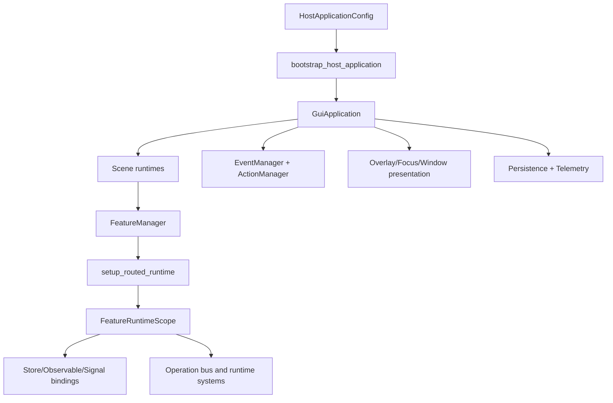

# gui_do Manual

## Title and Purpose
[Back to Table of Contents](#table-of-contents)

This manual is the implementation-aligned reference for building applications with gui_do using the current repository state. It is written for three audiences at once:

- Application developers who need a practical path to first success.
- Maintainers who need contract-accurate runtime behavior and test anchors.
- Integrators who need composition patterns across features, scenes, windows, controls, and runtime systems.

The core goal is to explain not just what APIs exist, but why they are shaped this way and how to compose them safely under real runtime constraints: deterministic dispatch, scene-scoped execution, lifecycle-owned cleanup, and explicit optional facilities.

## Table of Contents
[Back to Table of Contents](#table-of-contents)

- [Title and Purpose](#title-and-purpose)
- [Table of Contents](#table-of-contents)
- [How to Use This Manual](#how-to-use-this-manual)
- [Feature Organization Conventions](#feature-organization-conventions)
- [Conceptual Foundations (Theory)](#conceptual-foundations-theory)
- [Quickstart Path (Practice)](#quickstart-path-practice)
- [Architecture and Runtime Model](#architecture-and-runtime-model)
- [Core Workflow: Build, Bind, Route, Update, Draw](#core-workflow-build-bind-route-update-draw)
- [Main Systems Reference](#main-systems-reference)
  - [Application Bootstrap and Host Configuration](#application-bootstrap-and-host-configuration)
  - [Feature Lifecycle and Feature Types](#feature-lifecycle-and-feature-types)
  - [Events, Actions, Input Mapping, and Routing](#events-actions-input-mapping-and-routing)
  - [State and Observables](#state-and-observables)
  - [Controls and Control Composition](#controls-and-control-composition)
  - [Layout Systems](#layout-systems)
  - [Focus and Accessibility](#focus-and-accessibility)
  - [Overlays, Dialogs, Notifications, and Command Surfaces](#overlays-dialogs-notifications-and-command-surfaces)
  - [Scene, Window, and Task-Panel Presentation Models](#scene-window-and-task-panel-presentation-models)
  - [Scheduling, Timing, Animation, and Transitions](#scheduling-timing-animation-and-transitions)
  - [Persistence and Workspace/Session State](#persistence-and-workspacesession-state)
  - [Theme, Styling, and Visual Systems](#theme-styling-and-visual-systems)
  - [Text, Input, Forms, and Validation Systems](#text-input-forms-and-validation-systems)
  - [Data and Dataflow Helpers](#data-and-dataflow-helpers)
  - [Graphics and Audio Integration Points](#graphics-and-audio-integration-points)
  - [Telemetry, Introspection, and Operational Hooks](#telemetry-introspection-and-operational-hooks)
- [Integration Patterns and Composition Recipes](#integration-patterns-and-composition-recipes)
- [End-to-End Reference Application](#end-to-end-reference-application)
- [Testing, Diagnostics, and Reliability](#testing-diagnostics-and-reliability)
- [Performance and Scaling Guidance](#performance-and-scaling-guidance)
- [Migration, Versioning, and Deprecation Notes](#migration-versioning-and-deprecation-notes)
- [FAQ and Troubleshooting](#faq-and-troubleshooting)
- [Appendix](#appendix)
  - [Appendix A: Glossary](#appendix-a-glossary)
  - [Appendix B: Lifecycle and Event Routing Sequence](#appendix-b-lifecycle-and-event-routing-sequence)
  - [Appendix C: System Dependency Map](#appendix-c-system-dependency-map)
  - [Appendix D: API Quick Index by Topic](#appendix-d-api-quick-index-by-topic)
  - [Appendix D.1: Tier-to-System Reference Matrix](#appendix-d1-tier-to-system-reference-matrix)
  - [Appendix D.2: Public API Selection Heuristics](#appendix-d2-public-api-selection-heuristics)
  - [Appendix E: Architecture Templates](#appendix-e-architecture-templates)
  - [Appendix F: Specifications and Option Reference](#appendix-f-specifications-and-option-reference)

## How to Use This Manual
[Back to Table of Contents](#table-of-contents)

Use this manual with a three-lens reading strategy:

- Theory lens: Read Conceptual Foundations and Architecture first to internalize runtime ownership, scene scoping, and deterministic dispatch.
- Practice lens: Follow Quickstart and Core Workflow to implement first runnable behavior.
- Contract lens: Use Main Systems Reference and Appendix F while coding to avoid stale assumptions and to keep test coverage aligned.

Recommended paths:

- New project path: Quickstart -> Core Workflow -> Main Systems chapters 1-4 -> chapter 9 -> chapter 11.
- Feature author path: chapters 2-4 -> chapters 8-10 -> chapters 12-14.
- Maintainer path: Architecture -> Testing/Reliability -> Performance -> Appendix B/F.

Contract alignment checklist while reading:

- Prefer root imports from gui_do explicit names.
- Treat scene menu strip, task panel, and command palette as optional facilities that exist only when declared by specs.
- Treat runtime scope ownership as mandatory: if a resource is bound inside routed runtime, its cleanup must be owned by runtime scope disposal.

## Feature Organization Conventions
[Back to Table of Contents](#table-of-contents)

The demo package layout under demo_features is the canonical composition convention.

Key convention rules (verified against docs/demo_feature_layout.md and current demo_features tree):

- Put each feature/scene in its own folder package.
- Keep package __init__.py as a clean export surface for that package.
- Keep root demo_features focused on bootstrapping and shared assets.
- Use purpose-suffixed module names such as *_feature.py, *_specs.py, *_presenter.py, *_helpers.py.
- Keep runtime registration explicit in demo_config.py; startup does not auto-scan folders.

Minimal package pattern:

```python
# demo_features/alpha/__init__.py
from .alpha_feature import AlphaFeature
from .alpha_specs import ALPHA_RUNTIME_SPEC

__all__ = ["AlphaFeature", "ALPHA_RUNTIME_SPEC"]
```

Why this works:

- It enforces clear ownership boundaries.
- It keeps import contracts stable for app bootstrap.
- It avoids hidden registration behavior that breaks determinism.

## Conceptual Foundations (Theory)
[Back to Table of Contents](#table-of-contents)

### 1) Data-driven runtime model
[Back to Table of Contents](#table-of-contents)

gui_do uses declarative dataclass specs for runtime assembly. Instead of wiring every manager manually, feature and host composition is encoded as specs such as FeatureSpec, WindowSpec, RuntimeSceneSpec, ActionSpec, and RoutedRuntimeSpec.

### 2) Lifecycle ownership as safety
[Back to Table of Contents](#table-of-contents)

Routed runtime setup creates a feature-scoped runtime scope. Subscriptions, connections, operation buses, and disposable runtime systems are owned by that scope and are cleaned on shutdown_routed_runtime. This is the central leak-prevention mechanism.

### 3) Runtime-scope teardown discipline
[Back to Table of Contents](#table-of-contents)

Any binding helper that returns an unsubscribe/cleanup is attached to runtime scope cleanup. This includes store subscriptions, selector subscriptions, signal connections, operation registrations, and dynamically created runtime subsystems.

### 4) Declarative service/effect/operation specs
[Back to Table of Contents](#table-of-contents)

RoutedRuntimeSpec supports service_bindings, service_consumers, observable_effects, signal_effects, operations, and failure_policies. These support robust behavior without embedding every concern into bind_runtime.

### 5) Higher-level routed runtime faculties
[Back to Table of Contents](#table-of-contents)

Current runtime_systems specs discovered in code include execution contexts, budgets, checkpoint recovery, saga compensation, reactive graphs, migration contracts, policy engines, event pipelines, durable operation queues, capability contracts, projection/recompute systems, QoS policies, health probes, and replay harnesses.

These are opt-in by declaration and are attached only when corresponding specs are present.

### 6) Unified menu-strip model (single narrative)
[Back to Table of Contents](#table-of-contents)

Use one menu strip model across scene/window contexts via MenuStripSpec and add_menu_strip_from_spec. Scene-level strips are full-width top-docked scene chrome; window strips are full-width top-docked within window scope.

### 7) Command palette two-bind model
[Back to Table of Contents](#table-of-contents)

SceneCommandPaletteSpec declares two independent binds:

- toggle bind: opens/closes palette.
- action bind: when palette is open, activates pointer-targeted entries while preserving open-state behavior.

Each bind uses PaletteInputBindSpec(action_name, key, pointer_button). setup_scene_command_palette_bindings registers both using global binds when requested.

### 8) Unified window visibility model
[Back to Table of Contents](#table-of-contents)

Current behavior is unified by shared window_presentation routing across task panel toggles, menu-strip window list, and command palette window entries when those facilities are present.

Current inclusion/opt-out controls discovered in code:

- Include windows by declaring/registering them in FeatureWindowPresentationModel.
- Exclude from menu list by titlebar controls menus_enabled=False.
- Exclude palette built-in windows globally by PaletteBindingSpec(include_window_entries=False).
- Include or omit windows menu section via MenuStripSpec(windows_shown=True/False).
- Control ordering via task_panel_slot_index, with no-slot windows placed after slotted windows.

### 9) Scene/window participation controls
[Back to Table of Contents](#table-of-contents)

Scene and window participation is explicit through declarations, not implicit auto-discovery:

- Runtime scenes declared via RuntimeSceneSpec/SceneSetupSpec.
- Window presentation bindings declared via WindowSpec/WindowToggleBindingSpec/FeatureWindowBundleBindingSpec.
- Optional command palette built-ins controlled by PaletteBindingSpec flags.

### 10) Contract tests as design guardrails
[Back to Table of Contents](#table-of-contents)

Contract docs and boundary behavior are guarded by dedicated tests (for example test_public_api_docs_contracts, test_runtime_operating_contracts, test_boundary_contracts).

## Quickstart Path (Practice)
[Back to Table of Contents](#table-of-contents)

First-success milestone flow:

1. Create HostApplicationConfig with display size, title, initial scene, feature specs, and scene specs.
2. Bootstrap host via bootstrap_host_application.
3. In feature bind_runtime, call setup_routed_runtime with a RoutedRuntimeSpec.
4. Add at least one window and one action hotkey.
5. Run app.run_entrypoint.

Minimal verified scaffold:

```python
import pygame
from gui_do import (
    ActionHotkeySpec,
    FeatureSpec,
    HostApplicationConfig,
    RoutedRuntimeSpec,
    RuntimeSceneSpec,
    SceneSetupSpec,
    bootstrap_host_application,
    setup_routed_runtime,
)

class DemoFeature:
    def bind_runtime(self, host):
        spec = RoutedRuntimeSpec(
            scene_name="main",
            action_hotkeys=(
                ActionHotkeySpec(
                    action_name="noop",
                    handler=lambda _feature, _host, _event: True,
                    key=pygame.K_F2,
                    scene_name="main",
                    global_key=True,
                ),
            ),
        )
        setup_routed_runtime(self, host, spec)

cfg = HostApplicationConfig(
    display_size=(1280, 720),
    window_title="gui_do quickstart",
    fonts={"default": None},
    initial_scene_name="main",
    scene_specs=(SceneSetupSpec(name="main", make_initial=True),),
    feature_specs=(FeatureSpec(attr_name="demo", factory=DemoFeature),),
    runtime_scene_specs=(RuntimeSceneSpec(scene_name="main"),),
)

app, host = bootstrap_host_application(cfg)
app.run_entrypoint(target_fps=120)
```

Common first-run failures and fixes:

- Missing scene registration: add SceneSetupSpec and RuntimeSceneSpec for target scene.
- Action key not firing: ensure scene scope matches active scene; for global reachability use global key binds.
- Subscriptions leaking: bind through routed runtime and let runtime_scope own cleanups.

## Architecture and Runtime Model
[Back to Table of Contents](#table-of-contents)

The architecture uses layered modules and explicit ownership:

- Public package root exports stable consumer API.
- App runtime coordinates scene runtimes and event loop.
- Feature layer provides lifecycle and data-driven composition.
- Systems (events, actions, state, layout, controls, overlays, persistence, telemetry) are composed by explicit declarations.

Runtime guarantees (from runtime_operating_contracts):

- Event normalization to GuiEvent before dispatch.
- Scene-isolated update work.
- Stable ordering for focus and key candidate resolution.
- Scheduler budget clamping (fraction 0.12, floor 0.5 ms, ceiling 4.0 ms).
- Optional facilities exist only when declared.

Boundary model:

- gui_do is the framework boundary.
- demo_features and gui_do_demo.py are consumer/demo boundary.
- Use explicit root imports from gui_do.

## Core Workflow: Build, Bind, Route, Update, Draw
[Back to Table of Contents](#table-of-contents)

1) Build

- Build specs and host config.
- Register scenes/features/windows/actions.

2) Bind runtime

- Feature bind_runtime calls setup_routed_runtime.
- Runtime scope is created and populated by declared bindings.

3) Route

- process_event normalizes to GuiEvent.
- Global pointer/global key actions may preempt lower routing.
- Overlay/toast/focus/window/scene handlers run with deterministic precedence.

4) Update

- Active-scene scheduler and feature updates run.
- Optional routed runtime systems process per-update work.

5) Draw

- Renderer draws active scene and controls.
- Feature draw hooks and transitions overlay the frame.

Routed lifecycle helper example:

```python
from gui_do import RoutedRuntimeSpec, setup_routed_runtime, shutdown_routed_runtime

class MyFeature:
    def bind_runtime(self, host):
        self._runtime_spec = RoutedRuntimeSpec(scene_name="main")
        setup_routed_runtime(self, host, self._runtime_spec)

    def unbind_runtime(self, host):
        shutdown_routed_runtime(self, host, self._runtime_spec)
```

Why this pattern matters:

- It guarantees teardown symmetry.
- It keeps bind_runtime small while still enabling complex runtime composition.

## Main Systems Reference
[Back to Table of Contents](#table-of-contents)

### Application Bootstrap and Host Configuration
[Back to Table of Contents](#table-of-contents)

What and why:

- HostApplicationConfig and bootstrap_host_application establish runtime root objects, scenes, managers, and facilities.

Mental model and lifecycle placement:

- Bootstrap is the only phase where global app graph should be constructed.

Primary public APIs and key types:

- HostApplicationConfig, HostApplicationBindingSpec, bootstrap_host_application, build_host_application_config.

Typical usage flow:

- Build config -> bootstrap -> run_entrypoint.

Minimal verified example:

```python
from gui_do import HostApplicationConfig, bootstrap_host_application

cfg = HostApplicationConfig(
    display_size=(1280, 720),
    window_title="App",
    fonts={"default": None},
    initial_scene_name="main",
)
app, host = bootstrap_host_application(cfg)
```

Advanced pattern:

- Use HostApplicationBindingSpec with scene_bundle_entries and feature_window_bundle_entries to reduce repetitive declarations while preserving explicitness.

Common mistakes and anti-patterns:

- Creating scenes lazily in arbitrary code paths.
- Treating bootstrap as a dynamic plugin scan.

Cross-links:

- See Feature Lifecycle and Feature Types.
- See Scene, Window, and Task-Panel Presentation Models.

### Feature Lifecycle and Feature Types
[Back to Table of Contents](#table-of-contents)

What and why:

- Feature, DirectFeature, LogicFeature, RoutedFeature define responsibility boundaries for behavior wiring.

Mental model and lifecycle placement:

- Register feature -> bind_runtime -> runtime updates/events -> unbind_runtime/shutdown.

Primary APIs:

- FeatureManager, setup_routed_runtime, shutdown_routed_runtime, RoutedFeatureLifecycleSpec.

Typical flow:

- Keep feature state local; expose only required host attributes.

Minimal verified example:

```python
from gui_do import RoutedFeature, RoutedRuntimeSpec, setup_routed_runtime

class InspectorFeature(RoutedFeature):
    def bind_runtime(self, host):
        setup_routed_runtime(self, host, RoutedRuntimeSpec(scene_name="main"))
```

Advanced pattern:

- Use companion_providers with RoutedFeatureLifecycleSpec to register helper logic features alongside a routed presenter feature.

Common mistakes:

- Manual subscription without runtime ownership.
- Directly mutating host internals instead of declaring services/effects.

Cross-links:

- See State and Observables.
- See Telemetry, Introspection, and Operational Hooks.

### Events, Actions, Input Mapping, and Routing
[Back to Table of Contents](#table-of-contents)

What and why:

- EventType/EventPhase/GuiEvent provide canonical routing payloads.
- ActionManager and InputMap map physical input to semantic actions.

Mental model:

- Normalize first, route second, enforce propagation/default contracts.

Primary APIs:

- GuiEvent, EventManager.to_gui_event, ActionManager.bind_key, ActionManager.bind_global_key.

Typical flow:

- Register actions -> bind keys/global keys -> process events in app loop.

Minimal verified example:

```python
import pygame
from gui_do import ActionHotkeySpec

hotkey = ActionHotkeySpec(
    action_name="toggle_help",
    handler=lambda _feature, _host, _event: True,
    key=pygame.K_F9,
    scene_name="main",
    global_key=True,
)
```

Advanced pattern:

- Use GlobalPointerActionSpec for pre-routing pointer behaviors that must run before focus/overlay scene handlers.

Common mistakes:

- Mixing scene-scoped and global bindings without clear intent.
- Ignoring logical pointer fallback for pointer actions.

Cross-links:

- See Overlays, Dialogs, Notifications, and Command Surfaces.
- See Appendix B.

### State and Observables
[Back to Table of Contents](#table-of-contents)

What and why:

- ObservableValue, selectors, and AppStateStore subscriptions support deterministic reactive UI updates.

Mental model:

- Declare subscriptions/selectors in RoutedRuntimeSpec and let runtime scope own cleanup.

Primary APIs:

- StoreSubscriptionSpec, StoreSelectorSpec, ObservableEffectSpec, SignalEffectSpec.

Typical flow:

- Declare store/effect specs -> bind via setup_routed_runtime -> automatic cleanup on shutdown.

Minimal verified example:

```python
from gui_do import StoreSubscriptionSpec, RoutedRuntimeSpec

runtime = RoutedRuntimeSpec(
    scene_name="main",
    store_subscriptions=(
        StoreSubscriptionSpec(
            state_key="status",
            handler=lambda value: None,
            store_attr_name="state_store",
            invoke_immediately=True,
        ),
    ),
)
```

Advanced pattern:

- Use depends_on in StoreSelectorSpec to narrow recalculation and reduce update fan-out.

Common mistakes:

- Subscribing manually and forgetting teardown.
- Overusing broad selectors that react to unrelated keys.

Cross-links:

- See Performance and Scaling Guidance.
- See Appendix F.

### Controls and Control Composition
[Back to Table of Contents](#table-of-contents)

What and why:

- Controls are composable nodes with predictable layout, input, and accessibility contracts.

Mental model:

- Compose controls as scene/window children; keep control behavior declarative where possible.

Primary APIs:

- PanelControl, LabelControl, ButtonControl, WindowControl, SceneTaskPanelBuilder.

Typical flow:

- Create control -> set rect and accessibility -> add to parent.

Minimal verified example:

```python
from pygame import Rect
from gui_do import ButtonControl

button = ButtonControl("exit", Rect(16, 16, 120, 32), "Exit", on_click=lambda: None)
button.set_accessibility(role="button", label="Exit")
```

Advanced pattern:

- Use declarative control builders from control_spec helpers for repeatable layouts across features.

Common mistakes:

- Hard-coding tab order without documenting sequence rules.
- Coupling control construction to unrelated runtime services.

Cross-links:

- See Focus and Accessibility.
- See Layout Systems.

### Layout Systems
[Back to Table of Contents](#table-of-contents)

What and why:

- Layout modules provide deterministic positioning across screen, scene, and window contexts.

Mental model:

- Use declarative layout specs and dedicated layout engines; avoid ad-hoc geometry mutation loops.

Primary APIs:

- FlexLayout, constraint/grid/dock/flow/snap systems, TaskPanelSlotLayoutSpec.

Typical flow:

- Configure layout spec -> apply to container rect -> assign child rects.

Minimal verified example:

```python
from gui_do import TaskPanelSlotLayoutSpec, create_task_panel_slot_layout

slot_spec = TaskPanelSlotLayoutSpec(left=16, top_offset=10, item_width=124, item_height=30, spacing=10)
layout = create_task_panel_slot_layout(task_panel, slot_spec)
slot0 = layout.slot_rect(0)
```

Advanced pattern:

- Use panel_rect_overrides in TaskPanelWindowToggleGroupSpec for non-linear placement, then fallback to flow slots for all other windows.

Common mistakes:

- Assuming slot indices are contiguous.
- Mixing absolute screen rects with panel-relative rect expectations.

Cross-links:

- See Scene, Window, and Task-Panel Presentation Models.
- See Appendix F.

### Focus and Accessibility
[Back to Table of Contents](#table-of-contents)

What and why:

- Focus managers and accessibility metadata provide keyboard- and assistive-friendly navigation.

Mental model:

- Focus state is a routing control surface, not just visual styling.

Primary APIs:

- FocusManager, WindowFocusManager, AccessibilitySequenceSpec, set_accessibility, set_tab_index.

Typical flow:

- Assign role/label and tab order as controls are created.

Minimal verified example:

```python
control.set_accessibility(role="toggle", label="Show Systems Window")
control.set_tab_index(42)
```

Advanced pattern:

- Use add_scene_task_panel_items(..., tab_sequence_start=...) to apply deterministic accessibility order across mixed button/nav/window-toggle controls.

Common mistakes:

- Omitting labels on icon-only controls.
- Reusing duplicated tab indices.

Cross-links:

- See Controls and Control Composition.
- See Overlays, Dialogs, Notifications, and Command Surfaces.

### Overlays, Dialogs, Notifications, and Command Surfaces
[Back to Table of Contents](#table-of-contents)

What and why:

- Overlays and command surfaces handle transient interaction layers without mutating base scene structure.

Mental model:

- Overlays route above scene controls; command palette is a scene-scoped optional facility with explicit bindings.

Primary APIs:

- SceneCommandPaletteSpec, PaletteInputBindSpec, setup_scene_command_palette_bindings, NotificationSpec, ShortcutOverlaySpec.

Typical flow:

- Declare command palette in RoutedRuntimeSpec.command_palette, then setup_routed_runtime wires toggle/action binds.

Minimal verified example (two-bind model):

```python
import pygame
from gui_do import SceneCommandPaletteSpec, PaletteInputBindSpec

palette_spec = SceneCommandPaletteSpec(
    scene_name="main",
    toggle=PaletteInputBindSpec(action_name="command_palette_toggle", key=pygame.K_F5),
    action=PaletteInputBindSpec(action_name="command_palette_action", pointer_button=2),
)
```

Advanced pattern:

- Keep action bind pointer activation resilient by allowing event.pos fallback to app.logical_pointer_pos (verified in test_scene_command_palette_bindings).

Common mistakes:

- Binding only toggle and forgetting action bind semantics.
- Using scene-local key binds when global reachability is required.

Cross-links:

- See Events, Actions, Input Mapping, and Routing.
- See Scene, Window, and Task-Panel Presentation Models.

### Scene, Window, and Task-Panel Presentation Models
[Back to Table of Contents](#table-of-contents)

What and why:

- Scene and window presentation models provide unified visibility and ordering semantics across menu strip, task panel, and command palette facilities.

Mental model and lifecycle placement:

- Window presentation bindings are declared during setup and used by UI facilities at runtime for synchronized lists/toggles.

Primary APIs and key types:

- FeatureWindowPresentationModel.register_feature_window.
- WindowSpec / WindowToggleBindingSpec / FeatureWindowBundleBindingSpec.
- SceneTaskPanelSpec, TaskPanelSlotLayoutSpec.
- TaskPanelWindowToggleGroupSpec(flow_start_slot, flow_slot_assignments, panel_rect_overrides).
- add_scene_task_panel_items(...).
- SceneTaskPanelItemsResult.window_toggle_placements.
- TaskPanelWindowTogglePlacement.

Typical usage flow:

- Declare windows -> build task panel -> add button/nav/toggle groups -> use returned placement metadata for deterministic geometry-aware follow-up behavior.

Minimal verified example (main demo style):

```python
result = add_scene_task_panel_items(
    host,
    task_panel,
    app_layout,
    button_specs=button_specs,
    scene_nav_button_specs=scene_nav_specs,
    window_toggle_group_spec=TaskPanelWindowToggleGroupSpec(
        flow_start_slot=2,
        flow_slot_assignments={"first": 2},
        panel_rect_overrides={
            "systems": (16, 10, 124, 30),
            "life": (150, 10, 124, 30),
        },
    ),
    window_presentation=host.window_presentation,
)

for placement in result.window_toggle_placements:
    # placement.panel_rect is panel-relative geometry; it ignores auto-hide offsets.
    print(placement.window_key, tuple(placement.panel_rect))
```

Advanced pattern:

- Use explicit panel_rect_overrides for non-linear custom placement and leave the remaining windows on slot-flow fallback controlled by flow_start_slot plus flow_slot_assignments.

Window visibility guidance (current behavior):

- Unified behavior is driven by shared window_presentation routing when facilities are enabled.
- Scene-level menu strip window section: MenuStripSpec(windows_shown=True).
- Command palette built-in window section: PaletteBindingSpec(include_window_entries=True).
- Menu inclusion can be disabled per window via titlebar controls menus_enabled=False.
- Registration controls participation: unregistered windows are absent from toggle/menu/palette lists.

Common mistakes:

- Treating panel_rect as screen coordinates.
- Expecting implicit facility creation without spec declaration.
- Assuming all windows appear without registration.

Cross-links:

- See Layout Systems.
- See Overlays, Dialogs, Notifications, and Command Surfaces.
- See Appendix F.

### Scheduling, Timing, Animation, and Transitions
[Back to Table of Contents](#table-of-contents)

What and why:

- Scheduling and animation systems keep update work bounded and visual transitions smooth.

Mental model:

- Separate deterministic scheduling from rendering; clamp budget under load.

Primary APIs:

- TaskScheduler, Timers, TweenManager, SceneTimeline, TransitionManager, SceneTransitionManager.

Typical flow:

- Schedule work -> process in update -> drive transitions through managers.

Minimal verified example:

```python
from gui_do import SceneTransitionManager, SceneTransitionStyle

transitions = SceneTransitionManager(app)
transitions.set_default(SceneTransitionStyle.FADE, duration=0.35)
```

Advanced pattern:

- Use routed runtime WorkloadBudgetSpec and QoSPolicySpec for cross-system work arbitration per update.

Common mistakes:

- Unbounded work in one frame.
- Running transition logic outside scene context.

Cross-links:

- See Performance and Scaling Guidance.
- See Telemetry, Introspection, and Operational Hooks.

### Persistence and Workspace/Session State
[Back to Table of Contents](#table-of-contents)

What and why:

- Workspace persistence captures scene snapshots, feature states, settings blocks, and metadata for resume flows.

Mental model:

- Capture and restore are manager-coordinated, returning structured reports.

Primary APIs:

- WorkspaceState.save/load, WorkspacePersistenceManager.capture/restore.
- GuiApplication.save_workspace, load_workspace, restore_workspace, run_entrypoint.

Typical flow:

- load_workspace before run, save_workspace on exit when WORKSPACE_SAVE enabled.

Minimal verified example:

```python
from pathlib import Path

app.run_entrypoint(
    target_fps=120,
    WORKSPACE_SAVE=True,
    workspace_path=Path("state.json"),
)
```

Path resolution behavior from process working directory:

- Cursor assets are explicitly resolved against Path.cwd() when relative.
- WorkspaceState.save/load uses Path(path) directly; relative paths resolve from process current working directory.
- Default workspace path is absolute: Path.home() / ".gui_do" / "workspace_state.json".

Advanced pattern:

- Use metadata in save_workspace to attach build/runtime provenance for diagnostics.

Common mistakes:

- Assuming relative paths are repo-root normalized.
- Letting workspace I/O exceptions crash startup/shutdown.

Cross-links:

- See Testing, Diagnostics, and Reliability.
- See FAQ and Troubleshooting.

### Theme, Styling, and Visual Systems
[Back to Table of Contents](#table-of-contents)

What and why:

- Theme systems centralize typography, color, and tokenized style behavior.

Mental model:

- Scene runtime owns theme manager state; theme changes should invalidate visuals coherently.

Primary APIs:

- ThemeManager, ColorTheme, FontManager, FontRoleRegistry, setup_standard_font_roles.

Typical flow:

- Register font roles -> apply by scene -> style controls via roles and sizes.

Minimal verified example:

```python
host.app.register_font_role("title", size=64, system_name="Arial", bold=True, scene_name="main")
```

Advanced pattern:

- Use scoped theme managers for per-scene overrides while preserving global token defaults.

Common mistakes:

- Inline style drift across controls.
- Forgetting invalidation after theme mutations.

Cross-links:

- See Controls and Control Composition.
- See Graphics and Audio Integration Points.

### Text, Input, Forms, and Validation Systems
[Back to Table of Contents](#table-of-contents)

What and why:

- Text and forms modules provide robust input composition, validation, and editing state.

Mental model:

- Keep validation explicit and composable; separate view controls from validation policies.

Primary APIs:

- TextInputControl, validators, forms modules, locale/text flow helpers.

Typical flow:

- Bind controls -> validate input -> publish state changes via store/observables.

Minimal verified example:

```python
# Conceptual flow used across tests and demos:
value = text_input.text
is_valid = validator(value)
if is_valid:
    state_store.set("username", value)
```

Advanced pattern:

- Use async validators with fail-safe UI states and explicit cancellation when control focus changes.

Common mistakes:

- Treating validation side effects as rendering side effects.
- Not debouncing high-frequency input validation.

Cross-links:

- See State and Observables.
- See Data and Dataflow Helpers.

### Data and Dataflow Helpers
[Back to Table of Contents](#table-of-contents)

What and why:

- Data helpers support reactive and structured flows across collections, selectors, and cache behaviors.

Mental model:

- Dataflow should be explicit, bounded, and testable.

Primary APIs:

- ObservableList/ObservableDict, CollectionView, Binding/BindingGroup, dataflow pipeline helpers.

Typical flow:

- Source collection -> projection/filter -> bound control model.

Minimal verified example:

```python
from gui_do import CollectionView

view = CollectionView(items)
view.set_filter(lambda row: row.get("visible", True))
visible_items = view.items()
```

Advanced pattern:

- Combine selector-based runtime subscriptions with projection specs from routed runtime systems for incremental recomputation.

Common mistakes:

- Recomputing full data snapshots every frame.
- Hiding data mutation in UI event handlers.

Cross-links:

- See State and Observables.
- See Performance and Scaling Guidance.

### Graphics and Audio Integration Points
[Back to Table of Contents](#table-of-contents)

What and why:

- Graphics/audio modules integrate specialized rendering and sound behavior with the main runtime.

Mental model:

- Keep graphics/audio resources scene-aware and lifecycle-managed.

Primary APIs:

- SceneGraph2D, draw contexts, graphics helpers, audio integration modules.

Typical flow:

- Build graphics state -> update per frame -> draw in feature draw hook.

Minimal verified example:

```python
from gui_do import SceneGraph2D

graph = SceneGraph2D()
# add nodes, update transforms, draw via feature pipeline
```

Advanced pattern:

- Prewarm hidden windows and heavy draw resources before first visible interaction.

Common mistakes:

- Lazy-loading heavy assets in latency-sensitive pointer handlers.
- Leaking graphics handles outside lifecycle teardown.

Cross-links:

- See Scheduling, Timing, Animation, and Transitions.
- See Persistence and Workspace/Session State.

### Telemetry, Introspection, and Operational Hooks
[Back to Table of Contents](#table-of-contents)

What and why:

- Telemetry and introspection expose runtime observability without invasive code changes.

Mental model:

- Instrument hot paths with spans; surface structured reports for restore and run failures.

Primary APIs:

- TelemetryCollector, telemetry_collector, configure_telemetry, introspection modules.

Typical flow:

- Wrap operations in telemetry spans -> analyze logs for bottlenecks.

Minimal verified example:

```python
from gui_do import telemetry_collector

collector = telemetry_collector()
with collector.span("gui_application", "draw", metadata={"scene_name": app.active_scene_name}):
    app.draw()
```

Advanced pattern:

- Correlate replay/health probe runtime systems with telemetry spans to isolate policy/budget regressions.

Common mistakes:

- Instrumenting only happy paths.
- Ignoring restore report fields (applied_settings, skipped_settings, missing_settings_blocks).

Cross-links:

- See Testing, Diagnostics, and Reliability.
- See Performance and Scaling Guidance.

## Integration Patterns and Composition Recipes
[Back to Table of Contents](#table-of-contents)

Recipe 1: Scene bundle with routed feature and optional facilities

- Compose SceneBundleBindingSpec + FeatureWindowBundleBindingSpec entries.
- Add menu strip and task panel only in scenes that require them.
- Add command palette via RoutedRuntimeSpec.command_palette.

Recipe 2: Service + effects + operations

- Publish service via ServiceBindingSpec.
- Consume with ServiceConsumerSpec.
- Bind ObservableEffectSpec/SignalEffectSpec.
- Add FeatureOperationSpec plus FailurePolicySpec for retriable operations.

Recipe 3: Unified window controls across three surfaces

- Register windows in window_presentation.
- Task panel toggles from TaskPanelWindowToggleGroupSpec.
- Menu strip windows_shown enabled.
- Palette built-in windows enabled with connect_window_presentation=True.

Recipe 4: Contract-safe teardown

- Setup in bind_runtime with setup_routed_runtime.
- Teardown in unbind_runtime with shutdown_routed_runtime.

## End-to-End Reference Application
[Back to Table of Contents](#table-of-contents)

The repository reference application is composed around gui_do_demo.py plus demo_features packages.

Observed package composition includes:

- main scene package with menu strip, task panel, and command palette specs.
- systems/life/mandelbrot/showcase feature packages with their own specs/helpers.

Validation checklist for your own reference app:

- Scene setup specs and runtime scene specs cover all navigable scenes.
- RoutedRuntimeSpec is used for any feature with nontrivial bindings.
- Optional facilities are declared explicitly per scene.
- Window toggle placement metadata is consumed if geometry-dependent behavior is required.
- Workspace save/load behavior is covered by tests.

## Testing, Diagnostics, and Reliability
[Back to Table of Contents](#table-of-contents)

Contract-first test strategy:

- Public surface contracts: test_public_api_exports, test_public_api_docs_contracts.
- Runtime contracts: test_runtime_operating_contracts.
- Boundary contracts: test_boundary_contracts and architecture docs contracts.
- Feature abstraction and demo composition tests: test_demo_feature_abstractions and related suites.

Maintainer diff checklist:

- If API names or fields changed: update docs/public_api_spec.md and Appendix F.
- If routing precedence changed: verify event system spec and related tests.
- If optional facility behavior changed: verify synchronized window list behavior tests.
- If persistence behavior changed: verify workspace report fields and run_entrypoint resilience tests.

Diagnostics practices:

- Use telemetry spans around update/draw/routing hot paths.
- Preserve structured nonfatal error reporting in top-level run flow.
- Keep tests deterministic by asserting exact ordering where contracts require it.

## Performance and Scaling Guidance
[Back to Table of Contents](#table-of-contents)

Baseline performance contracts:

- Scheduler budget clamping protects frame-time fairness.
- Scene-scoped runtime update reduces off-scene work.

Scaling guidance:

- Prefer selectors with depends_on over broad state subscriptions.
- Prefer incremental dataflow/projection/recompute specs over full recomputation.
- Avoid heavy resource initialization in first interactive frame; prewarm hidden windows/resources.

Practical optimization surfaces discovered in current codebase:

- Signal callback tuple snapshot optimization.
- Input snapshot lazy transition-set allocation.
- FeatureOperationBus empty failure-policy mapping reuse.

Reliability guardrails while optimizing:

- Keep mutation-safe subscriber semantics.
- Keep deterministic ordering in candidates and window lists.
- Preserve cleanup ownership at runtime scope.

## Migration, Versioning, and Deprecation Notes
[Back to Table of Contents](#table-of-contents)

Versioning realities in current repository:

- Public root exports are the stable consumer contract.
- Runtime behavior is locked by contract tests and docs parity tests.

Migration strategy for maintainers:

- Add migration handling through ContractMigrationSpec when payload schemas evolve.
- Preserve old behavior behind explicit migration paths; avoid hidden compatibility shims.
- Deprecate by documenting replacement API and adding focused contract tests.

Deprecation checklist:

- Mark legacy behavior in docs and tests.
- Add replacement examples in relevant chapter and Appendix F table rows.
- Remove obsolete docs language once tests and code fully transition.

## FAQ and Troubleshooting
[Back to Table of Contents](#table-of-contents)

Q: Why does a command palette action click do nothing?
A: Ensure SceneCommandPaletteSpec.action bind exists and that pointer activation receives either event.pos or app.logical_pointer_pos fallback.

Q: Why are some windows missing from menu/task panel/palette?
A: Verify window registration in window_presentation and feature/window binding specs. Also check menus_enabled and include_window_entries/windows_shown flags.

Q: Why does workspace file path resolve unexpectedly?
A: Relative paths are evaluated from process current working directory. Use absolute Path values for deterministic location.

Q: Why are runtime subscriptions leaking after scene/feature changes?
A: Bind through setup_routed_runtime and teardown with shutdown_routed_runtime so runtime scope disposal owns cleanups.

Q: Why does bounded area look smaller than expected?
A: bounded_area_rect excludes scene menu strip height and task panel reserved height (hidden peek when auto-hide is on).

## Appendix
[Back to Table of Contents](#table-of-contents)

### Appendix A: Glossary
[Back to Table of Contents](#table-of-contents)

- Routed runtime: declarative runtime wiring path based on RoutedRuntimeSpec.
- Runtime scope: ownership container for subscriptions, services, disposables, and cleanup callbacks.
- Optional facility: scene menu strip, task panel, or command palette; created only by spec declaration.
- Window presentation: model used by task panel/menu/palette to list and toggle windows coherently.
- Panel-relative rect: rectangle coordinates measured from task panel origin.

### Appendix B: Lifecycle and Event Routing Sequence
[Back to Table of Contents](#table-of-contents)

Lifecycle sequence:

1. bootstrap_host_application builds app/host/scenes/features.
2. Feature bind_runtime executes.
3. setup_routed_runtime wires runtime scope and declared subsystems.
4. process_event routes normalized GuiEvent through precedence chain.
5. update and draw execute for active scene.
6. shutdown_routed_runtime and scope disposal run on teardown.

Event routing sequence (high-level):

1. Normalize to GuiEvent.
2. Early global pointer/key dispatch where applicable.
3. Overlay/toast/focus processing.
4. Keyboard manager path.
5. Feature and scene dispatch.
6. Respect stop_propagation/default_prevented as hard stop.

### Appendix C: System Dependency Map
[Back to Table of Contents](#table-of-contents)



### Appendix D: API Quick Index by Topic
[Back to Table of Contents](#table-of-contents)

- Bootstrap: HostApplicationConfig, bootstrap_host_application, build_host_application_config.
- Features: Feature, RoutedFeature, FeatureManager, RoutedRuntimeSpec.
- Windows/task panel: WindowSpec, SceneTaskPanelSpec, TaskPanelWindowToggleGroupSpec, add_scene_task_panel_items.
- Command palette: SceneCommandPaletteSpec, PaletteInputBindSpec, setup_scene_command_palette_bindings.
- Persistence: WorkspaceState, WorkspacePersistenceManager, GuiApplication.run_entrypoint.
- Observability: telemetry_collector, configure_telemetry.

### Appendix D.1: Tier-to-System Reference Matrix
[Back to Table of Contents](#table-of-contents)

| Tier | System Group | Representative APIs |
|---|---|---|
| Tier 1 | Entry points and data-driven runtime | bootstrap_host_application, FeatureSpec, RoutedRuntimeSpec |
| Tier 2 | App and scene runtime | GuiApplication, create_display, SceneTransitionManager |
| Tier 3 | Data/state | ObservableValue, CollectionView, Binding |
| Tier 4 | Events/actions/focus | GuiEvent, EventManager, ActionManager, FocusManager |
| Tier 5 | Scheduling/animation | TaskScheduler, Timers, TweenManager |
| Tier 6 | Theme/fonts | ThemeManager, ColorTheme, FontManager |
| Tier 7 | Telemetry | TelemetryCollector, telemetry_collector |
| Tier 8+ | Layout/controls/overlays/persistence/forms/etc. | Flex/constraint layouts, controls, overlay managers, WorkspacePersistenceManager |

### Appendix D.2: Public API Selection Heuristics
[Back to Table of Contents](#table-of-contents)

- Prefer root imports from gui_do over deep module imports for stable consumer code.
- Prefer declarative specs over imperative wiring when both exist.
- Prefer routed runtime setup/teardown helpers for lifecycle-owned behavior.
- Prefer optional facility declaration per scene instead of global implicit enablement.

### Appendix E: Architecture Templates
[Back to Table of Contents](#table-of-contents)

Template 1: Minimal scene + one routed feature

```python
HostApplicationConfig(
    display_size=(1280, 720),
    window_title="App",
    fonts={"default": None},
    initial_scene_name="main",
    scene_specs=(SceneSetupSpec(name="main", make_initial=True),),
    feature_specs=(FeatureSpec("main_feature", MainFeature),),
    runtime_scene_specs=(RuntimeSceneSpec(scene_name="main"),),
)
```

Template 2: Multi-window scene with unified command surfaces

```python
RoutedRuntimeSpec(
    scene_name="main",
    command_palette=SceneCommandPaletteSpec(
        scene_name="main",
        toggle=PaletteInputBindSpec(action_name="command_palette_toggle", key=pygame.K_F5),
        action=PaletteInputBindSpec(action_name="command_palette_action", pointer_button=2),
    ),
)
```

Template 3: Task-panel toggles with explicit-first placement

```python
TaskPanelWindowToggleGroupSpec(
    flow_start_slot=2,
    flow_slot_assignments={"logs": 2},
    panel_rect_overrides={"systems": (16, 10, 124, 30)},
)
```

### Appendix F: Specifications and Option Reference
[Back to Table of Contents](#table-of-contents)

This appendix catalogs discovered spec families and sub-spec relationships from:

- gui_do.features.data_driven_runtime
- gui_do.features.runtime_systems
- gui_do.features.runtime_models

Use this together with chapter cross-links while modifying declarations.

| Spec name | Field or option name | Purpose | Default or notable behavior | Cross-reference chapter |
|---|---|---|---|---|
| FeatureSpec | attr_name, factory | Feature registration entry | factory is callable returning feature instance | Feature Lifecycle and Feature Types |
| WindowSpec | key, feature_attribute_name, task_panel_slot_index, startup_visible | Window presentation binding | slot index orders task panel/menu/palette groups | Scene, Window, and Task-Panel Presentation Models |
| WindowTitlebarControlsSpec | menus_enabled, include_window_hide_image_button | Window chrome options | menus_enabled=False excludes from shared menu windows | Scene, Window, and Task-Panel Presentation Models |
| RuntimeSceneSpec | scene_name, pristine_asset, bind_escape_to_exit, prewarm | Runtime scene startup behavior | prewarm can warm scene resources before use | Scheduling, Timing, Animation, and Transitions |
| ActionSpec | action_id, kind, target, key | Declarative action metadata | kind values include exit/scene_nav/palette_toggle | Events, Actions, Input Mapping, and Routing |
| StaticAccessibilitySpec | control_attr, role, label | Static accessibility annotation | applied during setup helpers | Focus and Accessibility |
| CursorSpec | name, path, hotspot | Cursor registration entry | path resolved from process CWD if relative | Persistence and Workspace/Session State |
| SceneRootSpec | scene_name, control_id, draw_background | Scene root panel declaration | draw_background defaults false | Controls and Control Composition |
| AnchoredWindowSpec | control_id, title, size, anchor, margin, startup_visible | Presenter-backed anchored windows | integrates with titlebar controls and effects | Scene, Window, and Task-Panel Presentation Models |
| LogicBindingSpec | alias, provider_name | Routed feature logic alias mapping | used by configure_routed_feature_runtime | Feature Lifecycle and Feature Types |
| TaskPanelButtonSpec | attr_name, control_id, slot_index, label, style | Declarative task panel button | no default buttons are auto-created | Scene, Window, and Task-Panel Presentation Models |
| RightAnchoredTaskPanelButtonSpec | offset_right, width, height | Right-edge task panel button placement | complements slot-flow buttons | Scene, Window, and Task-Panel Presentation Models |
| TooltipBindingSpec | control_attr, message | Tooltip registration by host attribute | skips missing controls safely | Overlays, Dialogs, Notifications, and Command Surfaces |
| MenuStripSpec | scenes_shown, windows_shown, scene_menu_mode | Scene/window menu-strip behavior | one scene strip per scene, one per window scope | Scene, Window, and Task-Panel Presentation Models |
| AutoSizedStyledLabelSpec | text, fallback_size, style_size | Styled label declaration | auto-size with fallback rect sizing | Controls and Control Composition |
| ActionHotkeySpec | action_name, handler, key, scene_name, global_key | Action + optional key registration | global_key routes before lower scopes | Events, Actions, Input Mapping, and Routing |
| ControlKeyBindingSpec | key, control_attr, action_name | Key activates host-held control | no handler lambda required | Events, Actions, Input Mapping, and Routing |
| SceneTaskPanelSpec | scene_name, control_id, height, hidden_peek_pixels, auto_hide | Scene task panel declaration | reserved height depends on auto-hide state | Scene, Window, and Task-Panel Presentation Models |
| TaskPanelSlotLayoutSpec | left, top_offset, item_width, item_height, spacing, horizontal | Slot-flow geometry for task panel items | fallback layout engine for un-overridden windows | Layout Systems |
| TaskPanelWindowToggleGroupSpec | flow_start_slot, flow_slot_assignments, panel_rect_overrides | Explicit-first placement for auto window toggles | supports non-linear placement + slot fallback | Scene, Window, and Task-Panel Presentation Models |
| TaskPanelWindowTogglePlacement | window_key, control_id, panel_rect | Reported geometry metadata per toggle | panel_rect is panel-relative and ignores auto-hide offsets | Scene, Window, and Task-Panel Presentation Models |
| SceneTaskPanelItemsResult | scene_nav_buttons, window_toggle_controls, window_toggle_placements | Return object from task panel composition | use placements for deterministic geometry lookup | Scene, Window, and Task-Panel Presentation Models |
| PaletteInputBindSpec | action_name, key, pointer_button | One command palette bind | used for both toggle and action binds | Overlays, Dialogs, Notifications, and Command Surfaces |
| SceneCommandPaletteSpec | scene_name, toggle, action | Two-bind command palette spec | toggle and action are independent binds | Overlays, Dialogs, Notifications, and Command Surfaces |
| TaskPanelSceneNavButtonSpec | control_id, slot_index, target_scene, accessibility_label | Task panel scene navigation button | callback resolved host-first, then transitions/app switch | Scene, Window, and Task-Panel Presentation Models |
| EventSubscriptionSpec | attr_name, topic, handler, scope | Feature-managed event-bus subscription | token stored on feature attr for unbind path | Feature Lifecycle and Feature Types |
| ServiceBindingSpec | attr_name, key, factory, owned | Publish service into runtime scope | owned controls disposal responsibility | Feature Lifecycle and Feature Types |
| ServiceConsumerSpec | attr_name, key, required | Resolve service from runtime scope | required=False allows optional dependency | Feature Lifecycle and Feature Types |
| StoreSubscriptionSpec | state_key, handler, invoke_immediately | Subscribe to one store key | unsubscribe owned by runtime scope | State and Observables |
| StoreSelectorSpec | selector, handler, depends_on, attr_name | Selector-driven store observation | depends_on narrows invalidation scope | State and Observables |
| ObservableEffectSpec | handler + observable source option | Subscribe to observable value | source via attr, service key, or factory | State and Observables |
| SignalEffectSpec | handler + signal source option + once | Connect signal-like source | one-shot via once=True | State and Observables |
| FailurePolicySpec | retries, retry_delay_seconds, timeout_seconds, publish_topic | Operation failure policy | applied by FeatureOperationBus | Feature Lifecycle and Feature Types |
| FeatureOperationSpec | name, handler, failure_policy | Operation-bus handler declaration | registered and cleaned by runtime scope | Feature Lifecycle and Feature Types |
| ShortcutOverlaySpec | dimensions, toggle action/key, manual shortcut options | Feature-owned shortcut overlay | supports manual-only and exclusion filters | Overlays, Dialogs, Notifications, and Command Surfaces |
| TaskPanelFocusToggleSpec | action_name, scene_name, key | Bind task-panel focus mode toggle | can override palette behavior if needed | Focus and Accessibility |
| GlobalPointerActionSpec | action_name, button, scene_name | Pre-routing global pointer bind | runs before overlay/focus/scene dispatch | Events, Actions, Input Mapping, and Routing |
| RoutedRuntimeSpec | service/effect/operation/system declarations | Master routed-runtime declaration | drives setup_routed_runtime and teardown | Core Workflow: Build, Bind, Route, Update, Draw |
| RoutedFeatureLifecycleSpec | companion_providers, runtime_spec | Lifecycle composition helper | keeps feature methods thin | Feature Lifecycle and Feature Types |
| FeatureWindowBundleBindingSpec | feature + window declaration bundle | Single entry expanding to feature and window specs | reduces repetitive config while explicit | Scene, Window, and Task-Panel Presentation Models |
| WindowToggleBindingSpec | shorthand for WindowSpec | Build conventional window toggle spec | passes through to WindowSpec builders | Scene, Window, and Task-Panel Presentation Models |
| SceneSetupBindingSpec | shorthand scene setup | Build SceneSetupSpec defaults | includes tiling defaults and initial scene flag | Architecture and Runtime Model |
| RuntimeSceneBindingSpec | shorthand runtime scene | Build RuntimeSceneSpec defaults | lightweight scene runtime declaration | Architecture and Runtime Model |
| SceneRootBindingSpec | shorthand scene root | Build SceneRootSpec defaults | draw_background optional | Controls and Control Composition |
| CursorBindingSpec | shorthand cursor | Build CursorSpec defaults | hotspot defaults to (0, 0) | Persistence and Workspace/Session State |
| FontRoleBindingSpec | role/size/font/bold/italic | Build font role entries | consumed by role setup helpers | Theme, Styling, and Visual Systems |
| ActionBindingSpec | kind/action_id/target/category/key | Build ActionSpec entries | useful for config shorthands | Events, Actions, Input Mapping, and Routing |
| SceneBundleBindingSpec | combined scene/runtime/nav/root bundle | Compact declaration of scene concerns | emit_* flags control which specs are generated | Architecture and Runtime Model |
| PaletteBindingSpec | include_scene_entries, include_window_entries, group_order, connect_window_presentation | Command palette built-in group policy | window entries can mirror task panel slot ordering | Overlays, Dialogs, Notifications, and Command Surfaces |
| HostApplicationBindingSpec | top-level application declaration bundle | Build complete HostApplicationConfig | includes palette_spec and all spec entry families | Application Bootstrap and Host Configuration |
| AccessibilitySequenceSpec | control_attr, role, label | Declarative tab/accessibility sequence entry | consumed by sequence application helpers | Focus and Accessibility |
| TabBuilderSpec | key, label, builder_attr | Tab-to-builder declaration | used in tabbed presenter helpers | Controls and Control Composition |
| PresenterLabelSpec | control_id, text, height, advance | Declarative tab/presenter label entry | advance defaults to context spacing when omitted | Controls and Control Composition |
| PresenterButtonSpec | control_id, text, handler_attr, style | Declarative tab/presenter button entry | handler resolved from presenter attribute | Controls and Control Composition |
| FeatureDependencySpec | feature_name, required | Routed runtime dependency declaration | missing required deps raise validation errors | Integration Patterns and Composition Recipes |
| ExecutionContextSpec | default_priority, default_deadline_updates, propagate_cancellation | Context propagation policy | enabled by default | Scheduling, Timing, Animation, and Transitions |
| WorkloadBudgetClassSpec | name, max_units_per_update, reserve_units, weight | Budget class policy | supports weighted arbitration | Scheduling, Timing, Animation, and Transitions |
| WorkloadBudgetSpec | classes, default_max_units_per_update | Global budget broker spec | activates workload arbitration | Performance and Scaling Guidance |
| CheckpointDomainSpec | name, capture, restore | Named checkpoint domain callbacks | composable capture/restore domains | Persistence and Workspace/Session State |
| CheckpointSpec | interval_updates, max_snapshots, domains, auto_restore | Checkpoint/recovery policy | optional storage_factory support | Persistence and Workspace/Session State |
| SagaStepSpec | name, handler, compensate, failure_policy | One compensation-aware step | used by SagaSpec | Integration Patterns and Composition Recipes |
| SagaSpec | name, steps, auto_start, initial_payload | Saga orchestration declaration | integrates with failure policies | Integration Patterns and Composition Recipes |
| ReactiveSourceSpec | name, subscribe, invalidates | Invalidating source declaration | used in reactive dependency graph | Data and Dataflow Helpers |
| ReactiveNodeSpec | name, compute, depends_on, target_attr_name | Derived reactive node | incremental computation node | Data and Dataflow Helpers |
| ReactiveGraphSpec | sources, nodes, max_nodes_per_update | Reactive graph declaration | optional per-update cap | Data and Dataflow Helpers |
| MigrationStepSpec | contract, from_version, to_version, migrate | One-hop contract migration | compose into migration sets | Migration, Versioning, and Deprecation Notes |
| MigrationTargetSpec | name, contract, version_attr, payload_attr, target_version | Migration target on feature | links payload attrs to target versions | Migration, Versioning, and Deprecation Notes |
| ContractMigrationSpec | steps, targets, strict | Runtime migration policy | strict defaults true | Migration, Versioning, and Deprecation Notes |
| RuntimePolicySpec | target, action, max_units, predicate | Runtime policy rule | action allow/deny/limit | Performance and Scaling Guidance |
| EffectBindingSpec | name, factory, group | Lifecycle-owned effect registration | grouped for orchestration | Integration Patterns and Composition Recipes |
| EventPipelineStageSpec | kind, predicate, mapper, interval_updates, window_size | One pipeline stage | composes filtering/mapping/windowing | Events, Actions, Input Mapping, and Routing |
| EventPipelineSpec | name, handler, source, stages, max_queue_size | Event stream pipeline declaration | queue bounded by max_queue_size | Events, Actions, Input Mapping, and Routing |
| DurableOperationBindingSpec | queue_operation, operation_name, idempotency_key_selector | Queue to operation mapping | idempotency selector optional | Integration Patterns and Composition Recipes |
| DurableOperationQueueSpec | queue_name, bindings, max_inflight, max_records, storage_factory | Durable queue policy | supports external storage factory | Integration Patterns and Composition Recipes |
| CapabilityProviderSpec | capability, version, value_factory, service_key | Capability provision declaration | negotiation by capability/version | Integration Patterns and Composition Recipes |
| CapabilityRequirementSpec | capability, min_version, optional, attr_name | Capability consumption requirement | optional requirements allowed | Integration Patterns and Composition Recipes |
| ProjectionNodeSpec | name, compute, depends_on, target_attr_name | Projection graph node | incremental derived output | Data and Dataflow Helpers |
| ProjectionSpec | nodes, max_nodes_per_update | Projection runtime declaration | bounded per-update processing optional | Data and Dataflow Helpers |
| WorkflowStepSpec | name, handler, compensate, failure_policy | Workflow step declaration | compensation optional | Integration Patterns and Composition Recipes |
| WorkflowSpec | name, steps, auto_start, initial_payload | Multi-step workflow declaration | can auto-start | Integration Patterns and Composition Recipes |
| RecomputeNodeSpec | name, compute, depends_on, target_attr_name | Per-update recompute node | writes optional feature attr | Data and Dataflow Helpers |
| QoSPolicySpec | policy_name, max_work_units_per_update, drop_policy | QoS budget policy | drop_policy defaults defer | Performance and Scaling Guidance |
| HealthProbeSpec | name, evaluator, failure_state | Runtime health probe declaration | failure_state defaults degraded | Telemetry, Introspection, and Operational Hooks |
| ReplaySpec | enabled, max_records, capture_updates, capture_workflows | Runtime replay/capture settings | bounded record retention | Telemetry, Introspection, and Operational Hooks |
| ReplacePolicySpec | enabled, transfer_state, allow_cross_type | Feature hot-swap policy | strict cross-type disabled by default | Migration, Versioning, and Deprecation Notes |

Final enrichment pass completed once across the whole manual:

- Added targeted advanced patterns for each major system chapter.
- Added cross-links from spec-heavy explanations to Appendix F.
- Expanded troubleshooting with behavior-backed answers.
- Added explicit task-panel placement and geometry-reporting API guidance with verified semantics.
- Expanded unified command palette and window-visibility sections with current behavior details.
